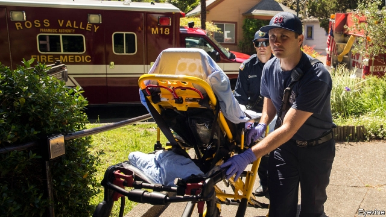
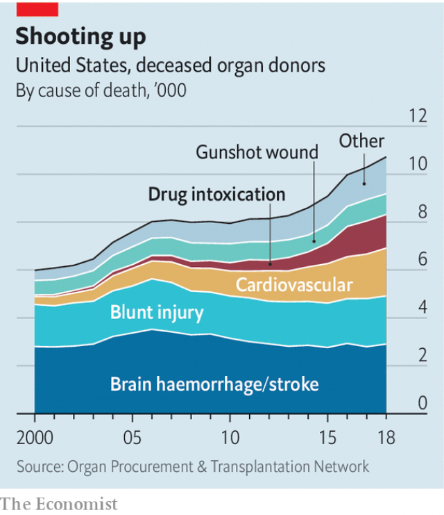

###### Life after death

# The silver lining of America’s opioid tragedy 

##### Transplants from people killed by drug overdoses are soaring 

 

> Apr 11th 2019 

THE OPIOID addiction sweeping America is devastating. It kills around 60,000 people annually, far more than the number who die in traffic accidents or from gun violence. It has contributed to three years of falling American life expectancy—the first such sustained fall since the first world war. But there is one small but significant silver lining: organ donations. In 2017 one in eight deceased organ donors in America died from an overdose, compared to one in 100 in 2000. 

Fatal drug overdoses usually kill by starving the brain of oxygen. As far as organ donation is concerned, brain death is the more useful kind. That is because it takes some time for the heart to register the loss of brain function and stop beating—at which point organs begin to deteriorate rapidly. Moreover, the opioid epidemic has been concentrated among younger middle-class people, who are in otherwise good overall health. “These are extremely high-quality organs,” says Dorry Segev, a transplant surgeon at the Johns Hopkins School of Medicine in Baltimore. 

Yet until recently they were often discarded for fear of blood-borne diseases. Many of the people who die from a heroin overdose have, at some point, shared needles with other users. That spreads viruses. The most common is hepatitis C (which leads to liver disease) but there is also a risk of HIV. At some transplants centres now as many as half of transplanted organs are from such “infectious-risk donors”, as they are called in medical circles. 

That, luckily, is becoming less of a problem. Thanks to new technology, it is easier to know whether a donor was infected with a disease. In the past, tests were not sensitive enough to pick up HIV or hepatitis C if the infection had been acquired in the previous six months or so. The testing methods used today may miss only infections picked up in the previous week. And if they were infected, it matters less too. In recent years medicines for hepatitis C have improved to the point where almost everyone is cured completely. 

 

As a result, more patients agree to transplants from donors who they know are infected. Last year, they included Robert Montgomery a transplant surgeon at the New York University Langone medical centre, who got a heart transplant from a donor who he knew had hepatitis C. Dr Montgomery became infected and then cured of the virus. A study of more than 100,000 people on the kidney waiting list in 2010-2014 found that five years afterwards, those who accepted such organs were, on average, more likely to have survived than those who declined. The low chance that a better offer would come along meant that taking the risk was worth it. 

A study published on April 3rd in the New England Journal of Medicine adds to growing evidence that such transplants are indeed safe. In that study, 44 people got hearts or lungs from donors with hepatitis C and a four-week course of antiviral drugs for it. Six months later, all these patients were clear of the virus. And they were doing as well as the patients in a comparison group who had transplants from donors without hepatitis C. Other studies have shown similar results for kidney and liver transplants, although they have also been small and with short follow-up periods. 

All this is good news for the 6,500 Americans who die on the waiting list for transplants each year—as well as for the 114,000 who are currently on the list, most of whom will not get lucky this year (see article). And for some of the families bereaved by the opioids tragedy, the possibility that their loved ones may give a new lease of life to others may be a flicker of light in the darkness. 

-- 

 单词注释:

1.opioid[əʊ'pi:əʊɪd]:a. 类鸦片（引起）的 n. 类鸦片活性肽 

2.overdose['әuvәdәus]:n. 配药量过多 vt. 配药过量, 使过分沉溺 

3.soar[sɒ:]:n. 高扬, 翱翔 vi. 往上飞舞, 高耸, 翱翔 

4.APR[]:[计] 替换通路再试器 

5.opioid[əʊ'pi:əʊɪd]:a. 类鸦片（引起）的 n. 类鸦片活性肽 

6.addiction[ә'dikʃәn]:n. 入迷, 瘾 [医] 瘾, 癖嗜 

7.devastate['devәsteit]:vt. 毁坏 [法] 使荒废, 毁灭, 掠夺 

8.annually['ænjuәli]:adv. 一年一次, 每年 [经] 年度的, 每年的 

9.donation[dәu'neiʃәn]:n. 捐赠物, 捐款, 捐赠 [经] 赠品, 捐款, 捐赠 

10.decease[di'si:s]:n. 死亡 vi. 死亡 

11.donor['dәunә]:n. 捐赠人 [化] 给体; 供体 

12.deteriorate[di'tiәriәreit]:v. (使)恶化 

13.epidemic[.epi'demik]:n. 传染病, 流行病 a. 流行的, 传染性的 

14.dorry[]:[网络] 东利；多莉；陀里 

15.segev[]:[网络] 塞格夫 

16.john[dʒɔn]:n. 盥洗室, 厕所, 嫖客 

17.hopkins['hɔpkinz]:n. 霍普金（姓氏） 

18.Baltimore['bɒ:ltimɒ:]:n. 巴尔的摩 

19.heroin['herәuin]:n. 海洛因, 吗啡 [化] 海洛因; 二醋吗啡; 二乙酰吗啡 

20.hepatitis[.hepә'taitis]:n. 肝炎 [医] 肝炎 

21.C[si:]:[计] 调用, 访问, 呼叫；电容, 进位, 通道, 字符, 清除, 常数, 控制, 周期；C 程序设计语言 [化] 碳的化学符号; 胞苷 

22.hiv[]:abbr. 艾滋病病毒（human immunodeficiency virus） 

23.luckily['lʌkili]:adv. 幸运地, 幸亏, 侥幸 

24.les[lei]:abbr. 发射脱离系统（Launch Escape System） 

25.infection[in'fekʃәn]:n. 传染, 影响, 传染病 [医] 传染, 感染 

26.Robert['rɔbәt]:[法] 警察 

27.montgomery[mәnt'^ʌmәri]:n. 蒙哥马利（姓氏）；蒙哥马利（英国郡名） 

28.york[jɔ:k]:n. 约克郡；约克王朝 

29.langone[]:[网络] 美国纽约大学兰贡；纽约大学朗格尼；纽约大学兰宫 

30.kidney['kidni]:n. 肾, 个性 [医] 肾 

31.afterwards['ɑ:ftәwәdz]:adv. 然后, 后来 

32.antiviral['ænti'vaiәrәl]:a. 抗病毒的 [医] 抗病毒的 

33.currently['kʌrәntli]:adv. 现在, 当前, 一般, 普通 [计] 当前 

34.bereaved[bi'ri:vd]:a. 丧失亲人的 bereave的过去式和过去分词 

35.lease[li:s]:n. 租约, 租期, 租 vt. 出租, 租出, 租得 

36.flicker['flikә]:n. 闪烁, 闪光, 颤动 vi. 闪动, 闪烁, 摇动, 扑动翅膀 vt. 使摇曳, 使闪烁 

