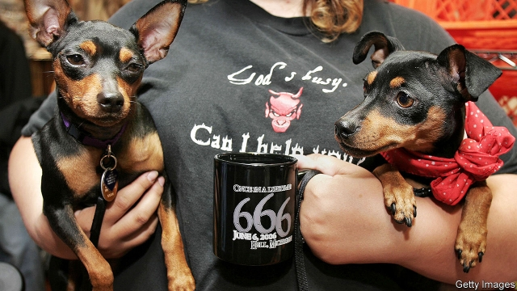

###### Why Hell is hot

# What small-town America can learn from a town called Hell 

##### An unusually-named settlement in Michigan escapes eternal damnation 

 

> Apr 11th 2019 

THE ROAD to Hell is paved with good tarmac. Water runs clear in its creek. The township in Michigan has only 72 residents, Hellians, but offers attractions aplenty. Post-office staff singe cards and stamp them, in blood-red ink, from Hell. Two bars—the Hell Hole and Hell Saloon—bustle with customers. Both of them, and a mini-golf course, are decorated with ghouls and monsters. Chuckling tourists browse a shopful of perdition-themed souvenirs. Most popular are T-shirts with slogans such as “Hell is my happy place”. 

John Colone owns Screams, an ice-cream stall, and much of the commercial centre. His red-roofed wedding chapel last year hosted 81 marriage ceremonies (including ten same-sex ones). He also threw three “living wakes” for sick customers who wanted to party in Hell before they died. Some 150 people a year pay $100 to be declared Hell’s mayor for a day. Tourist-money generates 18 local jobs. 

The township, founded in 1838, supposedly got its name from a visiting German who declared the local weather “hell”, or wonderfully bright. It thrived by hosting a sawmill and tavern, but like much of rural America its economic prospects slumped as farm jobs vanished. Hell’s only church burned down in 1963 and was never rebuilt, says Mr Colone. A lifelong resident, he frets that youngsters leave and “the only people moving in are senior citizens”. 

Hell, nonetheless, is a success. The Midwest’s landscape “is littered with has-been towns”, says Richard Longworth, who wrote a book about the decline of similar places. He notes other settlements dwindling much faster, such as Gravity, a farming town in southern Iowa. It once had more than 1,000 people but has steadily lost its pull, especially after the school and local businesses closed. It now has an estimated 150 residents, many of them elderly. 

Rural towns survive by adapting. Hellians are creative in luring tourists, preferring families who shop and eat with gusto, rather than the biker gangs that used to flock in. The township won national attention on June 6th 2006 by hosting a 12,000-strong party to mark 6/6/6. In especially cold weather, when Hell’s creek freezes over, television journalists are invited to report from its banks. Each autumn it hosts “Hearsefest”, a spooky parade. The result, says Mr Colone, is 70,000 visitors yearly. 

What could others learn from the boomlet in Hell? James and Deborah Fallows, who visited 42 towns and small cities across America, last year published a popular book celebrating the most successful. They say towns need “local patriots”, often in business, who are energetic, set out grand plans and excite others. They also need a clear civic story, “myth or a lie”, that residents can organise around. Being open—both to migrants and visitors—is important. It pays, too, not to be truly remote: being in the orbit of a city with a thriving university is best of all. Much of this applies to Hell, half an hour from Ann Arbor, home to the University of Michigan. 

Some things, however, are unique to a town with an odd name. Mr Colone doubts that earlier generations would have been as keen on shopping in Hell, but says public attitudes have grown more relaxed. “Hell sells,” he says. Pay attention, residents of Satans Kingdom, Massachusetts. 

-- 

 单词注释:

1.Michigan['miʃigәn]:n. 密歇根州 

2.eternal[i'tә:nl]:a. 永恒的, 永远的, 不灭的 

3.damnation[dæm'neiʃәn]:n. 非难, 被罚下地狱, 诅咒 interj. 糟了, 该死, 完了 

4.APR[]:[计] 替换通路再试器 

5.tarmac['tɑ:mæk]:n. 柏油碎石, 柏油碎石路 

6.creek[kri:k]:n. 小溪, 小河, 小湾 

7.township['taunʃip]:n. 小镇, 镇区 [法] 镇区, 乡 

8.aplenty[ә'plenti]:a. 丰富的 adv. 充裕地 

9.singe[sindʒ]:v. 烧焦, 烤焦 

10.ghoul[gu:l]:n. 食尸鬼, 饿鬼, 盗墓者 

11.monster['mɒnstә]:n. 怪物, 恶人, 巨物 [医] 畸胎 

12.chuckle['tʃʌkl]:n. 咯咯的笑声, 轻笑 vi. 咯咯的笑, 咕咕叫 

13.browse[brauz]:v. 浏览, 吃草 n. 浏览, 吃草 [计] 浏览 

14.shopful[]:[网络] 购物 

15.souvenir[.su:vә'niә]:n. 纪念品 

16.john[dʒɔn]:n. 盥洗室, 厕所, 嫖客 

17.colone[kәj'lәjn]:n. 冒号 

18.stall[stɒ:l]:n. 厩, 停车处, 牧师职位, 货摊, 托辞, 拖延 vt. 关入厩, 停顿, 推托, 支吾, 使陷于泥中 vi. 被关在厩内, 陷于泥中, 停止, 支吾 

19.chapel['tʃæpәl]:n. 小教堂, 礼拜式 

20.supposedly[sә'pәuzidli]:adv. 想象上, 看上去像, 被认为是, 恐怕, 按照推测 

21.wonderfully[]:adv. 惊人地；极好地；精彩地 

22.sawmill['sɒ:mil]:n. 锯木厂, 锯木机 

23.tavern['tævәn]:n. 酒馆, 客栈 

24.slump[slʌmp]:n. 暴跌, 垂头弯腰的姿态 vi. 猛然掉落, 陷入, 衰落(经济等) 

25.lifelong['laiflɒŋ]:a. 终身的, 毕生的 

26.fret[fret]:n. 烦躁, 磨损, 焦急, 网状饰物 vi. 烦恼, 不满, 磨损 vt. 使烦恼, 腐蚀, 使磨损, 使起波纹 

27.nonetheless[,nʌnðә'les]:conj. 然而, 尽管, 不过 adv. 不过, 仍然, 尽管如此, 然而 

28.landscape['lændskeip]:n. 风景, 山水, 风景画 vi. 从事景观美化 vt. 美化...景观 [计] 横向 

29.richard['ritʃәd]:n. 理查德（男子名） 

30.longworth[]: [人名] [英格兰人姓氏] 朗沃思住所名称，来源于古英语，含义是“长+圈用地”(long+enclosure) 

31.dwindle['dwindl]:vi. 减少, 缩小, 衰落 vt. 使缩小 

32.Iowa['aiәwә]:n. 衣阿华州 

33.lure[luә]:n. 饵, 诱惑 vt. 引诱, 诱惑 

34.gusto['gʌstәu]:n. 爱好, 嗜好, 由衷的高兴 

35.biker['baikә(r)]:n. 骑自行车/摩托车的人 

36.spooky['spu:ki]:a. 幽灵一般的, 吓人的, 令人毛骨悚然的 

37.boomlet['bu:mlit]:n. 小景气, 短暂的繁荣 

38.jame[]: 灰岩井 

39.deborah['debәrә]:n. 黛博拉（女子名） 

40.fallow['fælәu]:n. 休耕地 a. 休耕的, 淡棕色的 

41.patriot['peitriәt]:n. 爱国者, 爱国主义者 

42.civic['sivik]:a. 市的, 市民的, 公民的 [法] 公民的, 市民的, 公民资格的 

43.myth[miθ]:n. 神话, 虚构的事, 虚构的人 

44.migrant['maigrәnt]:n. 候鸟, 移居者 [法] 移居者 

45.ann[æn]:n. 安（女子名） 

46.arbor['ɑ:bә]:n. 藤架, 树, 心轴, 凉亭 [医] 树(树状结构) 

47.Satan['seitәn]:n. 撒旦, 魔鬼 

48.Massachusetts[.mæsә'tʃu:sits]:n. 麻萨诸塞州 

