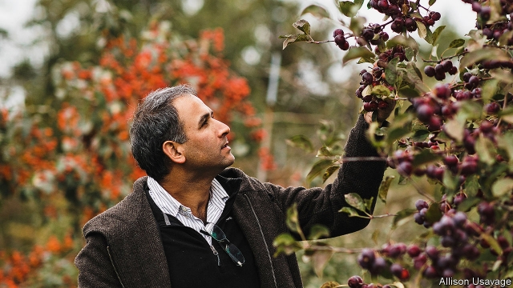

###### Applecalypse now

# Young apple trees are dying, and no one understands why 

##### How do you like them apples? 

 

> Apr 11th 2019 

CHRIS BAUGHER’S great-grandfather first planted apple trees in Adams County, Pennsylvania in 1905. In 2013 Mr Baugher planted 7,000 Fuji apple trees in the orchard, which supplies apples to market and for making apple sauce. Three years later, just when the trees should have been bearing fruit, he noticed that a few of them had yellow leaves. Within weeks they were dead. The next year, the problem had spread to more than a few trees. By last year, 2,000 of Mr Baugher’s 7,000 new trees were dead. 

Mr Baugher has the worst case of “rapid apple decline” (RAD) in the county, but he is not alone. The mysterious disease has been plaguing growers across America’s north-east, in North Carolina and in Canada for at least six years. Science, a magazine, reports that up to 80% of North Carolina’s orchards may have been affected. Kari Peter, a fruit-tree pathologist at Penn State University, first observed massive die-offs in her research orchard in 2013. She came up with the term “RAD”. But her attempts to explain it have not produced much fruit. The usual reasons for the death of a tree—mould, infestation, a known virus, blight, fungi, an early frost—didn’t fit the symptoms. Her investigation only ruled things out. 

The dead trees tend to be younger: two- to eight-years-old. They are nearing the prime of production. Dwarf trees, which are commonly used by commercial growers, seem to be the most susceptible. Historically, orchards held 600-700 apple trees an acre, but most are now under high-producing dwarf trees, which are more compact. Growers now plant 1,200-1,500 trees per acre. Commercial apple trees typically have two parts, the scion (the apple variety, such as Gala or Honeycrisp) and the rootstock (the trunk base and roots of the tree). The scion is grafted onto the rootstock. Where the two join is the tree’s most vulnerable spot, and where the decline appears to originate. 

Although the rootstock is healthy, Ms Peter says one sort of rootstock, known as Malling 9, is the most affected. Working with the research arm of the Department of Agriculture, she found a new latent apple virus in the infected trees. But they cannot be sure if this new virus has any connection with the decline. 

Researchers at Cornell University, led by Awais Khan, published a paper last month examining the role of soil, weather, fungi and bacteria. They found that severe cold followed by drought could have weakened the trees, leaving them susceptible to pathogens or boring-insect infestation. Mr Khan says more research is needed. Other scientists speculate that herbicides may be to blame. Dan Donahue, a fruit-tree specialist at Cornell University’s Hudson Valley lab, says it could be any or all of those theories. He speculates that quality control could be a basic cause. In a recent sampling, he found that 64% of young trees had latent viruses. These do not show symptoms, but they could affect vitality. Older, larger apple trees were better at shrugging off the viruses. 

RAD is a big worry for the $4bn apple industry. Mark Seetin of USApple Association, a trade group, says his growers are concerned. Trade wars have already upset the apple cart. Mexico, America’s largest export market, has imposed a 20% tariff on American apples. And customer taste is changing. Traditional varieties like Red Delicious are no longer a customer favourite, so growers are having to invest in new varieties. Most orchard growers operate on very tight margins. Few are able to absorb the losses stemming from more typical causes, such as bad weather, an infestation or a known pathogen, never mind unexplained ones like RAD. 

Mr Baugher found some relief in the Tree Assistance Programme, through which the federal government provides financial assistance to orchard-owners and nursery owners whose trees are damaged by natural disasters. The sudden death of apple trees may not seem as dramatic as a hurricane, but in its insidiousness, it is perhaps even more dangerous. Americans have given considerably more before in the defence of apple pie. 

-- 

 单词注释:

1.APR[]:[计] 替换通路再试器 

2.chris[kris]:n. 克里斯（男子名）；克莉丝（女子名） 

3.Adam['ædәm]:n. 亚当 [计] 自动直接存取管理 

4.Pennsylvania[.pensil'veinjә]:n. 宾夕法尼亚 

5.baugher[]:n. (Baugher)人名；(英)鲍尔 

6.Fuji['fu:dʒi:]:n. 富士山（在日本本州岛上的死火山） 

7.orchard['ɒ:tʃәd]:n. 果园, 果树林 

8.RAD[ræd]:[计] 随机存取装置, 快速存取数据, 快速存取设备 [化] 拉德 

9.plague[pleig]:n. 瘟疫, 天罚, 麻烦, 灾祸 vt. 折磨, 使苦恼, 使得灾祸 

10.grower['grәuә]:n. 栽培者, 生长物 

11.Carolina[.kærә'lainә]:n. 北(或南)卡罗来纳州 

12.kari[]:n. 卡利（男子名）；卡丽（女子名） 

13.peter['pi:tә]:vi. 逐渐消失, 逐渐减少 

14.pathologist[pæ'θɒlәdʒist]:n. 病理学家 [医] 病理学家 

15.penn[pen]:abbr. 宾夕法尼亚大学（Pennsylvania） 

16.infestation[.infe'steiʃәn]:n. 骚扰, 大批出没, 横行 [医] 侵染, 感染 

17.blight[blait]:n. 枯萎病 vt. 使染上枯萎病, 破坏 vi. 枯萎 

18.fungus['fʌŋgәs]:n. 真菌, 真菌类植物 [医] 真菌, 霉菌, , 蕈, 海绵肿 

19.dwarf[dwɒ:f]:n. 矮子, 侏儒 v. (使)变矮小 

20.susceptible[sә'septәbl]:a. 易受影响的, 易感动的, 容许...的 [法] 易感的, 易受影响的, 容许 

21.historically[his'tɔrikәli]:adv. 历史上地；从历史观点上说 

22.dwarf[dwɒ:f]:n. 矮子, 侏儒 v. (使)变矮小 

23.compact[kәm'pækt]:a. 紧凑的, 紧密的, 简洁的 vt. 使紧密结合, 压缩 vi. 变坚实 

24.typically['tipikәli]:adv. 代表性地；作为特色地 

25.scion['saiәn]:n. 接穗, 子孙 [医] 嫩枝, 接穗 

26.gala['geilә]:n. 节日, 祝贺 

27.Honeycrisp[]:[网络] 脆；蜜脆；蜜脆苹果 

28.rootstock['ru:tstɒk]:n. 根茎, 根源, 起源 [医] 根茎 

29.graft[grɑ:ft]:n. 嫁接, 贪污 v. 嫁接, 移植, 贪污 

30.vulnerable['vʌlnәrәbl]:a. 易受伤害的, 有弱点的, 易受影响的, 脆弱的, 成局的 [医] 易损的 

31.mall[mɔ:l]:n. 林荫路 

32.latent['leitnt]:a. 潜伏性的, 隐藏的 n. 隐约指纹 

33.cannot['kænɒt]:aux. 无法, 不能 

34.cornell[kɔ:'nel]:n. 康奈尔（姓氏） 

35.awais[]:n. (Awais)人名；(英)阿韦斯 

36.khan[kɑ:n]:n. 可汗, 商队宿店 

37.pathogen['pæθәdʒ(ә)n]:n. 病原体 [医] 病原体 

38.speculate['spekjuleit]:vi. 深思, 推测, 投机 [经] 投机 

39.herbicide['hә:bisaid]:n. 除草剂 [化] 除草剂 

40.dan[dæn]:n. 段(柔道、围棋运动员的等级) [建] 小车, 空中吊运车, 杓 

41.donahue[]:n. (Donahue)人名；(英)多纳休 

42.Hudson['hʌdsn]:n. 哈得孙河 

43.vitality[vai'tæliti]:n. 活力, 生命力 [医] 生机, 活力, 生活 

44.tariff['tærif]:n. 关税, 关税表, 价格表, 收费表 vt. 课以关税 [计] 价目表 

45.unexplained[]:[法] 未经说明的, 未经解释的 

46.insidiousness[ɪn'sɪdɪəsnəs]:n. 潜伏, 阴险; 隐袭性 

47.considerably[kәn'sidәrәbli]:adv. 非常地, 很, 颇 

