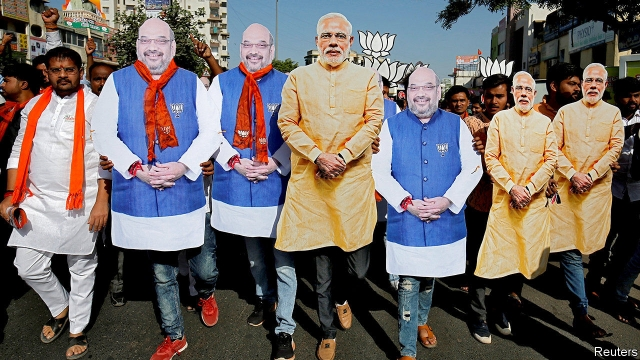
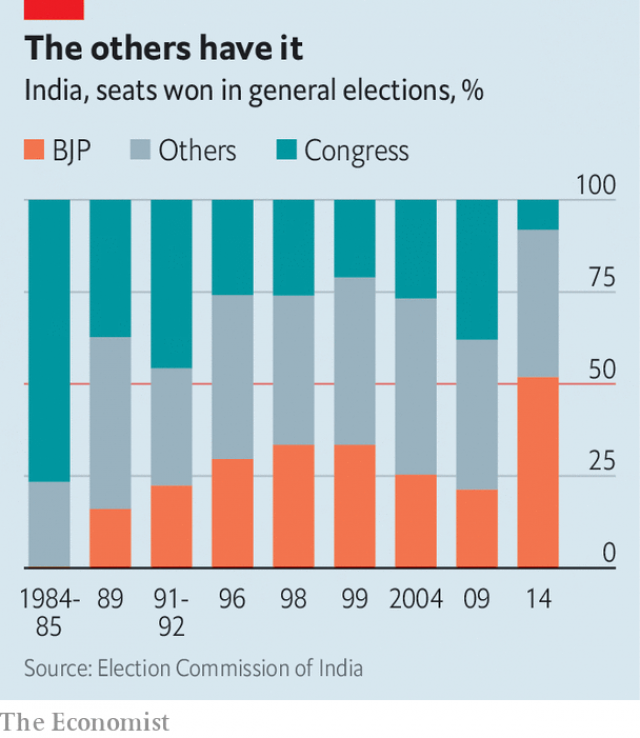

###### A matter of state

# India’s next government is likely to be a coalition of mercenaries 

##### Regional parties usually throw their lot in with the highest bidder 

 

> Apr 17th 2019 

THE HOTLY contested general election has made the face of Narendra Modi, the prime minister, hard to escape in most of India, beaming from walls, lamp posts, pillars and shop windows. Yet his image is nowhere to be seen in Hyderabad, the country’s fourth-biggest city. Its dusty bazaars and gleaming industrial parks could be in another country. 

True, campaigning has already ended in Telangana, the state of which Hyderabad is the capital. Its voters went to the polls on April 11th, in the first of seven stages of an election that will not wrap up until May 23rd, when all the country’s 900m or so votes will be tallied at once. But Mr Modi is absent mainly because in this part of India his Bharatiya Janata Party (BJP) hardly matters. In Telangana, as in many southern and eastern states, local parties dominate. 

Most pundits predict that the prime minister, boosted by a surge of nationalism after briefly bombing Pakistan, will do well nationwide. Yet few think he can repeat the success of 2014, when the BJP won an outright majority in the 545-seat Lok Sabha, the lower house of parliament. After the previous seven elections, coalitions were needed to build a majority (see chart). 

 

Mr Modi may not even be able to cobble together a majority by relying on close ideological allies such as Shiv Sena, a Hindu nationalist party centred in the state of Maharashtra. Instead, he may find himself competing with the Congress leader, Rahul Gandhi, to woo support from such regional overlords as K. Chandrasekhar Rao, who in December nabbed 88 of the 117 seats in Telangana’s state assembly, or Naveen Patnaik, who has ruled the state of Odisha for 19 years, or Mamata Banerjee, whose party currently enjoys a 72% majority in West Bengal’s state assembly. 

In a country with 22 main languages and hundreds of lesser ones, it is not surprising that even big, rich parties like the BJP struggle to build—or in the case of its main rival, Congress, to sustain—a nationwide presence. Congress and the BJP do best in the largely Hindi-speaking north and west, where they face each other, not local parties. “It is very difficult for a national party to construct a narrative where a regional party is strong,” says K.C. Suri of the University of Hyderabad. 

Local leaders, often far more secure than interlopers from “the centre”, as Indians call New Delhi, the national capital, can drive hard bargains. Mr Suri reckons that the domination of politics in Tamil Nadu, a big, southern state, by two local parties has helped to make it richer. The state is seldom ignored by the “centre” because building a governing coalition typically entails enlisting one of the two rivals. “Tamil Nadu somehow always ends up with the largest contingent of cabinet members,” says Mr Suri. 

Should Mr Modi want support from Jagan Mohan Reddy, a rising star in Andhra Pradesh whose party looks poised to land a majority of that state’s 25 MPs, the price is clear. “He is completely indifferent to who wins the national election,” says a close aide to the 46-year-old upstart, who campaigned with a 340-day march on foot across his state. “He’ll go with whoever agrees to give Andhra special status.” (A designation that entitles states to bigger budget allocations from the “centre”.) Mr Patnaik, who also looks set to command most of Odisha’s 21 MPs, is similarly aloof: “We are happy to support anyone who benefits us,” he tells an interviewer. 

As prime minister, and leader of the party that will almost certainly have the most MPs, Mr Modi has plenty to offer. But some potential kingmakers dislike his politics. “In terms of plain ideology it’s easier for us to gel with Congress, and they are also more used to working with lots of smaller partners,” says a southern politician. “But if Congress fails to win enough seats on its own, say 80 or 100, who will stay with them?” Noting that one of Tamil Nadu’s two big parties has already announced an alliance with Congress, the politician points out that since the national party has few voters in the state, the alliance is really just about branding the local party as “secular” and raising its profile. The party would merrily dump Congress after the vote, if need be. 

Before campaigning picked up, there had been much talk of Congress forging a broad coalition to fight the BJP. The logic is obvious. Seats in the Lok Sabha go to the party that wins the most votes in each constituency. In 2014 the BJP won lots of seats with a minority of votes thanks to its divided opposition. But with regional parties complaining that Congress overestimates its clout, talks have foundered in several states. If they fail in Delhi with the locally powerful Aam Aadmi Party, the BJP could walk away with all seven MPs, as in 2014. 

Given widespread impatience with Congress and dislike of the BJP, why don’t the smaller parties band together and form a government without either of them? Mr Rao, the Telangana strongman, talks of just such a “federal” front. It would not be unprecedented: a government took office in 1996 without Congress or the BJP. But the scrappy coalition fell in less than a year. 

