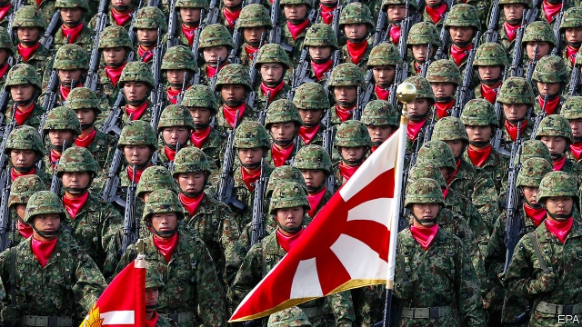
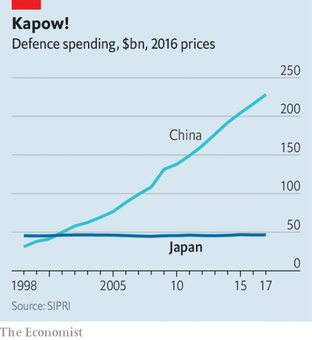
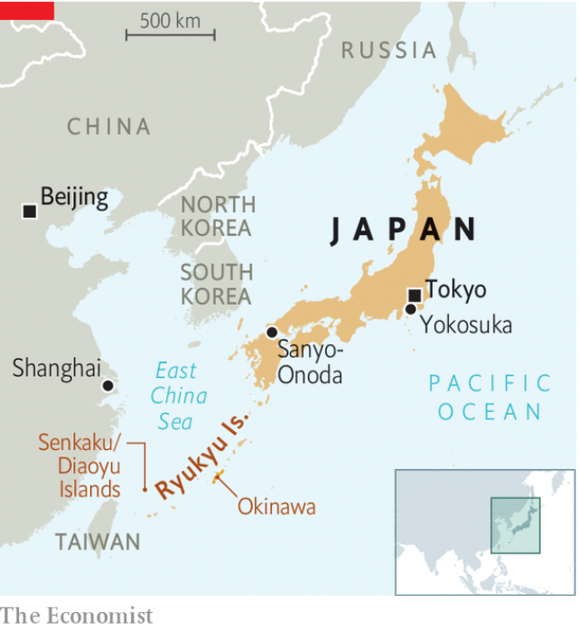

###### A new front

# Japan’s Self-Defence Forces are beginning to focus on China 

##### But the pace of change is slow and the legal obstacles daunting 

 

> Apr 17th 2019 

ON A COLD spring day, crowds of Japanese gather to peer at the hulking grey ship moored in the port of Yokosuka, just south of Tokyo. The Izumo, the country’s largest warship, has attracted attention at home and abroad since December, when Japan’s government announced that it would upgrade her. Her deck, and that of her sister ship, the Kaga, will be reinforced to accommodate up to a dozen of the 147 F-35 fighter jets Japan recently ordered from America. 

The refitting of the Izumo is one sign of Japan’s shifting defence posture. The changes are small, by necessity. Japan is constrained by its constitution, written by occupying American forces after the second world war. It bars Japan from maintaining armed forces or settling disputes by war. Despite these strictures, Japan has long had an army in all but name: the “Self-Defence Forces”. The SDF has focused, aptly enough, on defence—hunting submarines and warding off warplanes, for example—while relying on American troops based in Japan to go on the offensive, should that be required. Little by little, however, that formula is changing. 

Since Shinzo Abe began his second stint as prime minister in 2012, he has pushed to make the SDF more of a normal army, as part of a broader nationalist agenda. He has passed laws to allow Japan to come to the aid of allies and to permit the SDF to use its weapons in a wider range of circumstances while on UN peacekeeping missions. This month, for the first time, Japan even contributed two soldiers to an American-led peacekeeping mission, rather than a UN one, in Egypt’s Sinai peninsula. 

In 2013 Mr Abe also established a National Security Council (NSC), staffed by 70-odd officials, to debate and co-ordinate defence and security policy. The NSC, which puts out guidelines every five years, issued its latest in December. They are “really significant”, says Narushige Michishita, a former defence official at the National Graduate Institute for Policy Studies in Tokyo. 

 

Three things stand out. One is the increase in spending on defence. Japan plans to splash out $245bn over the next five years–an 11% rise over the past five years, and about $49bn annually. That is less than a quarter of China’s defence budget (see chart), and only around 1% of Japan’s GDP, but it is more than Britain or France currently spend. 

Second is Japan’s acquisition of new offensive capabilities, which are stretching the constitution even further. The development of a seaborne strike force, in the shape of the F-35-laden Izumo, is the most eye-catching aspect. But as important is the acquisition of “stand-off” munitions with long ranges. The JASSM-ER, a cruise missile fired from a warplane, can travel more than 900km, about the distance from Okinawa to Shanghai. Japanese officials insist that the target would not be China’s mainland but People’s Liberation Army (PLA) ships and troops in Japanese waters or on Japanese soil, should that occur. 

Third, the NSC’s new guidelines recognise for the first time that Japan needs to prepare for war in space, cyberspace and on the electromagnetic spectrum. To that end, the air force is establishing a $240m unit to track threats to satellites, backed by a powerful new radar in the south-western city of Sanyo-Onoda. Paul Kallender and Christopher Hughes, both of the University of Warwick, point out that Japan’s dual-use space budget adds up to 10% to defence spending outside the formal budget. 

Japan also plans to increase its ranks of cyber-warriors over the next five years, from 150 to 500. Here, too, the gap between defence and offence begins to blur. “The definition of defence capability in cyber-war is hard,” admits a Japanese official. Tracking cyber-intrusions can sometimes require penetrating an adversary’s networks first, and acts of espionage can look like preparations for sabotage. 

These shifts are a response to the rapidly changing security environment. A Japanese defence official observes that since the country published its last defence guidelines in 2013, North Korea has tested 53 missiles and three nuclear bombs. And America, under President Donald Trump, is seen as a less reliable and more demanding ally. Japanese officials acknowledge that their defence drive is aimed partly at shoring up the alliance. 

But Japan is not building military muscle primarily to please America. “Over the past ten years, we have had three serious national-security concerns,” says a Japanese diplomat: “The first is China; the second is China; the third is China.” 

 

China’s defence spending surged by roughly a third between 2013 and 2017; Japan’s rose by less than 3%. Even the planned increase in the defence budget will barely make a dent in the disparity. In the first nine months of last year, Japanese warplanes scrambled 476 times against Chinese interlopers. There are also frequent Chinese incursions into the waters around the Senkaku Islands in the East China Sea (see map), which China claims, calling them Diaoyu, but which Japan controls. But the anxiety goes beyond this shadowboxing. “China is 20% of humanity, decidedly authoritarian and still growing,” says the diplomat. “They build submarines like sausages.” 

Japan was slow to shift its military resources from the north, where they were positioned during the cold war for fear of a Soviet invasion. Many American soldiers are based on Okinawa, in the Ryukyu Islands, a chain which ends just 100km from Taiwan. Now Japan, too, is building them into a military bulwark. In March it opened two new bases at the sleepy southern end of the chain, and is working on a third. 

Taiwan, which is claimed by China, is an important but unspoken element in this shift. A Chinese war to seize Taiwan would probably draw in American forces in Japan, and so Japan itself. The SDF’s ground forces, which last year formed their first unit of marines since the second world war, are practising anti-ship and amphibious warfare–useful for defending and retaking islands respectively. 

“We are taking steps in the right direction, but it is slow,” says Chiyuki Aoi, a professor and former government adviser on defence. For example, the new space radar won’t appear until 2023. Staffing is a constant difficulty given Japan’s shrinking, ageing population: the SDF has missed recruiting targets since 2014. Last year it had to raise the maximum age for new recruits. It is considering raising the retirement age. 

And although Japan hopes its new vigour will “cause China to think twice”, as Mr Michishita puts it, that will only happen if its fancy purchases are seen as credible weapons, not just sports cars parked in a garage. Take peacekeeping. Despite the change in law, Japan currently has no peacekeepers on UN missions; those who have been deployed in the past tend to have been engineers teaching people how to use Japanese-made equipment. 

When Mr Abe did dispatch troops to South Sudan in 2017, he hinted that he would resign if a drop of blood was spilled. “Japan has not fired a shot in anger in seven decades,” observes one Western diplomat. “Will they crap their pants and run home to the countryside? No one knows.” 

And then there are the constitutional constraints. The circumstances in which Japan can come to the aid of allies remain limited. Mr Abe appears to have all but abandoned his ambition of revising the constitution to make explicit that Japan has armed forces, let alone revoke the pacifist Article 9 altogether. Some 54% of the public are opposed even to the smaller change, according to recent polls. 

That makes Japanese leaders coy about what they are doing. An official admits that translations of documents about the alliance with America used to play down the extent of Japan’s obligations so as not to “expose the Japanese people to the full meaning of our responsibility”. The SDF even calls the Izumo an “escort ship”. With a deck full of F-35s, it will be hard not to see her as—whisper it—an aircraft-carrier. 

