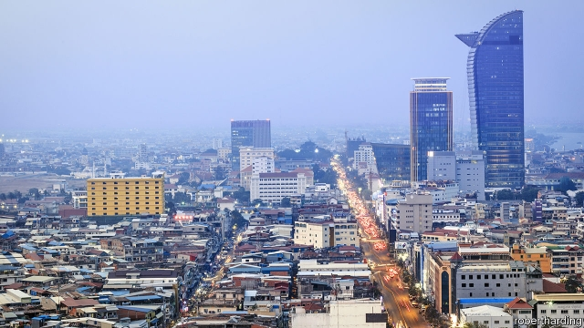

###### Fast and loose

# Rapid economic growth props up Cambodia’s strongman 

##### But his strangulation of democracy imperils the country’s biggest industry 

 

> Apr 17th 2019 

DRIVING ALONG Hun Sen Boulevard—named after the man who has led Cambodia since 1985—a shiny Mercedes-Benz dealership appears in the litter-covered scrubland, its chunky white vehicles nestled behind thick plate glass. Beyond, the cranes and towers of Phnom Penh loom. They speak to the riches Mr Hun Sen’s authoritarian rule has brought to a minority. But even the majority can testify to a rapid economic recovery since the end of the long civil war in the 1990s, and the final extinguishing of the Khmers Rouges, a Maoist movement that had forced all Cambodians to become subsistence farmers in the 1970s. Between 1995 and 2017 Cambodia grew at an average rate of 7.7%; GDP per person rose from $321 in 1994 to $1,137 in 2017, after accounting for inflation. 

Foreign money has flooded in and Cambodia’s economy, which war and the Khmers Rouges had destroyed, has quickly revived. In the decade to 2015 more than 1.6m jobs were created in construction, garment-making and the hotel business, reckons Miguel Eduardo Sanchez Martin of the World Bank. Workers support family members left behind in villages. The proportion of Cambodians living below the Cambodian poverty line—$0.93 a day—declined from almost 48% in 2007 to 13.5% in 2014. Inflation remains in check partly thanks to widespread use of the American dollar. And a budget deficit that was left over from the global financial crisis has largely been tamed. 

Economic progress, however, has been accompanied by political regression. Mr Hun Sen’s administration has hounded its opponents and locked up its critics. Trumped-up tax charges were used to close an independent newspaper in 2017. That year the country’s Supreme Court also dissolved the main opposition party. One of its leaders is under house arrest; the other, in exile. An election last year proved farcical: the ruling party won all 125 seats in the National Assembly. 

After a more competitive contest in 2013 garment workers staged protests against rigging for months. The government tried to win them over by gradually raising their minimum wage to $182 a month. This time things are quiet. One businessman admits he is pleased the election was so peaceful. No doubt encouraged by the calm, Mr Hun Sen talks of introducing a minimum wage for other industries as well. 

It is harder for the government to buy off foreign critics, however. In protest at the strangulation of democracy, the European Union has threatened to cancel tariff-free access to the European market for Cambodian goods under a concessionary regime called “Everything But Arms”. This will hurt, given that clothing is Cambodia’s main export, bringing in around $5bn a year, and Europe its biggest market. Overall, two-fifths of the country’s exports wend their way there. Garment factories, in particular, are easy to relocate; some firms are reportedly already contemplating moving to Vietnam or Bangladesh. Languid European procedures give the Cambodian government 16 months or so to repent or prepare. Mr Hun Sen shows no contrition, but also few signs of preparation. 

Cambodia’s infrastructure is straining under the pace of growth. Blackouts have become frequent as hydropower generation, which meets about half Cambodia’s energy needs, has been curtailed by drought. The country plans to buy additional power from neighbours such as Thailand, but this will further increase already heady electricity prices. Transport costs are eye-watering, too, since all but the biggest rural roads are unpaved. 

Bureaucracy also needs battling. Roughly half of Cambodia’s workforce are still farmers, many of them stuck tending tiny paddyfields. Agribusiness could help raise their productivity and incomes. But Sela Pepper, a four-year-old firm, initially encountered not encouragement but red tape as it tried to build Cambodia’s only pepper-processing plant. The firm’s marinated peppercorns have a sour tang; trying to get the business going left a similar taste, recalls Soeng Sopha, the general manager: “It was all extremely difficult.” 

Other bosses moan about corruption. Cambodia ranks 161st of 180 countries in Transparency International’s latest corruption index, alongside Haiti and the Democratic Republic of Congo. The head of Cambodia’s European chamber of commerce says “unfair competition” bothers his members. Yet there is little chance the kleptocratic elite would permit sweeping attempts to root out the problem. Mr Hun Sen himself likes to sport flashy watches and gleaming SUVs. 

A fourth headache for investors is a shortage of skilled workers. Cambodia’s young population should aspire to more than driving tour buses and sewing sequins, reckons Chheng Kimlong of the Centre for Governance, Innovation and Democracy, a think-tank in Phnom Penh. “We are far behind the region in spending on education,” he says. Rural schools often lack textbooks, let alone internet connections. This makes a mockery of new schemes promoting employment in the digital economy. 

Instead of getting to grips with these problems, the government appears to be counting on China. “Hun Sen thinks that China will be waiting over the cliff with a safety net,” says Sophal Ear of Occidental College in America. Ties are indeed close. Chinese businesses, the largest source of foreign investment, had pumped a cumulative $12bn into Cambodia by the end of 2016. Dozens of casinos and the vast majority of garment factories have Chinese owners. Chinese buyers are also a force behind the construction boom, picking up properties in developments such as Diamond Island in Phnom Penh and in the resort town of Sihanoukville. (According to the Ministry of Land Management nearly 6,000 construction projects valued at more than $11bn have been approved in the past two years.) Of the 6m tourists who came to the country last year, almost a third were Chinese. Xi Jinping, China’s president, visited in 2016. In January he promised almost $600m in aid over the next three years. 

It is unlikely that Chinese investors will be as enthusiastic if Cambodia loses tariff-free access to its main market, however. And whether the European Union pulls the plug or not, Mr Hun Sen seems more focused on stifling dissent than on economic reform. Sooner or later, that will sap the growth that underpins his longevity. 

