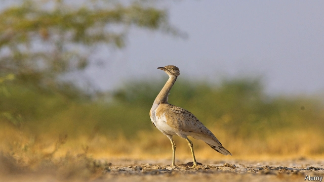

###### Hunting the houbara

# Why Pakistan lets Arab bigwigs set falcons on rare birds 

##### Money and politics could doom a vulnerable bustard 

 

> Apr 17th 2019 

THE ASIAN houbara is an unlikely diplomatic asset. An elusive, desert-dwelling bird, its expression suggests bad temper rather than entente. Yet the migratory, chicken-sized fowl, also known as the Macqueen’s bustard, is considered prized sport by Arab falconers. Its meat is also thought to be an aphrodisiac. For decades dignitaries from the Gulf have been visiting Pakistan to hunt, as the number of houbaras has dwindled in their own countries and as hunting has become dangerous in other places, such as Iraq and Syria. That has given Pakistan a special opportunity to butter up Gulf potentates. 

Selling the hunters the required permits is lucrative in itself. In the province of Punjab, all six designated hunting grounds were used during the season that ended on March 31st. Each hunting party had paid $100,000 to be assigned a territory and another $100,000 for a ten-day permit authorising the killing of 100 birds, as well as $1,000 for each falcon they brought with them. Hunting permits are also available in the provinces of Balochistan and Sindh. 

But the sport’s main value to Pakistan is diplomatic. This season saw visits from kings, crown princes, ministers and governors from Bahrain, Qatar, Saudi Arabia and the United Arab Emirates (UAE). Pakistan’s leaders called on many of these grandees. It was the least they could do, given that Pakistan is currently relying on handouts from Saudi Arabia and the UAE to fend off a balance-of-payments crisis. 

Unfortunately for Pakistan’s government and Arab hunters alike, the number of houbaras is declining, and hunting faces stiff opposition. The International Union for Conservation of Nature classifies the species as vulnerable to extinction. Reports that hunters have wildly exceeded their quotas heighten the concern. 

Imran Khan, the prime minister, took up the issue while in opposition, chiding his predecessor’s government for venality. “For dollars, we are allowing the killing of houbara bustard, an endangered species,” he fumed. Yet now he is in power his indignation has waned. 

Much of the income from permits is spent on conservation and local livelihoods, hunting advocates say. The visitors have also donated money for roads, hospitals and wells near the hunting grounds. Captive breeding programmes, meanwhile, are releasing birds into the wild in an effort to replenish stocks. 

Conservationists are not convinced. Nor are the courts. In 2015 the Supreme Court ordered a complete ban on hunting to protect the species before reversing itself months later. Lahore’s High Court has set up a commission to decide whether hunting in Punjab is sustainable. Parvez Hassan, the lawyer who heads it, says data will dictate its recommendations. It might suggest reducing the scale of the hunting, or perhaps a complete moratorium for a couple of years. A long hiatus or an indefinite ban would be deeply unpopular with the government, he acknowledges. But the survival of the species, he insists, trumps the demands of diplomacy. 

