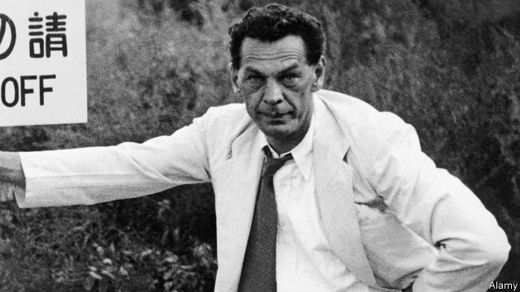

###### Carousing for the Comintern

# A rollicking biography of Richard Sorge, a master Soviet spy 

##### His intelligence on Operation Barbarossa may have proved decisive for the outcome of the second world war 

 

> Apr 20th 2019 

An Impeccable Spy: Richard Sorge, Stalin’s Master Agent. By Owen Matthews. Bloomsbury; 448 pages; $30 and £25. 

WITH ITS clash of grand ideologies and sweeping geopolitical upheavals, the 20th century was a natural setting for espionage. The intrigues cooked up in embassies and drinking holes and secret clubhouses shaped the fates of nations, which made the work of spies of the utmost importance. And of them all, Richard Sorge may well have been the best. He was a “flawed individual, but an impeccable spy—brave, brilliant, and relentless”, writes Owen Matthews in his rollicking and moving chronicle of Sorge’s life. 

“An Impeccable Spy” is also a story of the era’s convulsions, for which Sorge is a fitting avatar. A man of great ego and daring, he was sacrificed to a cause that had long since abandoned its professed ideals. 

Born in 1895 to a German father and a Russian mother, Sorge, like many young men of his generation, was dispirited by his experience in the trenches of the first world war. Recovering from his wounds in hospital, he made his way through Marx. The panacea of communism seduced him: the grandeur of the idea matched his vision of himself. 

Sorge’s activism led him to Moscow and the Comintern, the global wing of the Communist Party, “world revolution’s most secret club”. He was dispatched to Shanghai, a madcap colonial city where he drank, caroused and acted the “debauched bourgeois expatriate”, Mr Matthews writes. “He found the role entirely to his liking.” 

But it was Japan, where Sorge arrived in 1933, which would host his most fateful exploits. As the tremors of a new war were felt, the question of Japan’s alliances and military ambitions became vital to Soviet leaders. Would Tokyo make a move to the south, deeper into Asia, or north—into Siberia? The latter might well spell doom for the Soviets, whose country was young and unsteady, with untested armed forces that would be hollowed out by Stalin’s purges. Sorge’s bosses in Moscow—his spy ring now reported to the Fourth Directorate of the Red Army’s General Staff—made untangling this riddle his main task for the next eight years. 

Sorge carried out this mission with a panache that veered toward recklessness. He twirled women around the dance floor at Tokyo embassy parties and made a name for himself in the drinking dens of Ginza. An American journalist said he “created the impression of being a playboy, almost a wastrel, the very antithesis of a keen and dangerous spy.” 

Yet that is what he was. Sorge befriended a German military officer named Eugen Ott—after first seducing his wife, a characteristic Sorge move. With time, Ott rose to become Hitler’s ambassador in Tokyo. As Mr Matthews points out, what made Sorge such a dizzyingly successful spy was that he didn’t so much steal secrets as trade them. Thanks to a member of the ring who was also an adviser to the Japanese prime minister, Sorge had access to the inner sanctum of Japanese politics; he passed this information to Ott, who would share the latest in Nazi strategy from Berlin. All the while, the sum total of this intelligence haul was cabled back to Moscow. 

Yet as “An Impeccable Spy” makes clear, intelligence is only as good as those at headquarters who interpret it. And in Moscow in the 1930s, the apparatchiks’ priority was self-preservation. Five successive heads of the Fourth Department were shot in the purges. The survivors’ only hope to avoid a similar fate was to tell Stalin what he wanted to hear: that Hitler would refrain from invading the Soviet Union, and that any suggestions to the contrary were malevolent disinformation. 

Sorge was hearing otherwise from Ott and his other German contacts. His attempts to sound the alarm were greeted coolly by Moscow. He got his hands on the plans for Operation Barbarossa, the German invasion, telling Moscow that war was “95% certain” and specifying where Nazi forces would strike and a date of June 15th. (He was off by a week: the invasion began on June 22nd.) Stalin scrawled on the cable: “Suspicious. To be listed with telegrams intended as provocations.” 

All the same, Sorge’s intelligence may have proved decisive for the outcome of the war—thus saving not just the Soviet Union but perhaps the world. In September 1941 he relayed that Japan was unlikely to target the Russian Far East, which meant that Stalin could bring half the Red Army troops in Siberia to the western front. 

A month later, Sorge’s luck ran out, and he and other members of the Tokyo rezidentura were captured by Japanese police. His arrest barely registered back in Moscow: the man who may have saved the country was quickly discarded. He spent three years at Sugamo prison awaiting his fate, which turned out to be execution by hanging. A German translator who took his last will said he gave the impression of a man “who is proud to have accomplished a great work and is now ready to leave the scene”. Mr Matthews has given Sorge a fitting remembrance: audacious, spirited and laced with the madness and tragedy of his age. 

