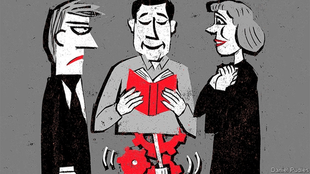

###### Who, robot?

# In “Machines Like Me”, Ian McEwan asks an age-old question 

##### Beneath the androids and the game-playing is a discussion of what makes people human 

 

> Apr 17th 2019 

Machines Like Me. By Ian McEwan. Nan A.Talese/Doubleday; 352 pages; $26.95. Jonathan Cape; £18.99. 

AFTER A SEQUENCE of more or less realistic novels, including “On Chesil Beach” (2007) and “The Children Act” (2014), Ian McEwan is letting himself go. His previous novel, “Nutshell”, was narrated by a fetus; now he tells the story of a love triangle between an online trader, Charlie, an academic, Miranda, and a handsome android, Adam, purchased by Charlie after a windfall. At one point, Charlie hears Miranda and Adam having sex; when he confronts Adam, the robot breaks his owner’s wrist before disabling his own kill switch. 

The book is set in London in the 1980s, except with 21st-century technology, and—as Adam’s existence indicates—more besides. A train journey from London to Glasgow takes only 75 minutes. The world is askew: the Beatles are still going strong, and a novel called “Catch-18” (the manuscript title of “Catch-22”) is mentioned. Margaret Thatcher loses an election after Britain is routed in the Falklands; the IRA assassinates Labour Prime Minister Tony Benn. “I repeat this well-known history for the benefit of younger readers who won’t be aware of its emotional impact,” Charlie says. 

Mr McEwan’s game-playing recalls the appendix to “Enduring Love” (1997), a plausible-seeming case report from a non-existent British Review of Psychiatry. “It’s always very tempting for a writer to blur the line between fiction and reality,” he later said. “And it was linguistic exuberance, as well—I just wanted to show that I could do it too.” As subplots multiply in “Machines Like Me”, the fun occasionally loses its purpose. When Charlie intervenes to help a small boy who is being shouted at by his mother in the street, Miranda wants to adopt the child. She is later targeted by an ex-convict bent on revenge after she falsely accused him of rape. 

Amid all the action, there are sober passages of philosophical discussion between Charlie and Adam. But in parts the novel is funny, too. To Charlie’s disgust, Adam’s encyclopedic recall of Shakespeare makes him seem the better catch to Miranda’s father, a writer, who assumes Charlie is the robot, because he isn’t interested in books. 

Late in the story it emerges that other androids around the world are committing suicide in horror at the behaviour of their flesh-and-blood masters. Adam wonders about the “mystery of the self” and his fear that he is “subject to a form of Cartesian error”. Strip away the counterfactual wrapping and “Machines Like Me” is ultimately about the age-old question of what makes people human. The reader is left baffled and beguiled. 

