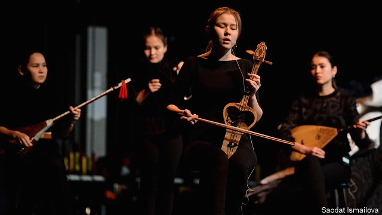

###### Once were warriors

# Saodat Ismailova, an Uzbek film-maker, bridges two worlds 

##### Though her themes and the languages she enlists are familiar to Central Asian audiences, her techniques may not be 

 

> Apr 17th 2019 

GULAIM IS THE Boudicca of the Eurasian steppe. With her qyrq qyz—40 girls—she defended the ancient clans from eastern invaders, leaving an imprint on the collective consciousness of her region. She bequeathed “a memory of a matriarchal society in Central Asia,” says Saodat Ismailova. “If you ask the Iranians and the Afghans, they don’t have the idea of these girl warriors, whilst over the Amu Darya [the river that divides Afghanistan from Uzbekistan], people are very aware of it.” 

Central Asia’s history—from the ancient Sogdian language to the soul of the extinct Turan tiger—permeates Ms Ismailova’s art, which ranges from feature films and documentaries to video installations and multimedia performances. Born and brought up in Tashkent, Uzbekistan’s capital, she has lived most of her adult life in Europe; but she feels “an unconditional connection, like the unconditional love for your parents or children”, with the traditions she inherited. 

The production of “Qyrq Qyz”, Ms Ismailova’s retelling of the legend, has proved as epic as its plot. It emerged from a short film she made in 2014, and incorporates an 86-minute film shot partly among the ruined desert fortresses of Karakalpakstan, plus a live element in which seven young women perform an original score of traditional music. It had its premiere in New York last year and is being staged this week at the Centre for Contemporary Art, a new venture in a former power station in Tashkent. 

Ms Ismailova spent 18 months casting the seven performers, all of whom are musicians at the beginning of their careers. She collaborated with Séverine Rième, a Parisian choreographer and lighting designer, to ensure that their bodies communicated the same message as the sound. It wasn’t easy: as Ms Ismailova puts it, the women had to counteract the weight of “a certain Soviet past which [dictates] how you go on stage, how you sit, and how you perform.” But they overcame these constraints, she says, and the result “is a wave like an audio wave, but it is related to their bodies.” 

This is the first time “Qyrq Qyz” and the accompanying exhibition “Qo’rg’on Chiroq” (part of which appeared at the Venice Biennale in 2013) have been shown in Uzbekistan. Ms Ismailova’s only previous exposure there was on a much smaller scale. She is curious to see how her work will be received. “It is like bringing a child back to its home,” she says. “I think it is going to raise questions…What is it about? What is this language of communication?” 

Ms Ismailova’s apprehension is understandable. Though her themes and the languages she enlists—Karakalpak, Kazakh, Kyrgyz and Uzbek—are familiar to Central Asian audiences, her techniques may not be. “There was no access to information about contemporary culture,” Ms Ismailova recalls of her education in Tashkent in the post-Soviet doldrums of the early 2000s. “We were trained in the traditional way.” She and her work have become a bridge connecting two worlds. 

The lines she draws between Central Asia and Europe run in both directions. As well as introducing the West to Central Asia’s heritage, she is using her European experience and network to help develop the arts in her homeland. 

