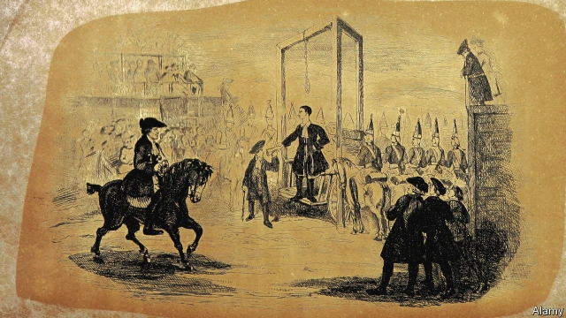

###### Life, art and crime

# The murder of Lord William Russell scandalised the Victorian literati 

##### The ghastly deed was said to be inspired by a novel 

 

> Apr 17th 2019 

Murder by the Book. By Claire Harman. Knopf Doubleday; 252 pages; $25.95. Viking; £14.99. 

BY ALL ACCOUNTS, Lord William Russell was a harmless old gent. What a horror, then, when he was found in his bed on the morning of May 6th 1840, “his throat cut so deeply that the windpipe was sliced right through and the head almost severed.” 

Russell was the youngest son of the Marquess of Tavistock, and although some of his family could not have been grander—his nephew Lord John Russell was the principal architect of the Great Reform Act of 1832, and was to be the last ever Whig prime minister—he himself lived modestly by aristocratic standards. When not abroad he could be found in a terraced townhouse on Norfolk Street, with only a maid, a cook and a valet to tend to him. He had no enemies; he had no great debts. Yet, as Claire Harman writes in her compact and engrossing account of his death and its aftermath, on that spring night “mayhem and murder” came to a quiet Mayfair street. 

Ms Harman’s book is not a whodunnit. The circumstances of Russell’s death are not just a matter of public record: the case was one of the most notorious of its day. His Swiss valet (the Swiss were highly esteemed as domestic servants, being “cheap, clean and reliable”), François Courvoisier, was tried, found guilty and hanged at Newgate Prison on July 6th. Ms Harman is concerned, rather, with the way in which the murder, and Courvoisier’s execution, reverberated through literary London. 

Both Charles Dickens and William Makepeace Thackeray witnessed the execution, Dickens walking to Newgate late the night before and, towards morning, finding a room to rent that had a good view of the “drop”. His observations would find their way into “Barnaby Rudge”, and, as Ms Harman writes, led him to argue for the abolition of the death penalty. He was horrified by the carnival atmosphere of the hanging, where he saw only “ribaldry, debauchery, levity, drunkenness and flaunting vice in 50 other shapes”. 

But the real revelation of the book is the influence of an author whose fame has not survived into the 21st century. William Harrison Ainsworth was “the golden boy of his generation”. Originally a lawyer in Manchester, he moved to London in the 1820s and began writing adventures modelled on those of Sir Walter Scott and Alexandre Dumas. He took advantage of the fashion for “Newgate novels”, salacious and bloody tales inspired by the true-crime accounts to be found in the Newgate Calendar. 

The first chapters of his novel “Jack Sheppard”, based on the life of an elusive 18th-century criminal, were published in 1839 in the magazine Bentley’s Miscellany, alongside the last instalment of his friend Dickens’s story “Oliver Twist”. “Jack Sheppard” became a sensation, and was blamed for contributing to the nation’s moral decline. Courvoisier, at his trial, claimed that Ainsworth’s novel was responsible for his horrid deed. 

Ms Harman, who came across this grisly tale while researching her biography of Charlotte Brontë, is too careful a writer to adjudicate on whether Courvoisier’s reading matter really did lead him to a life of crime, or whether, indeed, he was actually responsible for the murder. Nor does she draw explicit parallels with later moral panics, such as the hysteria in the 1980s and 1990s over the supposedly pernicious influence of rap, or more recently over video games. She leaves readers to draw their own conclusions, and her compelling book is all the better for her tact. 

