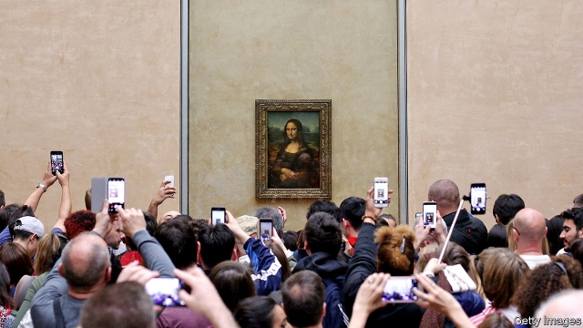

###### Art history

# Was Leonardo da Vinci a genius, or just our kind of guy? 

##### Contemporary reverence for da Vinci is more about our age than his oeuvre 

 

> Apr 17th 2019 

IN THE NORTHERN Italian city of Treviso, a Polish pianist, Slawomir Zubrzycki, sits down at an instrument that resembles a harpsichord and starts pumping a pedal with his right foot. As his hands float over the keyboard, the sound reaching his audience is as singular as it is beautiful: simultaneously reminiscent of the harpsichord, organ and a string quartet. The instrument is based on sketches Leonardo da Vinci made in his notebooks of a “viola organista” with the dream of simulating a viola ensemble that could be played from a keyboard. Hitting one or more keys brings the same number of strings inside the casing into contact with one of four bow-wheels spun by the pedal. 

Mr Zubrzycki’s concert, sponsored by the Benetton Foundation, was among the more unusual commemorations of the 500th anniversary of da Vinci’s death, which falls on May 2nd. It was also a reminder that, even in an age of polymaths, the breadth of the Tuscan master’s interests was exceptional. It encompassed not only painting, architecture, mathematics, engineering and numerous branches of science, but music too. “How many specialists would we need today to attempt Leonardo’s researches?” asks Martin Kemp, emeritus professor of the history of art at Oxford University. “At least 13. Maybe more.” 

In the Antico Setificio Fiorentino, Italy’s oldest working silk mill, Beatrice Fazzini turns by hand a vertical warper: a cylindrical machine that prepares yarn for weaving. It was constructed in 1786 and is based on a design by da Vinci that Stefano Ricci, the fashion house which owns the mill, says has been used in Florence since da Vinci was alive. If that is indeed so, it was one of his very few inventions that had a practical application. 

Like many an autodidact, da Vinci was long on inquisitiveness but short on intellectual self-discipline. He had astonishing powers of observation, an extraordinary talent for making connections between different areas of knowledge, a readiness to challenge contemporary beliefs and an uncanny ability to anticipate future discoveries. But his life yielded an endless succession of untested contraptions, unpublished studies and unfinished artworks. 

Anniversaries are normally opportunities for reappraising the legacy of the great man or woman concerned. Da Vinci’s highlights the fact that, outside the field of painting, his legacy—as distinct from his genius—was modest. He had brilliant intuitions in fields as diverse as anatomy and hydraulics, but because he failed to publish his theories and findings, hundreds of years were to pass before they were discovered by someone else. 

Even his artistic oeuvre, though sublime, is minute. Fewer than 20 finished works are generally attributed to da Vinci. He failed to complete some of his most important commissions such as the “Adoration of the Magi”. His ill-fated experimentation with materials ruined others, including “The Last Supper”. Hence the paucity of exhibitions devoted to his art in what should be his year of years. Florence is commemorating him with a show devoted to his master, Verrocchio. 

Born out of wedlock in 1452, the son of a notary and a peasant woman, da Vinci had a lonely childhood and—probably left-handed and almost certainly gay—grew up something of a misfit. He spent much of his life outside his native Tuscany in Milan, Rome and finally France as the guest of King Francis I. He died at Amboise in 1519. 

Such is the status he has acquired as the definitive, universal genius that the few questions raised in his quincentenary year are being put almost surreptitiously, as in a show at the Scuderie del Quirinale in Rome that largely comprises models based on da Vinci’s designs. It opens with a display of treatises and often exquisite drawings by other Tuscan artist-engineers, including Francesco di Giorgio Martini, that show da Vinci was far from unique in combining technology with painting—and that some of his peers managed to get a lot more built or printed than he did. 

Paradoxically, the most direct applications of da Vinci’s researches outside art are to be found within his art. His understanding of physics, botany and geology vastly enhanced his painting. His study of light enabled him to develop sfumato, the technique that gives the outlines of his subjects their naturally undefined quality. “And if he hadn’t studied anatomy, he wouldn’t have been able to paint the most enigmatic smile in the history of painting,” says Fiorenzo Galli, the director-general of the Museo Nazionale Scienza e Tecnologia Leonardo da Vinci in Milan. 

The “Mona Lisa” has become the world’s best-known painting. Da Vinci’s “Vitruvian Man” is the world’s best-known drawing. Does that make him the greatest artist in the Western tradition? Even Professor Kemp, who has spent a lifetime studying da Vinci’s achievements, hesitates to go that far, stressing instead the Tuscan master’s huge influence on other painters. 

“If you were looking for someone who did as much to divert the stream of art, then you would have to keep searching until you came to Picasso,” he says. Da Vinci revolutionised Madonna and Child compositions, and altered the portrayal of narrative subjects and the way portraits were composed. Jonathan Nelson, who teaches art history at Syracuse University in Florence, notes that he was also the first artist to give women realistic bodies “with anatomically identifiable musculatures, but looking soft and feminine”. 

The notion that da Vinci stands alongside Michelangelo and Raphael at the very pinnacle of artistic achievement is nonetheless relatively modern. Until well into the 19th century, he was seen as a genius, but on a level below the others. As Donald Sassoon, a British historian, has recounted in his book, “Becoming Mona Lisa”, published in 2001, it was anti-clerical French historians who initiated the “cult of Leonardo”, seeing in him an ally in the fight against religious obscurantism: “He was not afraid to dissect corpses; he did not paint halos on his religious figures…Unlike Raphael and Michelangelo, he was never the servant of popes. He put Man at the centre of creation.” 

Those and other factors have endeared him to a wider, contemporary public. Da Vinci abhorred the slaughter of animals and was probably a vegetarian. He satisfies the modern requirement for artists to be outsiders with an eccentric streak. And his creative record chimes perfectly with the spirit of an age that tolerates, even venerates, unfinished work—all the more so if it is cryptic. Surveying the events this year to celebrate da Vinci’s genius, Professor Nelson says “I think these shows tell us more about us than about him.” 

