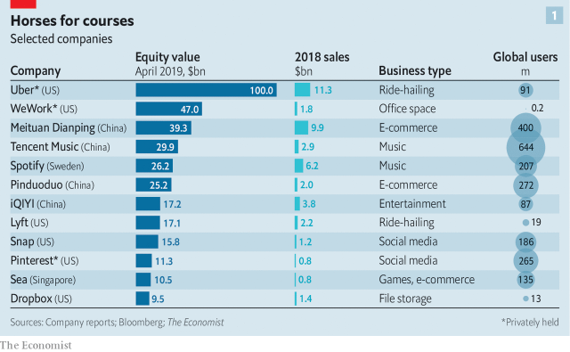
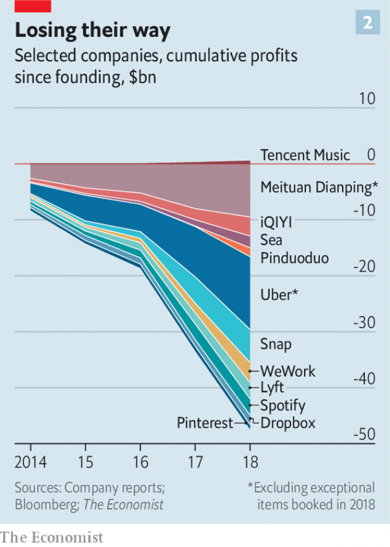
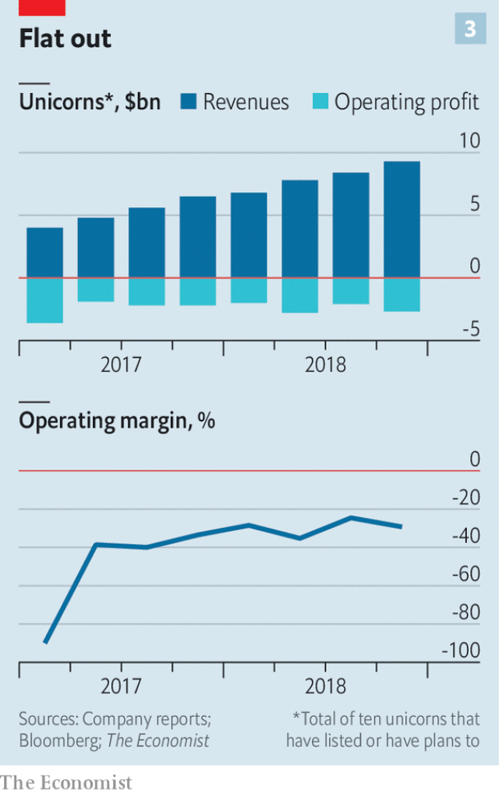

###### A stampede of mythical proportions

# The wave of unicorn IPOs reveals Silicon Valley’s groupthink 

##### There is more to life than blitzscaling 

 

> Apr 17th 2019 

IF YOU WANT to go unicorn spotting, take a turn around the brand-new park on top of San Francisco’s Transbay bus terminal. This is not because it is perched on a spectacular, undulating building that itself looks quite like a mythical beast (Moby-Dick, in this case) nor because its tastefully planted flora, all native to flower-power California, offer a particularly enticing equine habitat. It is just that, as a would-be icon of San Francisco’s business district, the park is conveniently placed for looking out on their corporate headquarters. 

There are 88 privately held startups worth more than $1bn each in the San Francisco Bay Area, more than in any other region in the world, and a fair few of them, including Slack, a corporate messaging service, and Instacart, a delivery firm, are hard by the Transbay terminal. You can’t quite see the headquarters of Lyft and Uber, two ride-hailing services, from its leafy roof, but were you to climb the swanky Millennium Tower next door you could. 

The hitch is that the park is currently inaccessible. Last September, just six weeks after it opened, cracks found in two steel beams forced the closure of the Transbay terminal’s crowning gardens as well as the rest of it. You can still climb the Millennium Tower—but you need to be aware that the city’s tallest residential building has developed an unwelcome departure from the perpendicular, something which is generating a prodigious amount of litigation and not a little mockery. 

Rather than damaging the emblematic purpose for which this sort of prestige architecture was conceived, such shortcomings enrich it. With buildings and businesses alike, everything looks shiny and new from a distance. The unicorns are exciting businesses from the same Silicon Valley stables as Alphabet (née Google), Apple and Facebook. Indeed, the production of unicorns has become the dominant part of what the Valley does. And an unprecedented number of the beasts have either just offered their shares to the world through initial public offerings (IPOs)—Lyft did so on March 29th—or are gearing up to do so, as Uber will on May 10th. It is not the only such cavalcade; a lot of Chinese unicorns are approaching IPOs too. Memories of the epic public debuts of Facebook and Google, and also of Alibaba, in China, make this a heady prospect for some investors. The American companies alone stand to raise up to $100bn, according to Kathleen Smith of Renaissance Capital, a fund-cum-research firm. 

But on closer inspection, there is trouble afoot. Look the market-bound herd of unicorns in the teeth and they are not as impressive as their myth might have you think. Some seem bred for show, not for work; not all of them are up to winning their races. These weaknesses are not just individual quirks; they are signs that the business culture which has tailored itself to churning out such beasts is beginning to suffer from its own structural flaws and lopsidedness. 

When Aileen Lee, the founder of Cowboy Ventures, an investment fund, gave the word “unicorn” its current connotation in 2013, she saw the term as betokening something both wonderful and rare. Back then, that made sense. In 2013 Ms Lee found just 38 unicorns in America. 

Today there are 156, and slightly more than that elsewhere, according to CB Insights, a data provider. There are three explanations for this population boom: an ideology that sees the rapid creation of companies with very large user bases as the best—possibly the only—business strategy available; an infrastructure that makes it ever easier to follow through on this belief; and a climate in which, until recently, there was not much pressure to take these new companies public. 

The ideological analysis is an odd combination of cornucopianism and constraints. First, the plenty. The Valley believes that “software is eating the world”, and that there is still a lot of the business world for it to eat. As atoms are replaced by bits—or, more prosaically, possessions and activities by convenient services ordered through screens—it becomes possible for industry after industry to be disrupted by startups. But the nature of the disruption means that in any given industry only a very limited number of startups can make good. Network effects, which make the value of the system grow more with each new user the more users it has, mean that the big get bigger while the small stay small, and that the quicker you can get bigger the biggerer you get. 

This does not necessarily mean monopoly; some sectors, such as ride-hailing, may support a big fish and a littler one. But it does mean that growing as large as possible as fast as possible—“blitzscaling”—becomes a paramount goal. As Reid Hoffman of Greylock Partners, a venture-capital firm, and the co-author of a book about blitzscaling, puts it: “In a connected world, someone will build an Amazon. The only question is who and how.” 

This analysis has changed the way that startups are born and bred. During the dotcom boom of the 1990s venture capital was decidedly artisanal. Entrepreneurs came up with an idea, made guesstimates to back it up and pitched it to venture capitalists. If they bought in, the startups would spend much of their multi-million-dollar jackpot on building their infrastructure before rushing to go public, hoping thereby to get their hands on the much larger amounts of money they needed to grow. 

After the debacle of the dotcom bust, things got more serious. As size became increasingly valued, ways to build it were developed. Today there is a “new regime of company formation”, according to Martin Kenney and John Zysman, of the University of California in Davis and Berkeley, respectively, the authors of a paper entitled “Unicorns, Cheshire Cats, and the New Dilemmas of Entrepreneurial Finance”. The design and manufacture of unicorns has become industrialised, and many of the ingredients needed are available on tap as online services. Smartphones let the companies distribute what they offer at home and abroad, social media let them market it and cloud computing lets them ramp up as demand grows. 

Yet while the production of unicorns gathered pace and slickness, their disposal did not keep up. The rate at which venture-backed companies move on to the public markets has slowed. In 2013 the average age of a venture-backed American company putting on an IPO was seven years. By 2018 it had grown to ten. 

One reason for this was regulation. After the dotcom bubble burst, new rules intended to protect investors, particularly the Sarbanes-Oxley Act, made going public much more burdensome. The JOBS Act of 2012 subsequently increased the number of shareholders beyond which startups must disclose financial information from 500 to 2,000, excluding holders of stock options. That made it easier to stay private longer. 

And there was no significant shortage of private capital willing, indeed eager, to help with that. A dearth of interesting alternative investments and endemic fear of missing out saw institutional investors, often from hedge and sovereign-wealth funds, eager to join in ever larger rounds of financing. As Randy Komisar, a venture capitalist at Kleiner Perkins, puts it: “Silicon Valley’s lust for scaling...is more a result of the desires of capital than the needs of innovation.” Last year investors financed more than 120 rounds of more than $100m, CB Insights says. 

At last, though, according to Barrett Daniels, an IPO expert at Deloitte, an auditing and consulting firm, a number of factors have come together to bring this period of reticence to an end. A lot of venture-capital funds were started around 2010, and they mostly have a ten-year term; investors want to cash out. A number of public listings last year showed that public markets have a big appetite for tech shares. And the window of opportunity may soon close; a global downturn would both limit investors’ appetite and severely test some of the unicorns’ business models. 

Much the same might happen if a number of IPOs failed to live up to their hype. So again the incentives are to go big and go quick. The move to the exits is not quite a stampede, but it is a pretty concerted group trot, even a canter. As many as 235 venture-backed American firms have plans to go public this year, says Ms Smith. 

To get a sense of the going, The Economist has examined a panel of a dozen former and current internet-focused unicorns in Silicon Valley and elsewhere (see chart 1). It is not a random sample, being weighted towards both prominence and accessible data. But it includes most of the larger prospects and covers a range of industries. Uber and Lyft are in transport, Spotify in music-streaming, WeWork in real estate, Meituan and Pinduoduo in Chinese e-commerce. Six are American, five Asian and one European. Like unicorns at large, they are on average ten years old. 

 

These firms are looking at a combined valuation of more than a third of a trillion dollars—roughly, as it happens, the same as that which resulted from the IPOs of Alibaba (2014), Facebook (2012) and Google (2004). Those IPOs, which led to the creation of over a trillion dollars of value, were among the most successful ever and have been burned into the memory of fund managers. If you owned those shares you outperformed; if you didn’t you risked being fired. 

The current herd all seek to suggest that they offer the same sort of opportunity as that illustrious trinity: vast potential markets; limited physical plant and staff; high margins; imposing barriers to entry. They lay stress on their user numbers—2bn of them in all, though not all are frequent customers or paying ones. They claim that the areas they work in are but a subset of the markets they can hope to dominate. Uber and Lyft say that the entire transport industry is their hunting ground, rather than the modest taxi trade; Airbnb is looking at lodging of all sorts. They also point to strong revenue growth of 44% for the median firm in the past quarter compared with the year before. Overheads are scant. They have just $6bn of fixed assets between them, and not many staff. 

But what they also lack, in 11 cases out of 12, are profits. Today, according to Jay Ritter of the University of Florida, 84% of companies pursuing IPOs have no profits. That is remarkably high. Ten years ago, the proportion was just 33%. To see profitlessness as rampant as today’s you have to go back to the peak of the dotcom boom in 2000. 

 

Back then the promise (one soon and spectacularly broken) was that profits would follow once the companies grew. This time round, though, the profit-free companies have already grown. Indeed our panel has burned through $47bn doing so (see chart 2); its companies got through $14bn in 2018 alone. This is profligate even by the standards of Amazon, which before and after its IPO was seen as a particularly profit-averse company; it had cumulative losses of $3bn between 1995 and 2002. Uber lost almost $4bn just last year, excluding exceptional items. 

If all this dearly bought growth has not supplied profits, what will? The unicorns have three answers: yet more growth; more spending by existing customers; and higher margins. The first is not necessarily that plausible. Among the companies in our panel that disclosed the number of customers they have in America, growth slowed to 9% last year. Though priding themselves on their overall user numbers, the firms in our panel are reluctant to reveal details of customer churn—how often customers switch to rival firms or switch off completely. 

 

What is more, few of the firms sit behind barriers to entry as strong as those that protected Alibaba, Facebook and Google. They can lose customers as well as gain them. Lots of property companies can rent out office space, as WeWork does. Spotify customers can get music from Apple, too. Drivers often toggle between Lyft and Uber apps; so do passengers. There are already several big Chinese e-commerce firms to choose from. 

To counter this concern the companies ask investors to consider “cohort analysis”, which separates out customers by vintage. Lyft says that customers who first used its service in 2015 took 2.7 times as many rides last year as they did back then. WeWork says that in its “mature” offices the revenue for each desk that it rents out is 50% higher than in other locations. The firms also argue that they can sell new stuff both to existing customers and new ones. Perhaps the best-known such strategy is Uber now offering food deliveries through Uber Eats, but the other 11 are expanding their suite of services, too. This, though, reveals something of a tension. If these firms can move on to other people’s turf, can they be sure that their own turf is as well protected as they would like investors to think? Plenty of firms are keen to offer people a diverse range of services through their phones, including Walmart, JPMorgan Chase, Apple, Amazon and Netflix in America and Alibaba and Tencent in China. 

 

The third line of defence is “operating leverage”: economies of scale will kick in, allowing their margins to soar. This is plausible, but there is little evidence as yet that it is true. For a subset of ten firms for which quarterly data are available, total sales have doubled since mid-2017, which is impressive; but there has been no obvious improvement in operating margins, which were around minus 30% both in aggregate and for the median firm (see chart 3). Contrary to the sales-pitch, some of these firms face high variable costs. Insurance costs for the ride-hailing firms are rising sharply as they provide more trips. 

None of this necessarily means they are bad businesses. But it does make them look like very pricey ones. All told, the IPO valuations the companies in our panel have received or are apparently looking for add up to $350bn. Based on a discounted cashflow model, in aggregate the dozen firms will need to increase their sales by a compound annual rate of 49% for ten years to justify that valuation. That is the same as the average growth of Amazon, Alphabet and Facebook in the decades after their IPOs. In other words, these firms have to be as likely to outperform the very best of the previous crop as to underperform them. 

But that is not enough. Justifying the valuation means not just staggering increases in sales, but also a very large improvement in margins. In aggregate these would have to increase by 34 percentage points. That would be truly unprecedented. The average for Amazon, Facebook and Google was only 19 percentage points. 

It is no secret why the valuations are high. The logic of the unicorn-building business requires it. Firms need not only to get big but also to be seen to be getting big; winning unicorn status and continuing to grow quickly thereafter is important for branding and attracting top talent. Thus every investment round is engineered to create a higher valuation than the previous one; the alternative, a “down round”, is seen as a dismal sign. To ensure that the only way is up, investors coming in at later stages get privileges over earlier ones, such as guaranteed returns. This means that their shares are worth more than those issued earlier. 

The valuation figure generated by an investment round assumes that all the shares are worth the same as the shares just issued. If you take into account the fact that this is not the case, and that earlier shares are in fact less valuable, it is possible to calculate the degree to which such values are overstated. According to Ilya Strebulaev, who teaches at the Stanford University business school, such calculations show the average unicorn to be overvalued by about 60%. 

Overvaluation does not mean that the coming spate of IPOs will not go ahead, or that they will not raise money. But it does suggest some rough times ahead. Some unicorns have already floated for less than they were previously said to be worth. Pinterest was privately valued at $12bn but is expected to go public at about $11bn. Others have seen the pop they got at their IPO swiftly dissipate. When Lyft went public its share price popped 8.7% on the first day of trading, giving it a market capitalisation of $22.4bn. But many got out of the stock, and short sellers piled in. Lyft’s capitalisation is now $16bn, and its shares are now well below their price at the IPO. 

That bumpy ride may be an exception. Lyft has threatened to sue Morgan Stanley, an investment bank, for offering a short-selling product to pre-IPO investors who are usually bound by agreements not to sell their shares for some time, typically six months (the bank denies the allegations). But if Lyft’s rollercoaster turns out to be the rule, unicorns could become a much less attractive investment and the flow of capital into Silicon Valley could slow. 

This all suggests that the Valley would be wise to come up with an alternative to blitzscale-and-hope as a strategy. So far, it has not. “I don’t like the model of growth at almost all costs, but I don’t see the end of it yet,” says Mr Komisar. Instead, investors are fine-tuning the unicorn-making machine. Funds will continue to professionalise by using more data and even automated algorithms to make investment decisions, predicts Mike Volpi of Index Ventures. Some venture capitalists are thinking about ways that they might do away with the IPO entirely. “Firms are getting so big that they no longer can go public,” says Mike Moritz of Sequoia Capital, which has put money into 20 unicorns. “What you need is four to five like-minded investors with a time horizon of 20 years.” 

A more fundamental threat to the model is the possibility that barriers to entry and the benefits of size are both getting harder to acquire and offering less value to their possessors. The tech industry has benefited from a legal exceptionalism, particularly when offering services to consumers. The existing giants took full advantage of Western governments’ haplessness. They successfully lobbied to avoid being held responsible for the content produced by their users, or restricted from doing what they pleased with personal data, or bothered by pesky antitrust laws. Regulators were often overpowered by blitzscaling startups, rushing for size. 

Now the world is undergoing what could be called the “great pivot”, in reference to the about-face startups perform when they see that their original idea does not work. Politically, the dark sides of some online services—disinformation campaigns, data leaks, monopolistic behaviour and so on—are getting harder to ignore. Regulators have started pushing back. The effects of Europe’s strict new privacy law, the General Data Protection Regulation, are being felt around the world. Britain, a bellwether in online regulation, is considering both sweeping new regulations of online content and stricter antitrust laws. The advantages and perquisites of unregulated size are under challenge; so are the routes by which it can be attained. 

Beyond this there appears to be a growing concern that the innovation produced by some unicorns does not leave society better off. Whether the benefits of being able to run more and more of one’s life through screens outweigh the costs remains an open question, argues Dan Breznitz of the University of Toronto. There are real benefits. But critics point to real downsides, too. Increased congestion and other environmental costs, a weakening of public transport systems, the precarious lives of the workers who make these platforms function and a more friable body politic. 

The wave of IPOs is unlikely to reverse these trends. Indeed it may exacerbate them, especially if the firms do less than spectacularly. Google almost quadrupled in value in the year after floating, which bought tech a lot of diffuse goodwill. No one expects Uber to do that. If today’s unicorns turn out to have created most of their value for private investors before floating, the public will take note. 

 

How should Silicon Valley react? Tim O’Reilly, a publisher who serves as one of the industry’s intellectual leaders, argues that it needs a deep rethink. “The pursuit of monopoly has led Silicon Valley astray,” he recently told the readers of Quartz, a website. “The goal for Lyft and Uber—and for all of the entrepreneurs being urged to blitzscale—should be to make their companies more sustainable, not just more explosive.” But if the logic of the sort of technologies the Valley develops is indeed inherently monopolistic, game theory suggests that that may be hard to do. What value is there in a sustainable business model that gets outcompeted by a blitzscaler? 

Again the park on top of the Transbay terminal is an apt metaphor. It is lovely and airy; but it is hemmed in by corporate buildings whose workers enjoy an ease of access to its flowers and fountains denied to hoi polloi. It is a walled garden, even if it has some gates. Meanwhile the terminal on which it sits is still a decade away from becoming the transport hub it is meant to be. Things that are gleaming and shiny and particularly nice for the better connected are not bad in themselves, even when they are hyped. But they are hardly the be-all and end-all of human innovation, inspiration and aspiration. 

