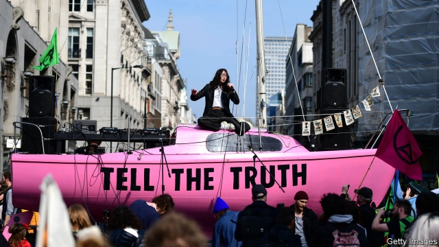

###### Climate protests heat up

# Could Extinction Rebellion be the next Occupy movement? 

##### How to get arrested and influence people 

 

> Apr 17th 2019 

IN FRONT OF a bright pink sailing boat emblazoned with the words “tell the truth”, an elderly man in red trousers is telling his. He urges the crowd assembled in the centre of Oxford Circus to use their anger about climate change, but not to allow it to put off others. “If we’re abusive to people that’s not helpful,” he warns, before proceeding to invoke Martin Luther King and Gandhi. He then loses his train of thought. “I’ve forgotten where I was. I’ll pause and invite you to do the same and breathe.” 

The climate protests, which began on April 15th in 80 cities across 33 countries, may look familiar, but they have a steely core. Extinction Rebellion, the group organising them, was set up in October last year after 94 academics wrote to the Guardian newspaper, calling for action. Founded by British activists, it has three goals: get governments to declare a “climate emergency”; reduce net greenhouse gas emissions to zero by 2025; and make the government create citizens’ assemblies to set climate priorities, bypassing the short-termism of parliamentary democracy. 

Plenty of protest movements have lofty aims, but Extinction Rebellion has an unusual knack for organisation. In its first six months it has secured high-profile support, including from a former archbishop of Canterbury, and lots of attention. It boasts around 150 chapters in Britain, from Penwith in Cornwall to Inverness in Scotland. Swarming protests have closed roads, a “die-in” was staged in a shopping centre and naked protesters interrupted a debate in the House of Commons. Demonstrators eschew violence, but are willing—indeed, eager—to be arrested for civil disobedience. 

The attention this generates can be converted into more activists. Loz, a teacher taking advantage of the Easter holidays to hand out leaflets, says this is her first environmental protest. She was inspired by an Extinction Rebellion event in Bristol, where she now attends weekly meetings. In a tent next to the pink boat, earnest young men explain to passers-by how rigorous academic study of protests has shown that, to bring about change, at least 3.5% of the population must be mobilised. 

Extinction Rebellion presents climate change as a moral, not political, cause but tries to avoid being preachy. As one flag states, “We live in a toxic system but no one individual is to blame.” Yet its plan to target the Tube on April 17th risked annoying commuters (and persuading them to use their cars instead). Transport authorities switched off the free Wi-Fi on the Underground in a bid to disrupt the protests. 

Others are put off by the tactic of using arrests to generate publicity. Lots of anti-fracking protesters were locked up without drawing much public sympathy, they point out. Still, there are plenty of volunteers in London. By the end of the second day, 290 people had been arrested in the capital. Organisers will be hoping that translates into lots more activists for the next round of protests. 

