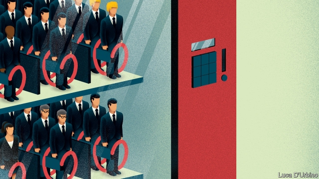

###### Conservative succession

# How to become the next prime minister 

##### The next Conservative leader must clear three tricky hurdles before they end up in Downing Street 

 

> Apr 17th 2019 

ADVISERS HAVE been hired, funds raised and sweeping speeches made. The Daily Telegraph, the house journal of Conservatism, features a buffet of op-eds by ambitious Tory MPs. Theresa May might still be resident in 10 Downing Street, but the race to replace her has already begun. 

Sajid Javid, the home secretary, is being advised by a former Vote Leave executive and has taken to giving speeches nodding to his gritty upbringing. Boris Johnson has declared a wish to reunite Britain via a “proper Brexit” and has scooped up nearly £140,000 ($183,000) in donations since late last year. Jeremy Hunt, meanwhile, insists that he is simply getting on with being foreign secretary, even as reports circulate that he has up to 100 MPs willing to support him should he stand. 

There are three hurdles to be cleared before an MP can send the moving vans to Downing Street. The first involves getting rid of Mrs May, which could prove hard. The second consists of winning support among Tory MPs, who are split over both Brexit and the future of the party. The third and final test is a ballot of all 120,000 Conservative members, who—in a constitutional novelty—would have the final say on who became the next prime minister. 

For now, Conservative MPs resemble family members squabbling over a will before the sick relative has died. After winning a party confidence vote last December, Mrs May has a 12-month grace period in which she cannot be challenged again. If she refuses to resign, plotting Tories will have to resort to unorthodox means. 

 

They could change the party’s rules to allow another leadership challenge, according to former heads of the 1922 Committee, the organisation of backbench Conservative MPs which decides these things. Activists are mulling a confidence vote of their own, after scouring the party’s rule book. Another option is a cabinet coup. Government would grind to a halt if cabinet ministers simply told Mrs May it was time to go. A final option would involve Tory MPs refusing to back the government in a confidence motion, pledging to support the party only if Mrs May quit. 

Only when there is a formal vacancy can the contest’s next stage start. Wannabe Tory leaders must secure the support of their fellow MPs. Already they are drawing up spreadsheets of the parliamentary party, scoping out who will back whom. All the campaigns boast of an embryonic whipping operation to woo supporters. 

In their would-be leaders, Tory MPs face a choice between competence and electability. Mr Hunt won a reputation as an efficient technocrat while running the health department for six years. He has been mostly sure-footed as foreign secretary. Mr Javid, meanwhile, has handled a tricky brief at the Home Office well. Michael Gove’s impressive record as environment secretary is offset by a reputation for treachery, earned when he kiboshed Mr Johnson’s attempt on Downing Street in 2016. “People have not forgotten him stabbing his colleague in the front,” says one MP. By contrast, Mr Johnson proved alarmingly inept as foreign secretary and chickened out of running in 2016 after losing Mr Gove’s support. 

Yet Mr Johnson’s incompetence is balanced by his perceived electability. His leading role in Brexit has made him less popular and more divisive. But he is still the Conservatives’ most recognisable figure and best campaigner. If the Brexit Party, Nigel Farage’s new political outfit, blows a hole in the Tories at the European elections next month, MPs may swallow their concerns about Mr Johnson’s character. Keeping Jeremy Corbyn out of government (and keeping hold of their own seats) is what they want more than anything else. 

The assumption is that an establishment (reformed Remainer) candidate will face off against an insurgent (Brexiteer) in the final ballot of Tory party activists. Cabinet ministers who backed Remain, such as Mr Javid and Mr Hunt, suffer from original sin in the eyes of the Conservative Party’s Brexit-supporting membership. They are competing with hardline Leavers such as Dominic Raab, a former Brexit secretary who has an established group of advisers and MPs banging his drum. The party has already tried a Remainer-turned-Leaver in Mrs May, warns one MP, and will be reluctant to do it again. 

Conservative activists may look beyond Brexit. They opted for a young, untested David Cameron over the more familiar charms of David Davis in 2005. Even so, Mr Hunt and Mr Javid have both felt it necessary to become enthusiastic born-again Brexiteers. Mr Hunt absurdly compared the EU to the Soviet Union in a speech last year. Mr Javid, meanwhile, insists that a no-deal Brexit is a viable option. 

Having a full-blooded Brexiteer is no guarantee of full-blooded Brexit. With enough chutzpah, a hardliner might even be the person most able to pursue a compromise—a “Nixon goes to China” strategy, as one Conservative MP puts it. The new prime minister is likely to call an election to firm up their mandate for the next stage of the Brexit talks, party insiders believe. Mr Raab’s allies play down the idea, perhaps hoping to win support from MPs who fear facing the voters again. Yet many others accept that a poll may be necessary sooner than the scheduled vote in 2022. 

Any new resident of Downing Street will face the same problems as its current tenant: a lack of votes in the House of Commons, Brexit negotiations that will leave swathes of voters dissatisfied, and a divided party approaching a decade in power. The Conservatives’ woes go well beyond Mrs May. Her successor will find that out sooner rather than later. 

