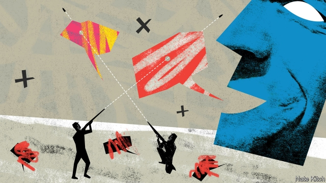

###### Bagehot

# Sir Roger Scruton and the public square 

##### Everybody suffers when controversial thinkers are driven from public life 

 

> Apr 17th 2019 

SIR ROGER SCRUTON is once again at the centre of a firestorm. The philosopher recently gave an interview to the deputy editor of the New Statesman, George Eaton, in which he ranged over numerous subjects on the assumption that, as a former wine critic for the magazine, he was on friendly turf. Mr Eaton published some of the “highlights” of the interview on Twitter, chosen, and indeed edited, to make them look as outrageous as possible. A Twitter storm ensued. The government sacked Sir Roger from his position as head of an architectural commission. Mr Eaton celebrated, posting a picture of himself swigging from a bottle of champagne, while conservatives raged about a giant brought down by pygmies. 

The Scruton case is more complicated than some conservatives imagine. They are right that Sir Roger is one of Britain’s leading public intellectuals, and that his books on aesthetics make him eminently qualified to head the government’s “Building Better, Building Beautiful” commission. They are also right that Mr Eaton behaved shoddily in twisting some of the philosopher’s words. In a tweet, he quoted Sir Roger’s comment that “each Chinese person is a kind of replica of the next one” without acknowledging that this was part of a criticism of Chinese government policy. (Mr Eaton stands by his article but has apologised for his behaviour on social media.) But Sir Roger is no saint. He is an inveterate provocateur who failed to recognise that, when you accept a public appointment, you have to be willing to bite your tongue. In his interview with Mr Eaton he made some worrying remarks about George Soros’s “empire” and about “huge tribes of Muslims” invading Hungary, which echo things he has said before. 

Sir Roger is not the only person in public life who says silly things. David Lammy has recently made a fool of himself by comparing Brexiteers to the Nazis, but he is nevertheless, in general, an excellent parliamentarian. As a rule the health of public life depends on a willingness to recognise people’s talents and forgive their foibles. But the British have taken to doing the opposite. Indeed, the public square is increasingly patrolled by thought police who unleash the dogs of outrage if you dare to step out of line. Lord Adonis has repeatedly called for Andrew Neil, the BBC’s most forensic interviewer, to be sacked because he supports Brexit. Oxford students have demanded that John Finnis, one of the world’s most distinguished legal scholars, should be silenced for the sin of opposing gay marriage. Oxford dons have cold-shouldered Nigel Biggar, a theologian, for holding a series of seminars on the ethics of imperialism that question the assumption that empire is always a bad thing. Cambridge University rescinded its offer of a visiting fellowship for Jordan Peterson, a Canadian psychologist, under pressure from students. 

Though the situation in Britain is not as bad as in America, where the public square is piled high with the bodies of the disgraced, it is heading that way. Brexit has divided the country into warring tribes who loathe each other. The combination of the rise of populism and the rise of identity politics is poisonous: identity politics encourages people to confuse criticism of their arguments with criticism of their person, and populism encourages them to trample over the rights of minorities. Twitter is an almost perfect outrage machine because it encourages loudmouths to comment on almost everything in 280 characters. 

The self-reinforcing outrage cycle is in danger of driving talented people from public life. Why should a young person contemplate a life in the public eye when a provocative argument or off-colour joke could end their career? There is a danger that the only people who are prepared to go into public life will be a weird collection of ideologues who are willing to sacrifice everything for the cause, provocateurs who make a living out of outrage, and bland functionaries who have nothing interesting to say. 

How can Britain’s public square be saved from ongoing destruction? It is not enough just to push back hard when you are confronted with an outraged mob. That risks handing the initiative to the mob and making yourself look foolish whenever the mob happens to have a kernel of truth in its complaints. Rather, it is important to act on the basis of principles. 

The most important one is that free speech is the core of a liberal society. The right to express a reasoned opinion should trump the right, for example, not to be offended. The right to free speech does not include the right to call for violence: Gerard Batten, the head of the UK Independence Party, put himself beyond the pale when he defended a tweet by one of his candidates about raping a Labour MP as “satire”. But it includes the right to express vigorous opinions on controversial subjects, such as whether Islam holds up economic growth or whether Israel is an imperial power. 

The second principle is that both sides of the political divide should be held to the same standards. This is particularly important in universities, where the people in charge of educating the next generation lean strongly to the left. The hounding of conservative intellectuals not only deprives students of the chance to hear a range of opinions. It also deprives liberals of the bracing discipline of having to argue with people from alternative intellectual traditions. The third principle is to beware pressure groups demanding a veto on what can be said in the public square. It often turns out that those behind the cries for no-platforming speakers are a sliver of a minority who represent no one but themselves. 

Liberal democracy is in essence government by discussion. If people are reluctant to engage in public discussion because they worry that they will be subjected to a howling mob then eventually liberal democracy dies. Public bodies, especially universities, need to do their utmost to defend the rights of contrarian thinkers, even if, as in the case of Sir Roger, those contrarian thinkers sometimes go too far. 

