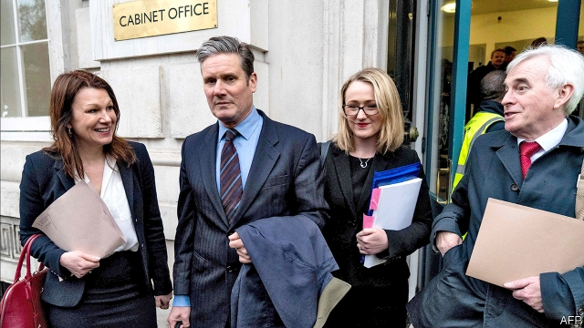

###### Hard bargaining

# The chances of a Brexit deal between Labour and Tories seem small 

##### The differences between the two parties are not wide. The real obstacle to a deal is political 

 

> Apr 20th 2019 

EVEN AS HE announced a Brexit extension from April 12th to October 31st, Donald Tusk, president of the European Council, seemed anxious. “Please do not waste this time,” he begged. As if to justify his concern, MPs in Westminster promptly went on a fortnight’s holiday. 

In truth, they needed a rest after weeks of late-night debates and votes. And it is not as if nothing is happening. Theresa May’s government and Jeremy Corbyn’s Labour opposition are meeting, and have even set up working groups on such issues as workers’ rights, the environment and security. Both sides have called the talks constructive. They could even produce a deal. 

After all, the differences between the two are not wide. Both want trade to be as frictionless as possible, a close alignment with most EU rules and no hard border in Ireland. Neither backs a no-deal Brexit. Labour accepts the current withdrawal agreement, including the Irish backstop to avert a hard border. Its objection to the political declaration on future relations is that it wants to add a permanent customs union. 

This technical issue creates much political misunderstanding. The Irish backstop in effect includes a customs union for the whole United Kingdom, yet Mrs May insists that it is merely a customs “arrangement” and says a permanent customs union would cross her red lines. Mr Corbyn has echoed Brexiteers’ objections to Britain being stuck in the backstop, even though he favours a customs union. He wants to add a right to be at the table in future EU trade talks that Brussels will not concede. 

Opponents of a customs union seem just as confused. Many say it means being a rule-taker and unable to strike trade deals. Yet a customs union does not imply automatic acceptance of single-market rules. Being in a customs union may indeed make it impossible to do independent trade deals for goods. But Sam Lowe of the Centre for European Reform, a think-tank, notes that this does not preclude deals on services, public procurement or immigration visas, even if it makes them harder. 

The real obstacle to any cross-party deal is political. Because of her lost authority in her party Mrs May cannot be seen to rub out any of her red lines. Any serious concessions to Labour would cost her even more support among Brexiteers and could lead to her being ousted. For his part Mr Corbyn has no wish to be tarred with helping to facilitate a Tory Brexit. And although he is under pressure from his party to demand another referendum, he sees Brexit as a lower priority than getting the Tories out in order to build a socialist Britain. 

It is hard to avoid concluding that, even if agreement were possible in theory, it will not be reached in practice. Mrs May will then have to resort to her fallback, another round of parliamentary votes on different options, probably including her own deal. This time she promises to structure the votes to produce a majority for at least one of them. But it is not clear this will work. 

What it will do is use up more of Mr Tusk’s extra time. And against the wishes of both main parties, that means Britain seems certain to take part in European elections on May 23rd (see article). That vote promises to be the next crunch point in the unending Brexit story. 

