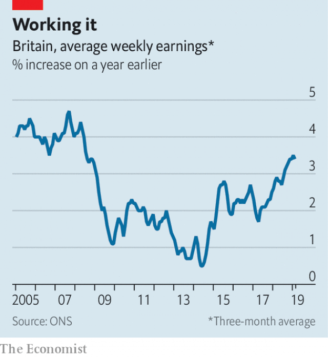

###### Take it or leave it

# Why British wage growth is picking up at last 

##### A tight labour market, better jobs and higher productivity are rewarding workers at last 

 

> Apr 17th 2019 

PERHAPS NO OTHER factor better explains why so many Britons want radical change, from voting for Brexit to backing Jeremy Corbyn’s far-left Labour Party. Since the financial crisis of 2008-09 Britain’s wage growth has been dreadful. Adjusting for inflation, wages fell from 2007 to 2017, a worse performance than in any other OECD country except Mexico or Greece. At last, however, the tables are turning. Data released on April 16th show that nominal pay is growing at about 3.5% a year (see chart), or 1.5% a year in real terms. Can this growth continue to accelerate? 

The obvious cause of strengthening pay is the tight labour market. When unemployment hit its post-crisis high of 8.5% in 2011, employers knew that they could get away with offering meagre or no pay rises. Workers’ bargaining power has since grown, as joblessness has fallen. Unemployment is just 3.9%, the lowest in four decades. Britain has about three vacancies for each 100 employee jobs, the highest ratio since the data began in 2001, meaning bosses have to try harder to fill posts. Nominal pay in the hospitality sector, which has a particularly high number of job postings, is growing at 5% a year. 

 

A hot jobs market is not the only cause of rising average pay. Another relates to the mix of jobs in the economy. Following the financial crisis, posts in low-productivity, low-paying sectors such as agriculture proliferated. Having more poorly paid positions dragged down the average. Yet lately Britain has created relatively more high-paying jobs. Strawberry-pickers have made way for stock-pickers. In the year to September 2018 the changing composition of the workforce boosted average nominal wage growth by 0.5 percentage points. 

Stronger pay may also owe something to rising productivity. How much workers produce ultimately determines how much they earn. After stagnating in 2007-14, more recently output per hour has grown by about 1% a year in real terms. Silvana Tenreyro of the Bank of England has floated the idea that some of these gains might not have yet shown up in the statistics. 

The question is whether wage growth will accelerate further. Workers will hope that it does: at its current rate real pay will not return to its pre-crisis peak until 2022. Yet few economists believe Britain will soon resume the healthy productivity growth of the post-war period, which was consistent with real-terms pay rises of some 3% a year. Most economic forecasts have productivity growing at an annual rate of about 1% this year and next. 

Already there are signs that firms are struggling to afford the modest pay settlements that their workers are demanding. The cost of staffing per unit of output, a measure of domestically generated inflation, grew by 1.7% in 2017 but by 2.7% last year. To absorb these extra costs some firms are accepting lower profits. Other firms are passing them on to customers, stoking consumer-price inflation, which hovers around the Bank of England’s target of 2%. 

For now there is little need for the bank to raise interest rates, which would bring down inflation. Uncertainty over Brexit, which is likely to continue until October and perhaps beyond, argues in favour of holding fire. Yet the difficult truth is that Britain’s current rate of wage growth, modest by historical standards, is about as high as it can go without pushing inflation above target. It will be some time before Britons’ pay squeeze is truly over. 

