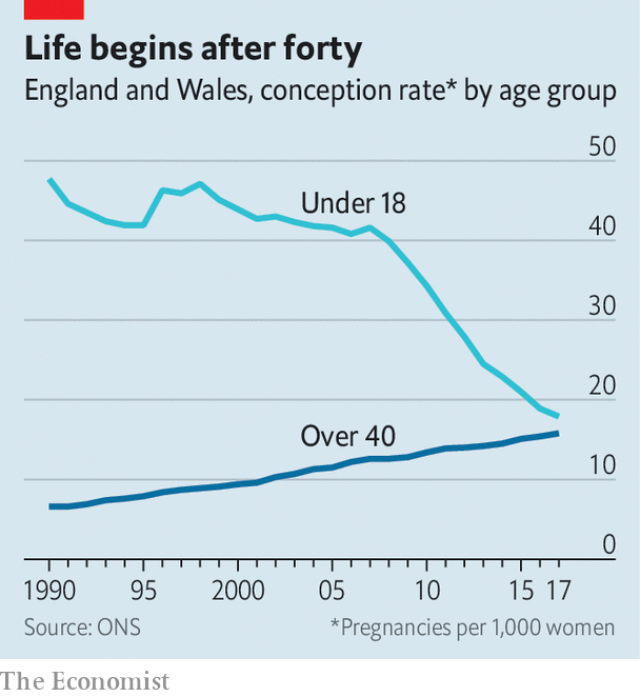

###### Maybe later, baby

# Why the middle-aged are replacing teenagers in maternity wards 

##### The conception rate is rising for women over 40, even as it crashes among under-18s 

 

> Apr 17th 2019 

IN HER 20S, Claire Fenelon was much too busy to have children. After going to university as a mature student, she spent a year in Australia then a few months in France, picking up the language. “I didn’t want to feel I was missing out,” she says. But by the time she was ready to settle down, she struggled to find the right man. At 39, she froze her eggs. Eight years later and still lacking a partner, she decided to “go solo”, giving birth to a son with the help of a sperm donor. “I was desperate to have kids,” she says. “But I didn’t want to have them with the wrong person.” 

Ms Fenelon belongs to a growing cohort of middle-aged women on maternity wards. As in other rich countries, the fertility rate in England and Wales is dwindling. But among women aged 40 and over the conception rate is rising. It jumped by 2.6% in 2017 and has more than doubled since 1990, according to statistics published on April 15th. Meanwhile, at the other end of the age spectrum, an even starker change is afoot. The official figures chart the tenth consecutive annual fall in the rate of teenage pregnancies. Since 2007 the conception rate for 15- to 17-year-old girls has dived by 57%. The conception rates of the youngest and oldest mothers are now close to converging (see chart). Middle-aged maternity may soon be more common than teenage pregnancy. 

 

Advances in health care help to explain the convergence. Although assisted conception accounts for only a small proportion of pregnancies, it is growing more popular and more successful. Between 1991 and 2016, birth rates from in vitro fertilisation treatment increased by more than 85%. In 2016 more than 20,000 babies were born following IVF (out of a total of 696,000 births that year). About three-fifths of women who use it are 35 or over. Demand is likely to increase as women learn of others whose treatment has been successful. Ms Fenelon was inspired by a magazine article about egg-freezing. 

The Labour governments of 1997-2010 pioneered a public-health strategy to curb rates of teen pregnancy. Nurses manned separate sexual-health clinics for young people, so teenagers did not run the risk of bumping into their parents at family planning centres. Careers advisers were trained to offer health advice as well as tips about jobs, and social workers and foster carers were encouraged to identify those most at risk of an early pregnancy and talk to them about relationships. Doctors were taught how to insert long-acting reversible contraception, such as implants, which are less prone to human error than condoms or the Pill. A study published in the Lancet, a medical journal, in 2016 concluded that the strategy had “probably contributed” to the falling under-18 conception rate. 

But government intervention in England cannot explain why the teenage-pregnancy rate began to fall at roughly the same time in Scotland, which was not covered by the strategy, and also dipped elsewhere in Europe, points out Peter Craig of Glasgow University. And since many women who give birth in their 40s do not rely on assisted conception, social factors must also have played a part. “The best form of contraception is aspiration,” says Penelope Law, a gynaecologist. Women in their teens and 20s are much more likely than in previous generations to prioritise education and work over starting a family. 

Studies have found that female educational enrolment is strongly associated with delaying cohabitation, marriage and childbirth. In the ten years from 2006, the female higher-education participation rate rose by ten percentage points in England, to 56%. In a survey of women at a family planning clinic in Scotland, a third of those who wanted children cited not being at the right stage in their career or concerns that having children would affect success at work as a reason why they had not yet had a child. Many more said they were “enjoying life as it is” or attributed the delay to issues with their current relationship. 

Yet the national convergence masks persistent regional divides. The over-40s’ conception rate in London is more than double that in the North East, which has a far higher rate of teenage pregnancy than the capital. In Middlesbrough, a northern town, the rate of teenage conception is 145% above the national average, and ticking up. If opportunities are not spread more evenly across the country, northerners may be left holding the baby. 

