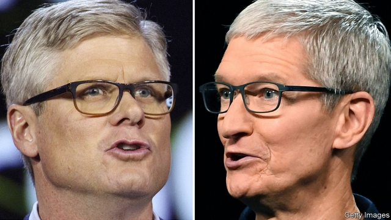

###### Suing for peace

# Apple and Qualcomm settle a feud over patents 

##### The agreement ends perhaps the most epic intellectual-property battle ever between technology titans 

 

> Apr 17th 2019 

THE COURTROOM battle in San Diego was supposed to last for weeks, if not months. It was over on the first day, April 16th. Evan Chesler, a lawyer for Qualcomm, a big chip designer, had only a few minutes left in his riposte to Ruffin Cordell, who represented Apple, a hardware giant, when it emerged that the two firms had agreed to a settlement. This included a one-off payment from Apple to Qualcomm and the decision to “dismiss all litigation between the two companies worldwide”. After a brief conference with the lawyers, the judge called off the trial and sent the jurors home. 

Thus ended what was perhaps the most epic fight ever over intellectual property and royalty payments between two technology titans. It began more than two years ago, spanned the world and could have seen Qualcomm pay billions in damages. More important, the settlement creates a new balance of power among big players in the industry as it gears up to install “fifth generation” (5G) mobile technology, which is supposed to carpet the world with a dense wireless fabric. 

The fight began in January 2017 when Apple sued Qualcomm in California and China, demanding more than $1bn in damages. The iPhone-maker was unhappy about how Qualcomm charges for its patents, many of which are needed to build a mobile phone. Instead of demanding royalties from component-makers, Qualcomm collects them from device-makers, as a percentage of the retail price, typically 5%. The manufacturers have no choice but to pay because most also rely on Qualcomm’s “baseband processors”, the chips that manage a device’s wireless connection. This, Apple argued, is an abuse of market power and a tax on innovation, because it is in effect levied on all new features, such as a better camera, even if these are unrelated to Qualcomm’s patents. 

Qualcomm reacted, as it had done in similar cases before, by suing Apple for patent infringement in America, China and Germany—with mixed results. It also stopped providing certain pieces of software the iPhone needed to test new devices, arguing that the code may end up in the hands of Intel, a rival chipmaker whose processors Apple had started using. As for the core of the case, Qualcomm argued that it had never threatened to withhold chip supply to obtain unfair licensing terms and that its approach made life easier for all involved: licensing patents for individual components would be simply too complex. 

On the face of it, Apple had the stronger arguments. In an ongoing trial America’s Federal Trade Commission is making a similar case against Qualcomm. At any rate, if Apple has agreed to a settlement which looks quite favourable to Qualcomm (it also includes, among other things, a six-year licence agreement), it is not for legal reasons, but out of business sense. Apple needs 5G chips for its devices in order not to fall behind Samsung, another smartphone-maker. But its preferred supplier, Intel, has been missing deadlines and Apple was losing confidence that Intel could deliver. This would leave it at Qualcomm’s mercy. In fact, a few hours after the settlement Intel announced its “intention to exit the 5G smartphone modem business”—fuelling speculation that Apple had an inkling of Intel’s plans when it settled with Qualcomm. 

For the San Diego-based chip designer, all this is a surprising reversal of fortunes. The trial was a threat to its licensing model, which generates most of its profits. It now has a new long-term customer for its chips and gets a rumoured $2.5bn in cash (the exact amount has not been disclosed). After Apple sued, Qualcomm’s shares lost a quarter of their value; after the settlement they rebounded by more than 23%. 

For Apple the deal is clearly a setback. It will be dependent on Qualcomm for its 5G chips and probably pay higher royalties than it would like to. 

The biggest loser is Intel. Yes, analysts are happy that the firm is leaving an expensive business in which it was an also-ran; after the 5G announcement Intel’s share price rose by 4% in after-hours trading. In the longer run, though, the chipmaker’s prospects in an important segment of computing devices looks further diminished. 

The settlement and its ramifications are part of a bigger, global 5G game. Not all of its epic struggles will end as peacefully. 

