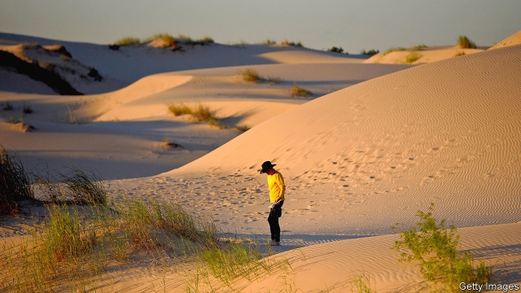
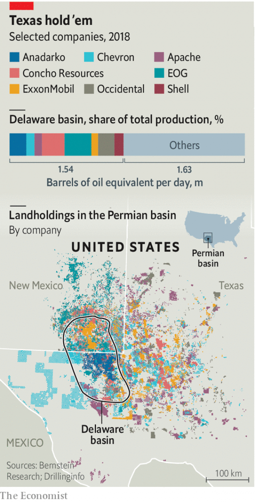

###### Permian explosion

# Chevron buys Anadarko for its shale assets 

##### The $33bn megadeal signals consolidation in the fracking business 

 

> Apr 20th 2019 

SHALE HAS transformed America into an energy superpower, which pumps more crude than Saudi Arabia. Investors are nonplussed. They clamour to buy bonds from Saudi Aramco (see Schumpeter). At the same time shale producers surveyed by the Dallas Federal Reserve gripe about access to debt. Oil prices climbed in recent months, but shares of many frackers failed to keep pace because of doubts over their ability to realise both growth and a steady income. 

There is one group with deep pockets that is eyeing shale: the oil majors. Last year BHP, a miner, sold its American shale assets to BP, Britain’s oil giant, for $10.5bn. In March ExxonMobil said it plans to produce 1m barrels of oil equivalent a day in Texas’s Permian basin by 2024. And on April 12th Chevron announced it would pay $33bn in cash and stock to buy Anadarko, a smaller energy company with a big shale business (and assume its $15bn of debt). It hands Chevron a big liquefied-natural-gas project in Mozambique. Anadarko’s holdings in the Gulf of Mexico will make Chevron the second-biggest producer there. But the main prize is its vast acreage in the Permian’s rich Delaware basin. 

Chevron has held land in the Permian for decades. It had drilled wells in the conventional direction: down. Its properties began gaining value a decade ago, after wildcatters had success drilling sideways, and blasted shale with sand and water to force it to give up oil and gas. Anadarko’s contiguous plots will let Chevron drill farther sideways and ease transport of masses of sand and water needed for each well. 

Frackers suffered after 2014, when Saudi Arabia declined to cut production and oil prices plunged. Today, even with higher oil prices, they look constrained. Their median return on equity last year was less than half that of the S&P 500 stockmarket index, according to Morgan Stanley, a bank. More investors are demanding that they spend only as much as they earn—a novel concept. To many asset managers, shale looks passé. Chevron’s share price is down by 4% since the announcement; Anadarko’s is up by 36%, below the 39% premium Chevron’s bid represents on its pre-deal value. A group of climate-conscious shareholders has chastised Chevron for choosing shale over renewables. 

 

For big oil companies, which are facing their own pressures, shale nevertheless looks alluring. They lost the title of the world’s most valuable corporations to tech firms. In an era of oil abundance, they are working not just to find new crude, as was their habit, but to produce it as cheaply as possible. The majors appreciate shale’s quick drilling times, predictable cashflows and favourable regulation. “It becomes your throttle,” says Bob Brackett of Bernstein, a research firm. “When times are good, you dial it up.” The question, then, is not whether Big Oil will bet on shale, but whether it will double down. 

The Delaware basin certainly looks ripe for consolidation (see map). Last year the largest seven producers accounted for about half of output. Others each produced 4% or less. Wall Street may have cooled on the Permian. Big Oil certainly has not. 

