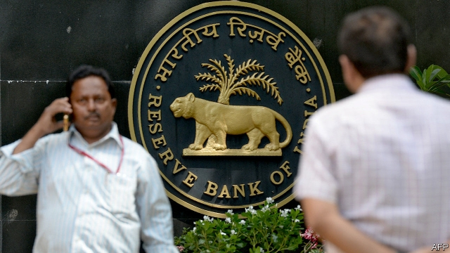
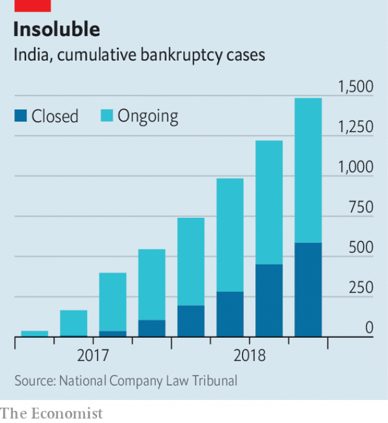

###### The deadbeats strike back

# India’s bankruptcy code collides with reality 

##### A much-ballyhooed insolvency regime faces court challenges 

 

> Apr 17th 2019 

REINCARNATION IS A religious tenet in India. It has also traditionally guided corporate life. Many of the country’s most powerful companies have looked dead and buried under a mountain of debt, only to be revived by biddable state-run banks willing to “extend (terms) and pretend (that politically connected debtors will pay)”. In the 1990s, after India liberalised its licence-choked economy, a government report warned that it was “impossible to liquidate and wind up an unviable firm”. Another in 2001 characterised the agency required to process such actions as “notoriously dilatory”. Because there was no “threat of imminent liquidation”, a third concluded in 2015, debtors felt no compulsion “to resolve their financial distress”. 

That was all supposed to change in May 2016, when parliament enacted a modern insolvency regime. Even a small missed debt payment would push a company into bankruptcy proceedings. These could not extend beyond 270 days. Owners and managers of an insolvent firm would lose control to a committee of creditors. The governor of the Reserve Bank of India (RBI) at the time, Raghuram Rajan, saw the law as a way to expunge incorrigible deadbeats from the financial system. Narendra Modi, the pro-business prime minister, hoped it would drag India out of the cellar of the World Bank’s “ease of doing business” ranking. Moneymen saw it as the most important reform since the end of the Licence Raj in 1991, perhaps since independence in 1947. 

This month the deadbeats got some life-force back. First, a decision by the Supreme Court in early April voided an RBI edict that ordered banks automatically to refer large companies which are behind in their debt payments to the insolvency regime. Lenders, including state-owned ones, in effect regained discretion to extend and pretend, which the law was intended to do away with. Then, on April 12th, the court all but suspended the bankruptcy proceedings of Essar Steel, a company with financial debt of 494bn rupees ($7bn). 

The Essar decision is the biggest knock yet to the nascent insolvency regime. The company has been stiffing creditors since 1999 and features on the RBI’s list of a “dirty dozen” companies which accounted for a quarter of the banking system’s non-performing debt and were first in line for restructuring. The family of Essar’s founders, Shashi and Ravi Ruia, which holds a controlling stake, was expressly blocked from the bankruptcy auction last October. The winning bid, of 420bn rupees to pay creditors plus another 80bn rupees to spruce up operations, came from ArcelorMittal, a rival steelmaker based in Luxembourg and controlled by Lakshmi Mittal, an Indian-born billionaire. 

The latest ruling leaves ArcelorMittal, which reportedly opened an office in Mumbai to manage the takeover, in limbo. The court decided that the dispute over which creditors get paid what be resolved before it assumes control. How long this will take is anyone’s guess. Meanwhile, the Ruias have tried to sidestep their exclusion with an offer for Essar backed by Russian money that would satisfy all 544bn rupees in claims, including financial debt. 

The Essar case ends a winning streak for bankruptcy reformers. In May 2018 Tata Steel, a big steelmaker, acquired Bhushan Steel, another “dirty dozen” company. Creditors recovered 76% of their claims. Another five companies on the RBI’s list were bought and a further two liquidated. The law is also credited with pressing Naresh Goyal, another tycoon, to step down as chairman of Jet Airways and relinquish control of his ailing carrier to lenders in March. It was a rare instance of a big Indian company being wrested from a founding shareholder. Such “promoters” had been considered immovable. 

All told, 1,484 companies have entered the insolvency system in the past two years. Although no comparable statistics exist for the earlier period, this is certainly a huge jump. Of these, 302 have been liquidated and 79 have been restructuring, which involves a repayment of more than one-fifth of debts and, often, an acquisition. Since March 2018 the level of non-performing loans on the balance-sheets of India’s banks has begun to decline. 

 

Perhaps inevitably, however, the law has collided with bureaucratic inertia and politics. The 270-day deadline is more an aspiration than reality; two-thirds of cases have exceeded it. In the busy Mumbai court established on the sixth floor of a battered tribunal building, the three hearing rooms are so packed that it is hard to see the chairs. Assurances that more space and judges are coming are treated with scepticism. The backlog of cases is growing (see chart). So are legal challenges. 

Reorganising a sizeable part of the bureaucracy in a country snarled in red tape was never going to be easy. Nor was disempowering the feckless but well-connected tycoons behind some of India’s powerful conglomerates. Cautious optimists, like Debanshu Mukherjee of the Vidhi Centre for Legal Policy, a think-tank in Delhi, talk of teething troubles. To those who view Essar as a test case for the new regime it looks more like a kick in the teeth. 

