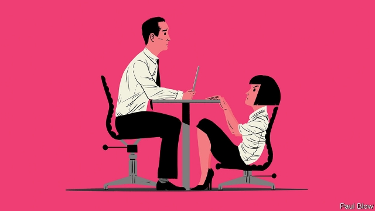

###### Bartleby

# The subtle ways that discrimination works 

##### In the workplace, it’s still a man’s world 

 

> Apr 20th 2019 

PREGNANT WOMEN have limited mobility. That is obvious to anyone who has had a baby, but didn’t occur to the founders of Google when they designed their car park. When Sheryl Sandberg, then head of online sales, became pregnant in 2004, she made a simple request: parking spaces for expectant women as close to the building entrance as possible. 

That is just one example of how many aspects of the workplace lack the female perspective. In her brilliant book “Invisible Women: Exposing Data Bias In A World Designed For Men”, Caroline Criado Perez shows how widespread these subtle biases can be. 

It starts at the recruitment stage. Women are put off from applying for jobs that use words in their adverts such as “aggressive” or “ambitious”. When one company changed its ad to focus on qualities such as enthusiasm and innovation, and used a photo of a woman rather than a man, the proportion of female applicants rose from 5% to 40%. 

Once you have a job, you must get to the office. Because they often care for children or elderly relatives, women are likelier to make multiple journeys. Those who use public transport often need radial routes whereas most systems favour commuters heading from the suburb to the centre of town. This means female journeys can be much longer than male ones, making it difficult for them to get to work on time. 

Women experience more work-related stress than men, according to research by Britain’s Health and Safety Executive, and face a particular problem with long working hours. But a study found that unencumbered people of both sexes (those with few or no caring responsibilities) could cope equally well with a 48-hour week. The stress occurred because women struggled to combine their caring responsibilities with work, a problem faced by a smaller number of men. 

Those responsibilities may also mean that women find it more difficult to take part in after-work bonding activities like dinners, Ms Criado Perez argues. Many companies allow workers to put the cost of food and drink at such events on expenses, but not the cost of a babysitter. That is a problem for single parents, and women comprise 80% of that category in America and 90% in Britain. 

When their performance is reviewed, Ms Criado Perez argues that women are criticised for being bossy, abrasive or strident, whereas men are encouraged to be more aggressive. But if women are warm and friendly, they get criticised for being insufficiently professional. 

Women’s physical health, too, may be affected by male-dominated design. Their bodies absorb chemicals more quickly than men’s do. The long-term effects of inhaled particles on (mostly male) miners have been studied extensively; those of cleaning products on (mostly female) cleaners have not. In construction and engineering, tools and safety jackets are designed for male hands and bodies, not female ones. Bulletproof and stabproof jackets are also designed for men and thus do not fit women comfortably; a British police officer removed her jacket so she could use a hydraulic ram to enter a flat, only to be stabbed and killed. 

Many men do not realise there is a problem. Those who believe they are objective when recruiting are nevertheless more likely to hire another man than a woman with identical qualifications, as a paper from 2007 showed. 

A similar issue is apparent with race, as Jennifer Eberhardt, a professor at Stanford University, describes in her book “Biased: The New Science of Race and Inequality”. An American study showed that candidates with black-sounding names get fewer callbacks than those with traditional European names. Even highly qualified African-Americans received fewer calls for interview than whites with lesser qualifications. White people with a criminal record received as many callbacks from employers as black people who had never committed an offence. And this was true whether or not the company described itself as an “equal opportunity employer”. 

It is natural if you have succeeded in work to assume this was down to your own merits. But the existence of hidden biases shows that the playing field is not level. As both authors argue, preventing discrimination depends not on white men discovering their inner liberal but on decisions being taken by those with broader perspectives. If every executive carries a hammer, it might not occur to them that some jobs need a screwdriver. 

