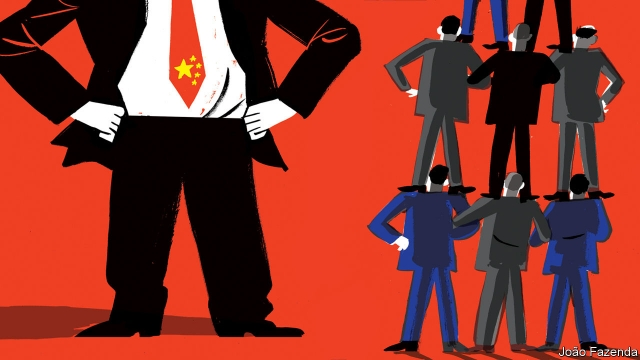

###### Chaguan

# Hope remains for Western solidarity. Look at embassies in Beijing 

##### China has only itself to blame for encouraging them to work together 

 

> Apr 17th 2019 

CHINA’S MESSAGE to the Western world has been called an argument in three parts. In order, it runs: China’s rise is inevitable; there are rich rewards for those who co-operate with it; resistance is futile. In the tree-lined embassy districts of China’s capital, there is no debate about the country’s rise, which inspires a mix of admiration, greed and dread. But the rest of the argument inspires more scepticism. 

Take that second claim about rewards awaiting China’s partners. Diplomats describe much greater realism in their internal discussions. Their views are affected, inevitably, by the apparent consensus in Washington that China is a threat, bent on growing richer and more powerful at America’s expense. But there has also been a broader change of mood. Only a few years ago, it is related, as soon as envoys sat to dine, “stealth boasting” would start. Isn’t China tricky, the envoys would sigh—though, of course, my country’s relations with it are rosy. Such bragging has become rarer. 

Diplomats say that the new realism extends to countries like Germany, whose trusted brands and sought-after technology seemed to give it an upper hand in a symbiotic relationship with China. Even the biggest firms find themselves in competition with state-backed Chinese rivals that mean to defeat and replace them. France and Britain are more sober about their prospects, too, though Brexit Britain is suspected of dreaming about serving as a Singapore-style financial hub for Chinese capital. 

Many countries are more clear-eyed about Chinese-led forums that have sprung up in recent years alongside older, multilateral bodies. On April 12th it looked like a win for China when Greece said it was joining the “16 plus One” group. That is a mechanism launched by China in 2012 as a way to co-ordinate its relations with a clutch of mostly eastern and central European countries, 11 of them members of the European Union (EU). That prompted talk of China trying to divide and rule in Europe. Greece is certainly eager to please China, a deep-pocketed friend. But Greece may have joined a group past its political prime. Western diplomats observe that members of what is now “17 plus One”—including the largest, Poland—seem both warier and wearier of the bloc, which has not delivered expected business opportunities and investments. 

A few weeks earlier, Italy handed China a clear victory by joining China’s Belt and Road Initiative (BRI), a globe-spanning infrastructure plan, in defiance of advice from America, Germany and others. Still, Western governments are less starry-eyed than before. Just a couple of years ago, European leaders talked the BRI up as a potential bonanza for their firms. Now they are as likely to fret about BRI schemes leaving participating countries dangerously in debt, damaging the environment or locking swathes of Africa, Asia or the Asia-Pacific into technical standards set by Chinese firms. 

Ahead of the Belt and Road Forum, a multinational gathering that will be hosted by President Xi Jinping in late April, Chinese officials and scholars suggest that it is time for other countries and multilateral lenders to join China in funding the BRI. That brings diplomats to the third part of China’s message, namely, that resistance to its rise is futile. 

It would be foolish to claim that China has united the world. But the grumbling is at least more co-ordinated. Among embassies in Beijing, groupings old and new are becoming more active and useful. Some are mostly about information-sharing, such as the “Group of Five”, which does not officially exist but involves a meeting at least once a month of ambassadors from America, Britain, France, Germany and Japan. Envoys from the “Five Eyes” intelligence-sharing pact (America, Australia, Britain, Canada and New Zealand) regularly meet. Other groups try to devise common policy, such as the economics-focused “Like-Minded Nine”, or L9 group, comprising America, Australia, Britain, Canada, France, Germany, Japan, South Korea and the EU. Embassy political officers whose briefs cover human rights have long met to co-ordinate their work. Their reports last year helped alert bosses to repression in the far-western region of Xinjiang, where China is accused of locking hundreds of thousands of Muslim members of the Uighur minority in re-education camps, and subjecting millions more to crushing surveillance. In an unusual move spearheaded by Canada, 15 Western ambassadors last year wrote to request a meeting with Chen Quanguo, Xinjiang’s hardline Communist Party boss. 

That led to a display of solidarity that startled China, when European ambassadors declined a peremptory invitation to visit Xinjiang. Chinese officials initially gave the ambassadors 24 hours to accept an offer to visit Xinjiang with their spouses from March 27th to 29th (though no meeting with Mr Chen would be possible). A day later the EU ambassador to Beijing was informed that this was a one-off invitation and that declining it would bring unspecified consequences. Though not all European governments are equally concerned about Xinjiang’s horrors, all 28 EU members, plus Norway and Iceland, agreed that the Europeans should decline the offer. Only Albania and Serbia accepted. 

“Chinese assertiveness has recreated a Western community, without a doubt,” says a diplomat. He notes other high points of Western unity, for instance in the aftermath of the bloodily suppressed Tiananmen Square protests in 1989. Post-Tiananmen unity did not last long, he adds. Even today it has limits. The same diplomat accuses President Donald Trump of pursuing selfish, might-is-right policies that resonate more with China than with Europe. As a result, he charges, no single China strategy unites America, Europe and Japan: “The Western world does not exist.” 

Another diplomat counsels patience. If a different American president were to try resisting Chinese aggression while defending universal values, that “alliance is there, waiting to be led.” Such talk may appal Chinese officials. They have helped to start it. 

