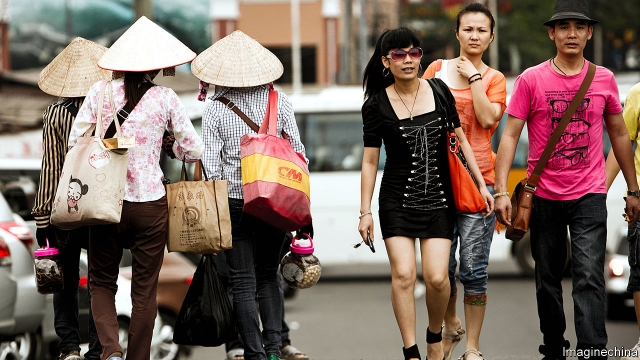
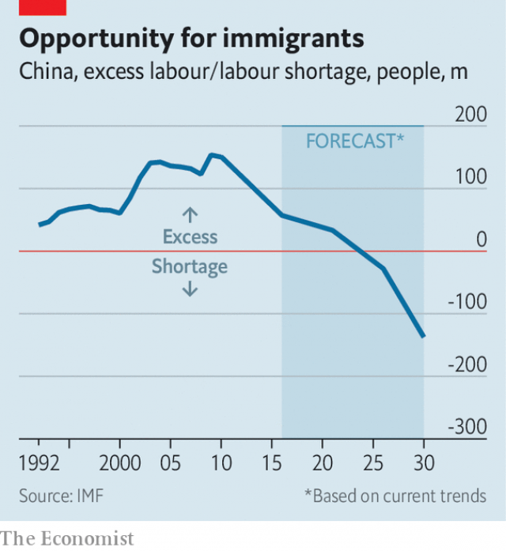

###### A breach in the wall

# In a Chinese border town, officials try a new approach to immigration 

##### Their decision to allow in foreign workers is a welcome change. More is needed 

 

> Apr 17th 2019 

WHEN HE IS home in his native Vietnam, Nhi Quang Ninh spends part of the year on farms and part of it down coal mines. Since last year, however, he has been finding more rewarding work in southern China. The polite 24-year-old waits for a permit at a visa office in Dongxing, a Chinese city with a beguiling old town that is separated from Vietnam by a shallow, narrow river. The job he has secured in a nearby brick factory pays about as well as his previous stints as a miner, but is a lot less dangerous. 

Vietnamese have been crossing into China for years in search of work. They have often come illegally, especially when demand for labour spikes during the sugar-cane harvest. Some have obtained three-day work passes reserved for residents of Vietnam’s borderlands. (Vietnamese traders in Dongxing are on the left of the picture above.) A Vietnamese migrant who sells fruit beneath the city’s busy border bridge says she has been serially renewing hers for five years. 

But under a scheme begun in 2017, Chinese firms in Dongxing and several nearby cities can now legally hire Vietnamese on monthly renewable visas, says Su Shihao, a local employment agent. The aim is in part to help manufacturing firms in Guangxi, a largely agricultural province, and in part to replace local residents who have left to find work in more prosperous areas of China. Locals don’t mind their arrival, says a shop-owner in Dongxing, because people on both sides share a similar culture. 

Until recently China has tried to keep foreign blue-collar workers out of the country, preferring the affluent sort of foreigner who usually dwells in its richest cities. The guest-workers in Guangxi are a sign of reform. Demand for such people is driven mainly by two profound changes. One is massive internal migration that has hollowed out poorer parts of the country, such as Guangxi province where Dongxing is located. The other is the shrinking of China’s labour supply. The working-age population has been falling since 2012 and could decrease by nearly one quarter between now and 2050. 

 

The central government’s immigration policy has remained very restrictive. In 2017 China granted permanent residence to about 1,800 foreigners, none of them ordinary workers. That is double the number it handed out five years earlier, but nothing compared with America, which doles out 1m “green cards” annually to immigrants. Relative to its size, China is home to fewer foreigners than almost anywhere else. A census in 2010 (the most recent reliable data) found only around 600,000 of them with resident visas, about 0.05% of the population. In many Western countries the proportion is 10% or higher. 

In 2013 China introduced a much-revamped immigration law. It was aimed not so much at allowing more foreigners to come in (though highly skilled ones are always encouraged), but at clarifying the rules in order to make it harder for people to live and work in China illegally. It introduced stiffer penalties for businesses that hire foreigners without work permits and for those who help such people get jobs. A campaign against illegal aliens has greatly reduced the number of African traders living in Guangzhou, once one of China’s most cosmopolitan cities. In 2016 the authorities said there would be three tiers of classification for employment-visa applicants. Those in the lowest tier, class C, would include almost anyone without a degree and a few years’ working experience. The government said the aim was to “encourage the top, control the middle and limit the bottom”. Last year it set up a new body called the State Immigration Administration (SIA). This was billed as marking a friendlier approach to dealing with foreigners, but the agency’s staff still belong to the Ministry of Public Security, China’s police, which has always held sway over such matters and is deeply conservative. 

However, by clarifying the rules and building a more effective bureaucracy to manage immigration, it may be that China is trying to develop an ability to loosen and tighten controls according to need in the same way that many other countries do. This seems to be what is happening in Guangxi. The province’s guest-worker programme is a step towards liberalisation. It is a very cautious one, limited to work in industries such as furniture-making, electronics and food processing. Those given permits usually have to return briefly to Vietnam before each monthly renewal in order to qualify. A Chinese academic says the police worry that Vietnamese with permits might head to other parts of China where they do not have permission to work. (Some Vietnamese have indeed found unauthorised jobs in factories in the neighbouring province of Guangdong, where China’s labour shortage is biting.) 

There are piecemeal attempts at immigration reform elsewhere, too. Shanghai has made it easier for foreigners at Chinese universities to stay in China after graduation. Foreign families in the city are being allowed to hire foreign maids. Wang Huiyao of the Centre for China and Globalisation, a migration think-tank in Beijing, believes the SIA may devise ways of allowing more people in with specific needed skills. That would help to remedy shortages of labour in essential sectors, such as social work and health care. The country has only about 2.5 nurses for every 1,000 people, about half the global average (Germany has 13). As China begins to age rapidly, its demand for them will grow apace. 

But officials remain hesitant about changing the rules. They worry that letting in more low-skilled foreigners could stir resentment among ordinary Chinese. It is fine letting limited numbers of Vietnamese into Guangxi, which has much in common with Vietnam culturally. But would things go as well if the government were to allow them farther inland? In recent years officials have become even more inclined to portray foreigners as a threat to stability. Change will be slow. 

