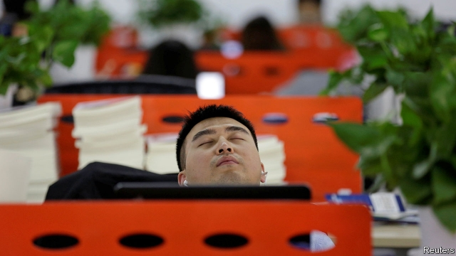

###### GitHubbub

# Office workers in China organise a rare online labour movement 

##### Tech firms have reason to worry 

 

> Apr 17th 2019 

IN THE WORLD’S most censored region of cyberspace, finding an unpatrolled spot to air shared grievances is hard. Yet disgruntled Chinese software developers have recently found one at their fingertips: GitHub, a platform owned by Microsoft that allows developers to help each other build software. Fed up with the grindingly long work hours imposed on them by China’s internet giants, this collective has recently built something else—a movement demanding more humane office hours and calling out the worst corporate offenders. 

Their beef is the “996” regime, which refers to a work schedule of 9am to 9pm, six days a week, often without extra pay. Toiling such hours has become an unspoken rule in the frenetic world of Chinese tech. In late March anonymous activists created a webpage called 996.icu (the letters standing for “intensive care unit”). On it they listed firms at fault, including 58.com, a site for classified ads that popularised the 996 approach in 2016. A page with the same name was also set up on GitHub, which was also used to host a sister project called “955.wlb” (standing for “work-life balance”). This celebrates firms with more relaxed working hours. Almost all of those listed are foreign ones. 

The anti-996 campaigners have a point. In 2016 Didi Chuxing, a ride-hailing giant, ranked the most “hardcore” internet companies by their overtime hours. Staff at JD.com, an e-commerce firm, clocked out at 11.16pm on average (the latest). Relative idlers at Didi left at 9.24pm. Fewer workers now regard such long hours as something to be proud of. Tempers flared in January when Youzan, a firm that helps run others’ online shops, implemented a 996 schedule and told non-compliers with it, more or less, to quit. (Staff complained to the labour authorities: the law limits the working week to 40 hours and requires overtime pay after that.) To the disappointment of his many fans, Jack Ma, the founder of Alibaba, a tech giant, spoke dismissively of the protesters, saying that “being able to work 996 is a huge blessing.” Richard Liu, the chief executive of JD.com, wrote: “Slackers are not my brothers!” 

The Chinese government is normally quick to censor discussion of protest. However, in this case it is the internet companies themselves that seem to be taking the initiative. Users say that web browsers including those of Alibaba, Qihoo 360 and Tencent have failed to load the 996.icu pages. The irony has not been lost on social-media users. “So 996 developers at 996 companies had to work 996 to block a website about 996,” one wrote on Weibo, a Twitter-like service. Jeffrey Knockel of Citizen Lab, an internet research group at the University of Toronto, says that tech firms must fear that the protesters have clout. 

The 996.icu page has been GitHub’s most popular for weeks. That is because Chinese developers are such avid users of the platform for work purposes: their contributions are second only to those of Americans. They also know how useful it is for spreading sensitive information and evading China’s vast web-filtering system. Because GitHub is encrypted, it is harder for the state to censor bits of it selectively. Blocking it entirely would cripple China’s technology champions, whose programmers rely heavily on code shared on GitHub. In 2013 the government did try blocking the platform. Complaints from developers brought it back online within days. Its appeal is not limited to techies. Mengyang Zhao, who researches tech activism at the University of Pennsylvania, says that Chinese NGO workers now use GitHub to back up articles posted on WeChat that are at risk of being censored. 

The GitHub page for 996.icu says that it is “not a political movement”. But if the government does decide to crack down, it has leverage of its own that it can try to deploy, says Mr Knockel. That is, it has sway over Microsoft, whose other services, including Bing and LinkedIn, are allowed to operate in China with censored content. In the meantime, vendors on Taobao, Alibaba’s retail platform, offer a “996” T-shirt with a more alluring interpretation: “Sleep at 9pm, rise at 9am, work six hours a day.” Not one for Mr Ma, then. 

