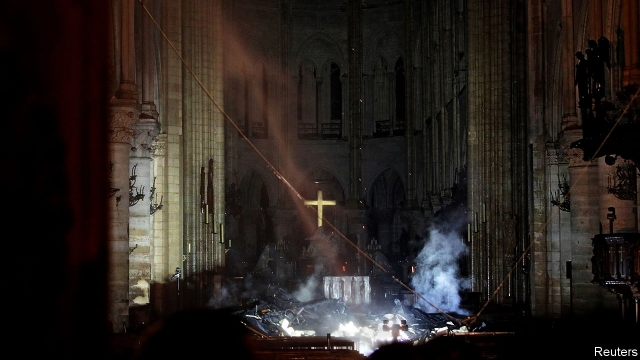

###### Damaged but still standing

# France agonises over the fire that devastated Notre Dame 

##### President Emmanuel Macron finds words of solace 

 

> Apr 17th 2019 

THE CATHEDRAL of Notre Dame is a “majestic and sublime edifice”, a “vast symphony in stone”, wrote Victor Hugo. “Every surface, every stone of this venerable pile, is a page of the history not only of the country, but of science and of art.” The devastating fire that broke out on April 15th, and destroyed much of the gothic cathedral’s wood-timbered roof and spire, stunned and distressed the French with a force that far exceeded the building’s religious significance. As the flames engulfed the roof, President Emmanuel Macron spoke for many across France when he tweeted that he was witnessing “part of us burn”. 

Why has the fire at Notre Dame stirred such emotion in France? In a city of broad vistas and stolen glimpses, it serves as a fixed point for Parisians; a stable presence that emerges reliably into view, like a much-loved aunt, from bridges across the river Seine. Visited by 13m tourists a year, the cathedral has been the backdrop to countless expressions of awe and romance, as well as been-there selfies. Locals may be riled by the narcissistic crowds, but are proud of what draws them. The 850-year-old cathedral is a national landmark that offers something particular: a form of timelessness, drama and spirituality, to set against the modernity and engineering prowess of the Eiffel Tower. 

On the night, as firefighters struggled to control the blaze, it looked for a stretch as if the centuries were dissolving in flames. For Parisians, watching in eerie silence on the bridges, the wait was agonising. In his preface to “The Hunchback of Notre Dame”, the novel that reawakened the French to the cathedral’s splendour, Hugo had warned darkly that “soon, perhaps, the Cathedral itself will have vanished from the face of the earth.” As the fire blazed, the visceral fear that Hugo might have been right seemed to touch a profound yearning for Our Lady to survive. 

The cathedral had withstood ransacking during the wars of religion, looting during the revolution, two world wars and Nazi occupation, becoming an emblem of resistance in the face of a constantly disrupted history. More than this, Notre Dame is a product of the paradoxes of that history. It is where an emperor, Napoleon, was crowned in 1804, and where the founder of modern republican France, Charles de Gaulle, was remembered upon his death. It was at once a living place of worship for the French Catholic church, and the property of the French secular state: a symbol in itself of the country’s history and its present, in all its glorious contradictions. 

As he visited the site shortly before midnight, Mr Macron, so often perceived as out of touch, for once found the right words to express this. “Notre Dame de Paris is our history, our literature,” he declared. “The place where we have lived all our great moments, epidemics, wars and liberation. It is the epicentre of our lives and the point from which we measure distance from Paris. This history, it is ours and it is burning.” 

Now that those flames have been extinguished, questions will turn to why Notre Dame burned, and how it can be rebuilt. The Paris public prosecutor has opened an investigation, declaring that “nothing suggests it was a deliberate act.” If this was indeed an accident, the focus will be the works to renovate the 19th-century spire, which began last summer. It was the oak-beamed roof above the vaults that proved to be both so flammable, and so difficult for the fire brigade to get to. Thanks to the efforts of 400 firefighters—as well as to the craftsmanship of the 12th- and 13th-century stonemasons who built the soaring stone vaults beneath the roof—the cathedral’s main medieval structure was largely saved. Firefighters also managed to save many religious artefacts and relics. 

How stable the remaining structure is, and whether the stone has been permanently weakened by the intense heat, say engineers, will have to be assessed once the masonry has cooled. Mr Macron vowed that, no matter what, the cathedral will be rebuilt, and launched a fundraising initiative to that end. In a country that lacks a tradition of private philanthropy, it was notable that France’s richest businessmen vowed to contribute. Two luxury titans, Bernard Arnault and François Pinault, between them pledged €300m ($340m). 

The search for somebody to blame will absorb France for some time. Many will want to know exactly what precautions were taken by those working on the renovation, and what exactly was the nature of the disaster-planning for a monument of this scale and national importance, situated amid narrow streets on an inaccessible island in the centre of the city. A broader question is whose responsibility it should be to maintain secular France’s great religious buildings. The government had contributed to the renovation of Notre Dame’s spire. But the cathedral had to raise funds to renew its bells in 2012, and the agreement between the archdiocese and the government over upkeep is unclear. 

On the morning after the fire, tourists gathered along the cobbled quays to get their shot of the old survivor, damaged but unfallen. For locals, sadness at the damage was mixed with deep relief that it had not been far worse. At one point, and after five months of unrest by gilets jaunes (yellow jackets), the fire seemed to be a ghastly symbol for the torment of France. It broke out just before Mr Macron was due to unveil his response to those protests, and to his “great national debate”, in a speech he promptly had to postpone. The moment was supposed to mark the end of a disaster. Instead, it brought another. 

Mr Macron now faces a different challenge. The country was already divided, and the president unloved. Today Notre Dame is charred, and Paris, and all of France, is in pain. Just occasionally, such a national drama can help to pull a divided country together. On the night, Mr Macron made a good start. But he has yet to bring closure to his great debate. It will take particular skill to do this while offering solace to a nation still in shock after the drama of Notre Dame. 

