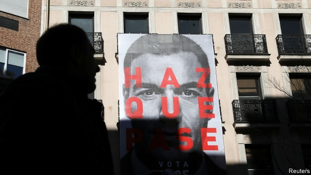
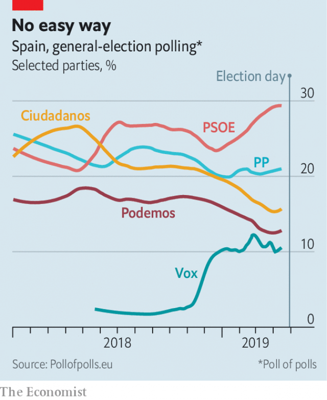

###### Sr Sánchez and his squabbling detractors

# Reading the runes for Spain’s general election 

##### The Socialists will come top, but struggle to form a government 

 

> Apr 17th 2019 

IN JANUARY 2017 in Dos Hermanas, a large dormitory town outside Seville, Pedro Sánchez launched a bid to regain the leadership of Spain’s Socialist Party, from which he had been ousted in an internal coup three months earlier. Few in the Madrid political establishment gave him a chance, yet after months driving from rally to rally in his 12-year old Peugeot 407 he won his job back in a party primary. Last May he showed the same determination and sense of opportunity when he organised a censure motion that installed him as prime minister of a minority government at the expense of Mariano Rajoy, a conservative whose People’s Party (PP) has been tarnished by corruption. 

This month Mr Sánchez returned in triumph to Dos Hermanas to launch his party’s campaign for a general election on April 28th. In the past ten months “we haven’t been able to change Spain,” he told some 2,000 supporters. But “we have set the course towards a fairer Spain.” In what is the third general election in little over three years, opinion polls suggest the Socialists will be easily the largest party for the first time since the election in 2008, gaining perhaps 50 seats on top of their current 84 in the 350-member Congress of Deputies. That would still leave Mr Sánchez well short of a majority, because Spanish politics has become extraordinarily fragmented and fluid. Indeed, the polls suggest that some 40% of voters, an unusually high figure, remain undecided. 

 

Until 2015, the Socialists and the PP alternated in power, sometimes relying on Catalan and Basque nationalists to make up the parliamentary numbers. But the discontent aroused by an economic slump that followed the bursting of a housing bubble in 2007 spawned two new national parties, Podemos on the far left and Ciudadanos, originally in the liberal centre. The slump was also a factor in the Catalan nationalists’ espousal of independence, culminating in an unconstitutional referendum in October 2017. This threat to the existence of the nation has in turn fuelled the rapid growth of Vox, a new far-right party, and also pushed the PP and Ciudadanos to the right. 

The three-way fight on the right has imprinted an ill-tempered character on the campaign. Whereas Mr Rajoy was a cautious moderate, his replacement as PP leader, Pablo Casado, is much more ideological and confrontational. Both he and Albert Rivera, the leader of Ciudadanos, have tried to turn the election into a plebiscite on Mr Sánchez. Neither has forgiven the prime minister for stealing a march on them with the censure motion, which succeeded with the votes of Basque and Catalan nationalists, or for holding inconclusive talks with the separatist regional administration in Catalonia (something Mr Rajoy did as well). Both threaten to impose direct rule on Catalonia and denounce the referendum in 2017 as an attempted coup. 

When launching the PP programme in Barcelona this month Mr Casado accused Mr Sánchez of being “the ally of coup-mongers, separatists and terrorists” and of being a “public danger”. This hyperbole is aimed at wooing back former PP voters who have turned to Vox, but it has distracted attention from the important differences between Mr Sánchez and his opponents on economic policy. 

The Socialists used their months in power to roll back some of Mr Rajoy’s cuts in the welfare state and decree a big increase in the minimum wage (as well as on a not-yet-successful attempt to exhume the remains of General Franco, Spain’s former dictator, from his grandiose memorial at the Valley of the Fallen outside Madrid). The right wants tax cuts, and worries that the Socialists will curtail a strong economic recovery which is starting to run out of steam. 

Under the influence of Vox, Mr Casado has talked tougher on immigration. He also fumblingly introduced abortion into his speeches, only to be rebuffed on that by some on his own side. Polls show that most Spaniards are happy with the current laissez-faire abortion law. 

Mr Sánchez’s bet is that Spaniards are less angry and paranoid, and more socially liberal, than the right now thinks. He insists that he would talk to the Catalan separatists only within the parameters of the constitution and would not concede a referendum on independence. He proposes a constitutional amendment to “clarify” the assignment of powers between the centre and the regions. That sounds like federalism that dare not speak its name (since in Spain it is associated with a brief and chaotic 19th-century republic). The Socialists are now “the only moderate party”, he said this week. He is seeking to mobilise undecided centrist voters by conjuring up the spectre of Vox entering government if the right wins. 

Many political analysts in the past asserted that Franco had inoculated Spain against far-right nationalism. Vox undermines that claim. Rather than such national populist movements as France’s National Front or Italy’s Northern League it is more akin to the Catholic conservative nationalism of Poland’s or Hungary’s governing parties. “We are liberal on economics and conservative on moral questions,” says Iván Espinosa, a Vox leader. “We have no memory of Franco.” Vox is anti-feminist, pro-bullfighting and wants to abolish the constitution’s regional autonomy, returning to a centralised state. It is a “metastasis of the PP”, from which some of its leaders come, says a former Socialist leader. It represents the Spanish male id. It has drawn big crowds to some of its rallies. Some of its opponents fear that it is going to attract a hidden vote, not fully captured by the polls. 

Maybe so, though the polls tend to exaggerate support for new parties. But Spain’s electoral system, which is less strictly proportional in less populated provinces, is likely to penalise the right for its three-way split, denying the right-wing parties the legislative majority of which they were confident two months ago. It will help the Socialists, who are profiting not just from the cacophony to their right but also from the seemingly permanent decline of Podemos, which is racked by internal divisions. 

Most political leaders accept that Spain is heading for its first-ever coalition government at national level since democracy was restored in 1977. “The new parties are now old parties—they know the system more and they know they have to make deals,” says Pablo Simón of Carlos III University in Madrid. But it may require a fresh election in the autumn to define its make-up. All will turn on the precise parliamentary arithmetic, and on whether Mr Rivera is pressed into dropping his promise (made with an eye on Vox) not to enter a coalition with Mr Sánchez. “This is only the end of the beginning of the cycle of instability” that began in 2015 (when the PP lost its majority), Mr Simón adds. 

In any event, Mr Sánchez is set to emerge as the most powerful social-democratic leader in Europe, reckons José Ignacio Torreblanca of the European Council on Foreign Relations, a think-tank. For a party that three years ago was flirting with irrelevance, that is quite an achievement. Mr Sánchez has shown he is a fighter. Now he may have to be a healer. 

