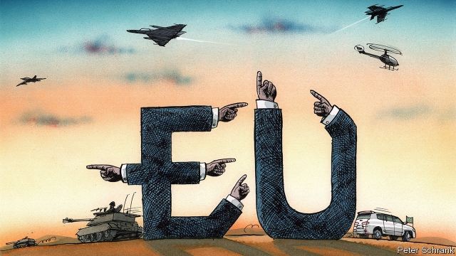

###### Charlemagne

# The problem with EU foreign policy 

##### Too much historical baggage 

 

> Apr 17th 2019 

SEVERAL MIRAGE 2000 fighter jets took off from an air base in N’Djamena, Chad’s capital, on February 3rd and flew north over the savannah and the scrubby Sahel towards the Sahara Desert. There the French planes bombed a column of some 50 lorries carrying rebels south from the Libyan border. Paris’s action was co-ordinated not with the rest of the EU, but with Chad’s brutal government and Khalifa Haftar, the Libyan warlord who controls swathes of his country. Today France is still backing General Haftar as he shells the post-Qaddafi “government of national accord” in Tripoli. On April 10th Paris blocked an EU statement urging him to stop, infuriating its European allies. 

Africa is churning and Asia is rising. President Donald Trump has raised doubts about the transatlantic alliance. Europe’s share of the world’s population and wealth is shrinking. Yet the EU still generates 22% of global GDP. And its members are trying to act more as one. In 1993 the EU established a mechanism for a “Common Foreign and Security Policy”. In 2011 it created the “European External Action Service”, a form of diplomatic corps, and a “high representative” to lead it (currently Federica Mogherini, an Italian). In the decade since then it has brokered a deal curbing Iran’s nuclear ambitions and taken on pirates near the Horn of Africa. In February it held its first summit with the Arab League and on April 9th it deployed newly tough language in a summit with China. Its new “Permanent Structured Co-operation” provides a framework for mutual defence and inspires talk of a “European army”. 

As recent events in north Africa show, however, this co-operation quickly ends where it collides with national impulses. France has oil interests in the part of Libya controlled by General Haftar and considers itself responsible for its former colonies to the south, such as Chad and Mali. Rome’s interests centre on Tripoli and the migration-prone Mediterranean coast. So France backs General Haftar and Italy backs the Libyan government. Europe is divided. Likewise, the EU’s recent summit with China belied growing bilateral links between southern and eastern European states and Beijing. And last month Italian objections prevented the EU from backing the popular uprising in Venezuela. 

Crises nearer home are even more divisive. The EU has been “irrelevant” in the Syrian conflict, despairs one European diplomat. Germany is still promoting NordStream2, a gas pipeline that will increase Russia’s power over countries like Poland; Spain frustrates efforts to guide Balkan states towards EU membership; it does however back Turkish membership, whereas Austria viscerally opposes that and others have doubts. The EU’s overseas missions remain inferior to its major national embassies and Ms Mogherini’s monthly meetings with EU foreign ministers are quests to find the lowest common denominator. Slow progress towards common defence procurement, let alone a shared doctrine, renders loose talk about a European army ridiculous. 

The common foreign and security policy still works on unanimity. It can take positions only where the EU’s 28 member states agree. One sensible proposal is to adopt “qualified majority voting” on foreign policy, allowing the EU to act against the will of minority stick-in-the-muds. But that can only achieve so much. On matters where it already applies, like the single market, member states tend to find fudges preserving unanimity. Where they do not, decisions can prove divisive. In 2015 central European states simply ignored a vote imposing refugee quotas on them. 

Look to architecture to see a representation of the problem. The EU diplomatic service is housed in a bland, modern office block in Brussels. France’s foreign ministry sits in a palace completed in 1855 amid the pomp of the Second Empire; Rome’s fascist-era Palazzo della Farnesina was signed over to Italian diplomats in 1940 as Italian tanks rolled through north Africa; Austria’s foreign ministry is housed in a Habsburg-era pile. And how to find a common European identity in Ho Chi Minh City, in Vietnam, where France’s consulate occupies a magnificent colonial mansion while the Brits and Germans squat in ugly office buildings? The buildings say what diplomats cannot: European foreign policies have different, centuries-old roots. They cannot easily be merged. 

History is the elephant in the room. France and Italy cannot agree on Libya because both see it as part of their sphere of influence. Ever since its “Racconigi” bargain with Russia in 1909, Italy has strayed sporadically from western European foreign-policy positions; its reluctance to join the chorus on Venezuela belongs to this tradition. Spain’s scepticism towards regional breakaways like Kosovo is rooted in its own centuries-old battle to hold Catalonia. Its Moorish heritage makes it a bridge between Europe and the Islamic world, including Turkey, whereas Austria nurtures old fears of the Ottoman invasion that reached the gates of Vienna. Germany’s wariness about military might has understandable 20th-century roots, and the country has a certain romantic attachment to Russia—witness Willy Brandt’s “Ostpolitik” rapprochement with the Soviet Union—that alarms Poles. And if central Europeans are naive about Chinese interference, this is at least partly because of their own historical links to Beijing, which for example backed the Czechs when the Soviets invaded in 1968. 

The foreign-policy instincts of EU member states were forged by the experiences of invasion, destruction or the threat of those things. Today’s challenges—China’s rise or the migration crisis, say—are dramatic but not sufficiently so to forge a single narrative for the EU. So its foreign policy remains hopelessly underpowered, limited to coaxing national capitals towards agreement and supporting their ad hoc initiatives. Over a generation or two, these common experiences may grow into a common foreign policy culture. But the world is changing faster than that. Europe will struggle to get over its past before the future arrives. 

