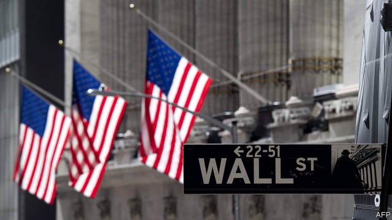

###### Swings and roundabouts

# American banks’ earnings are boosted by retail business 

##### Markets sparkled, but that’s not where the money was 

 

> Apr 20th 2019 

AMERICA’S FINANCIAL markets made a stunning start to 2019. The S&P 500 stockmarket index climbed by 13.1% in the first quarter, its best beginning since 1998. But that was little use to Wall Street banks. Trading revenues depend on volumes, not prices. Quarterly earnings, reported in recent days, have confirmed that they were markedly lower than a year earlier. Never mind. The retail divisions of America’s mightiest banks did well enough to boost profits overall. The giants’ retail heft is likely to keep serving them well. 

Start, though, with the grim stuff. Share-trading revenues fell by 24%, year on year, at Citigroup and Goldman Sachs; by 22% at Bank of America (BofA); and by 13% at JPMorgan Chase. (Morgan Stanley, the remaining bulge-bracket Wall Street firm, was due to report earnings after The Economist went to press on April 17th.) New share issues were delayed by a 35-day government shutdown that lasted until late January, holding up approvals at the Securities and Exchange Commission; equity-underwriting revenues tumbled by 20% at Citi, 23% at JPMorgan Chase, 29% at BofA and 34% at Goldman. But debt underwriting was perkier at Citi and JPMorgan Chase, and advisory fees rose across the board. 

Yet JPMorgan Chase, America’s biggest bank by assets, still reported a 5.4% rise in net income, to $9.2bn, a record. At BofA, the number two, profits climbed by 5.7% to $7.3bn, also a new high. That was largely due to an increase of 19% in earnings at JPMorgan Chase’s retail bank and a 25% rise at BofA. Despite the regulatory troubles that recently cost its chief executive his job, Wells Fargo (among the smaller fry on Wall Street, but America’s fourth-biggest bank even so) also reported a healthy increase. 

Banks were helped by wider interest margins and steady loan growth. Now that the Federal Reserve has stopped raising interest rates, that following wind may fade. But the biggest banks will find that easier to live with than their smaller competitors will. And they are determined to make a combination of scale and computing power tell; they are spending billions on IT. They may be starting to succeed. JPMorgan Chase is opening branches by the dozen; BofA has cut the cost-income ratio at its retail bank from 51% to 45% in the past year. Citi seems farther behind, but is wooing credit-card customers outside the half-dozen cities where it has branches by offering them deposits and loans. 

If America’s giants need further consolation, they should look across the Atlantic to Europe, where banks’ reporting season starts on April 24th. Already losing market share to the Americans on both sides of the pond and trailing in profitability, the Europeans’ woes show no sign of abating. 

Britain’s Barclays is being pestered by an activist investor, Edward Bramson, who wants it to retreat from investment banking. In March it parted company with Tim Throsby, the head of its investment bank, just two years after he joined. Germany’s Deutsche Bank is in merger talks with its neighbour, Commerzbank, in the increasingly desperate hope of reviving its fortunes. On April 15th two American congressional committees subpoenaed Deutsche and other banks for information on their dealings with President Donald Trump. France’s Société Générale is cutting 1,600 jobs. Switzerland’s UBS has complained of “one of the worst first-quarter environments in recent history”. That wobbly quarter on Wall Street wasn’t so bad, was it? 

 

Listen on: Apple Podcasts | Spotify | Google | Stitcher | TuneIn 

