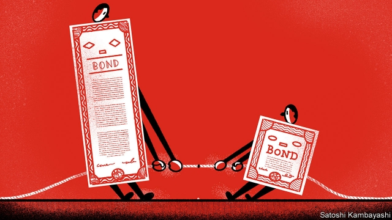
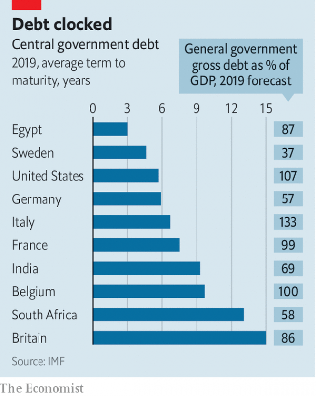

###### Buttonwood

# Bond maturities are the result of a tug-of-war 

##### On one side is cost; on the other, uncertainty 

 

> Apr 20th 2019 

 

IMAGINE TWO countries that differ only in the scale of public debt. In Vulgaria it is 50% of GDP; in Freedonia it is 5%. Vulgaria used the proceeds of its extra debt-raising to buy land for public parks. Because of these assets, it is regarded as being as good a credit risk as Freedonia. Taxes do not affect incentives to work or save in either place (they are a bit higher in Vulgaria). Inflation is low and stable. 

How should each country manage its debts? Specifically, how much should it raise by selling short-term bills, and how much by selling long-term bonds? A strain of public-finance theory, developed by Robert Barro of Harvard University, says it does not matter. Debt is deferred taxation. A dollar of debt will cut today’s tax bill by a dollar, but at the cost of raising it by a dollar tomorrow. If the debt is a one-year bond, the tax bill will come sooner. If it is a ten-year bond, it will come later. In this frictionless world the maturity of public debt is irrelevant. 

The real world is messier. The economy fluctuates, and so do interest rates. Taxes affect how willing people are to work. In such conditions, the maturity of debt is a tug-of-war between two influences. The government wants to keep today’s taxes low: that pulls it towards short-term bonds, the cheapest to issue. But it is wary of sudden increases in interest rates: that pushes it to issue long-term bonds, to limit “rollover” risk when bonds come due. The balance of these forces decides debt maturity. Certainty matters more to high-debt countries like Vulgaria. Cost matters more to low-debt countries like Freedonia. 

 

The IMF’s “Fiscal Monitor”, a health check of public finances, shows lots of variation around the world (see chart). A tendency for high-debt countries to issue long-term bonds is nevertheless evident. In Europe, high-debt Belgium has an average debt maturity of ten years; in low-debt Sweden the average is less than five. 

Rollover risk is a bigger concern for emerging markets. So although they have a lower debt-to-GDP ratio (the average is 53%) than rich countries do (104%), the average maturity of debt is similar, at around seven years. A big debt burden financed at short maturities can spell trouble (ask Egypt). Long-term debt might keep you out of it. South Africa’s debt is also high by emerging-market standards—and its stubborn budget deficit means that debt is rising quickly. Its economy is sluggish. A saving grace is that much of South Africa’s public debt is long-term. That buys the country time to address its problems. 

Still, the rule linking high debt to long maturity has many exceptions. America is one. Its debt-to-GDP ratio is above the rich-world average, but its debt maturity is towards the bottom of the scale. As a general rule bond-buyers prefer money-like securities, such as short-term bills, which is why they are cheaper to issue. By their nature, they are more liquid: they can be readily bought or sold. That makes them ideal collateral in transactions where each party fears the other might default. And because a lot of the world’s trade, derivatives and financing are in dollars, demand for America’s short-term debt is especially strong. That is why it can issue lots of it safely as well as cheaply. 

At the other end of the maturity spectrum, the big outlier is Britain. Despite a modest debt burden by rich-country standards, it has the longest term to maturity of any country in the IMF’s database. In contrast to America, it is long-term bonds that are prized in Britain—as outlined in a paper by Stéphane Guibaud, Yves Nosbusch and Dimitri Vayanos of the London School of Economics. Legislation in 2004 obliged pension funds in Britain to match their assets to the long-term promises they made to retirees. That spurred demand for long-dated bonds, driving down yields. Britain’s debt-management office responded by issuing lots more of them. 

This pension-fund effect is especially marked in Britain, but it is discernible in other countries, too. A recent study by Robin Greenwood of Harvard University and Annette Vissing-Jorgensen of the University of California, Berkeley, shows that countries with larger private pension systems are able to issue long-maturity bonds more cheaply. 

There are lessons for the hypothetical debt-managers of Vulgaria and Freedonia. Vulgaria might want to encourage a private pension system to stoke demand for long-term bonds. Freedonia might consider increasing its debt load a little to take advantage of the latent demand for money-like securities. It shouldn’t cost much. And the taxpayers of Freedonia might appreciate a public park. 

