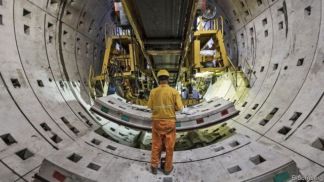
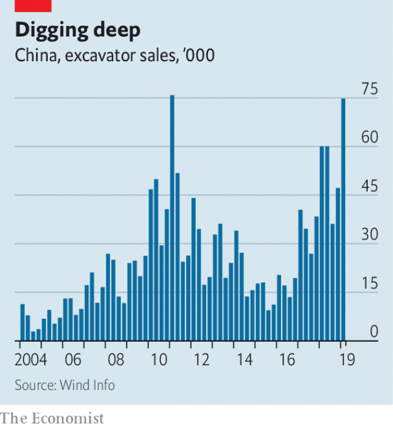

###### GDP in train

# China’s growth is set to perk up after a decade low 

##### Rising credit and an infrastructure programme point to a coming rebound 

 

> Apr 17th 2019 

JUST OVER 25 years ago Shanghai launched its metro with a single, stubby line. Since then it has added 15 lines and some 700km, making it the world’s longest metro system. It is far from done. The city recently unveiled plans for another 300km, including overland rail, within five years. Much of the work proceeds unseen as machines bore tunnels beneath the surface. But excavation holes around the city offer clues about the activity deep underground. 

They are part of a nationwide push. The Chinese government has, in the words of state media, hit the “fast-forward button” on infrastructure spending, a tried and tested way to pep up the economy. In the first quarter China’s GDP grew by 6.4% compared with a year earlier, level with the final quarter of 2018—its slowest in a decade. That would still be enviably fast for most countries. But Chinese officials have been unnerved by the possibility that it could herald the start of a steeper slide. 

Last year such fears were widely heard. The trade war with America seemed destined to get nastier. China’s stockmarket was slumping. Entrepreneurs complained that state-owned firms, already powerful, were elbowing them aside. A regulatory campaign to rein in debt levels sent tremors through the financial system, making banks much warier about lending cash. 

 

So in mid-2018 China’s government shifted gears. It cut taxes on personal incomes and corporate profits. Authorities ordered banks to lend more to small businesses. And planners cranked up the infrastructure machine again. For months they had held off from approving metro projects, mindful of the campaign to control debt. But in July they started things moving again, with half a dozen cities, including Shanghai, among the beneficiaries. Sales of excavation equipment, a proxy for construction, soared to an eight-year quarterly high in the first three months of 2019 (see chart). 

Yet there are still doubts about how far China will go to juice the economy. Li Keqiang, the prime minister, has repeatedly sworn off any major stimulus, fearful of undoing the progress made in slowing the growth of debt. Benefits from cutting taxes have been blunted by efforts to collect them more stringently. 

Meanwhile the infrastructure push shows how China has reached such a size that its growth faces clear limits. It aims to build 3,200km of high-speed rail lines this year. That is nearly as much as Spain, the country with the second-largest high-speed rail network, has in total; for China, though, it is down from an average of 3,600km annually over the past five years. Nor need the government worry about a slightly weaker economy causing unemployment: with the labour force shrinking as the population ages, help-wanted ads are popping up in shops across the country. 

Given all the reasons for restraint, many observers have therefore been taken aback by the strength of credit growth this year. Total social financing, a measure that consists mainly of bank loans and bond issuance, hit 8.2trn yuan ($1.2trn) in the first quarter, up by 40% from the same period last year, well above most forecasts. A quarter of the financing has been short-term corporate loans. In China that is usually a sign that pliant state-owned banks are heeding the government’s call to pump out credit, ahead of demand from borrowers. Growth could thus rebound by mid-year, says Larry Hu of Macquarie Securities. 

So are expectations of only a limited stimulus wide of the mark? More likely is that the change is one of timing rather than magnitude. The government seems to be front-loading its plans to prop up growth. 

Two political calculations may help explain this. The first is the trade war with America. China appeared to be on the back foot last year as its stockmarket tumbled. A rally this year, fuelled by the pro-growth policy tilt, has boosted China’s confidence as negotiations enter the home stretch. The second is the 70th anniversary of Communist Party rule on October 1st, which the government will mark with a flurry of festivities. It does not want them marred by grumbles about the economy. The subway-diggers can count on a busy summer. 

