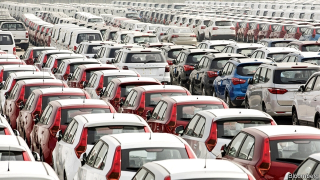
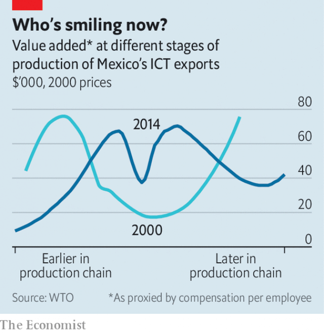

###### Everything to gain by their chains

# Is the world economy still slowbalising? 

##### Properly measured, the “China shock” looks less bad 

 

> Apr 17th 2019 

PROTONS POP up in every atom. Proton cars are not quite so ubiquitous. Founded in 1983 by Malaysia’s government, the Proton company strove to build a truly “national car”, but its parent lost over 1bn ringgit ($280m) in the two financial years before it sold a stake to Geely, a Chinese carmaker, in 2017. Neighbouring Thailand, in contrast, lacks a national car, but boasts a thriving car industry. Carmaking took off in the late 1980s after Japanese multinationals flocked to the country, importing whatever they could not make or buy within its borders. Foreign parts still account for 56% of the value of Thailand’s car exports, according to the most recent data from the World Trade Organisation (WTO). But the remaining home-grown value exceeds the total worth of Malaysia’s car exports several times over. 

Thailand’s cosmopolitan car industry illustrates the potential of “global value chains”, which link several countries in the production of a good or service. Unfortunately, these chains declined relative to world GDP between 2011 and 2016, contributing to what has been dubbed “slowbalisation”. But a new report by the WTO (and a long chain of partners, including the University of International Business and Economics in Beijing and the China Development Research Foundation, a Chinese government think-tank) finds that value chains recovered a little in 2017. 

Meanwhile, the political salience of value chains has shot up, thanks to tax battles and trade wars. In tax debates, trade along chains is often conflated with a narrower phenomenon: trade within multinationals (ie, when one of a firm’s outposts buys something from another in a different country). As a result, many commentators (including this newspaper on occasion) have claimed that 60% of world trade takes place within multinational firms. 

That figure would alarm tax authorities, because multinationals sometimes charge themselves contrived prices to shift profits out of high-tax jurisdictions. But the true percentage is about half that, as Maya Forstater, an independent researcher, and, more recently, Nick Shaxson of the Tax Justice Network, have pointed out. The rest is trade in which a multinational stands at one end of the transaction but not both. 

China’s position near the end of many chains has also inflamed the trade war. America’s prodigious imports from China contain many parts created elsewhere, including in America itself. This mongrel merchandise quickly penetrated America’s markets after China joined the WTO in 2001, inflicting what some scholars call a “China shock” on blue-collar workers. But the new report argues, in effect, that a $100 manufactured import from China does not represent $100-worth of Chinese manufacturing competition. Some of that value will have been counted already (if, for example, a phone casing had been imported to America, stuffed with components and returned to China for final assembly). Some represents the non-manufacturing inputs (including services and metals) required to make the product. And some of that $100 will have been created outside China by its foreign suppliers, including American firms. Properly measured, the report argues, the “China shock” looks less bad, hitting a third fewer jobs and ending in 2008 rather than persisting indefinitely. 

 

China may have had a bigger impact on Mexico. Back in 2000, the lucrative bits of its information and communication technologies industry were clustered close to either end of the value chain: upstream, in components and chemicals, or downstream, close to the customer in retail. The pattern thus resembled the “smile curve” invented by Stan Shih, a Taiwanese electronics magnate: value-added turns up at each corner (see chart). But China’s entry into the industry has transformed that expression. Ferocious competition in some of the upstream links of the chain has turned the smile curve into something considerably less cheerful. 

