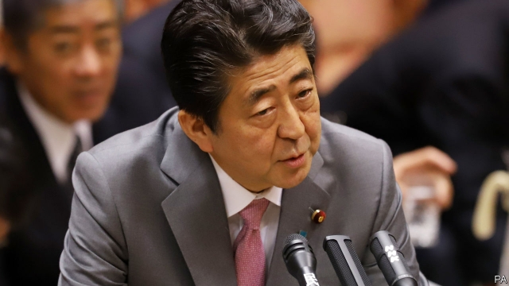

###### Read my lips: yes new taxes

# Shinzo Abe, Japan’s prime minister, is determined to raise sales taxes 

##### That risks snuffing out already sputtering growth 

 

> Apr 17th 2019 

AMONG THE pledges Shinzo Abe made in 2012, as he started his second stint as Japan’s prime minister, was to double the sales-tax rate. At 5% it was low by rich-country standards, and Japan’s public finances, battered by years of deficits, needed shoring up. But having gone part-way, to 8%, in 2014, he has twice put off finishing the job for fear of choking off a tentative economic recovery. That increase is now scheduled for October, and he is loth to delay a third time—so much so that he has said that only “an event with the magnitude of the Lehman Brothers shock” would deter him. 

Everyone agrees that a higher sales tax is needed, but they differ on the wisdom of a speedy move. The previous hike provoked a sharp downturn. Now fresh signs of economic weakness are leading to fears of a repetition. 

Just a few months ago the government was congratulating itself on having overseen Japan’s longest economic expansion since the second world war (as judged by a panel of experts appointed by the cabinet office). But last month the cabinet office downgraded its headline economic assessment for the first time in three years, blaming foreign factors, including China’s slowing economy. Their gloominess is widely shared. Freya Beamish of Pantheon Macroeconomics, a consultancy, points to the purchasing managers’ index and machine orders, both indicators of manufacturing activity, as well as the Tankan survey, a measure of business sentiment, and data on housing and retail sales. All show signs of weakness. First-quarter GDP figures, due out on May 20th, are expected to show a contraction. 

Some argue that the sales tax could still be raised on schedule. Koichi Hamada, an economist at Yale University and an architect of Abenomics, as Mr Abe’s economic programme is known, notes that the labour market is tight, suggesting an underlying resilience. And in contrast to 2014, points out Takatoshi Ito, a former official at the ministry of finance now at Columbia University, the government plans to mitigate the impact by returning much of the extra revenue to consumers, rather than seeking to reduce the deficit as fast as possible. 

The budget for 2019 includes ¥2trn ($18bn) of offsetting measures. Food, non-alcoholic drinks and newspapers will continue to be taxed at 8%. Poor households will receive shopping vouchers. Customers of smaller businesses will get rebates worth 5% of their purchase, or 2% at restaurants and convenience stores, provided they pay without cash. 

But plenty of observers are urging continued caution. Subdued price pressures mean that inflation remains far below the Bank of Japan’s target of 2%. If the economy is weak enough to require a negative interest rate (the Bank of Japan charges 0.1% annually to hold some reserves), it is surely too weak to withstand a tighter fiscal stance, they argue. And although gross public debt stands at around 2.5 times annual GDP, rock-bottom interest rates mean that servicing it is affordable. 

“Raising the consumption tax is putting the cart before the horse,” says Ms Beamish. Japan’s economy has long channelled too much cash into the corporate sector, at the expense of households. Tight-fisted managers have been reluctant to raise dividends or wages, and despite the government’s attempts to chivvy them into openhandedness, change is slow. “If they hike without having redirected income to the household sector, it’s a burden [households] can’t meet,” says Ms Beamish. 

Even some supporters think that if Mr Abe has to pause yet again, he will have only himself to blame. He has undoubtedly had a hand in Japan’s tentative economic recovery, mainly through monetary loosening, although the comfortable global environment helped. But he has also delayed reforms that would have put the economy on a firmer footing. Mr Ito points to proposals that could boost wages and therefore spending, such as changing tax incentives so that companies stop paying huge sums at retirement and instead increase compensation during workers’ careers. Without such measures, Mr Abe finds himself in an odd position for a politician: trying to raise taxes, even at the cost of potentially provoking yet another recession. 

