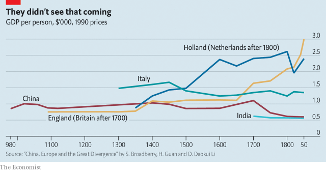

###### Free exchange

# Where growth is concerned, is population destiny? 

##### New research suggests that, in the very long run, size is a great advantage 

 

> Apr 17th 2019 

FOR CENTURIES prior to the Industrial Revolution, Asia’s massively populous societies made the continent the world’s centre of economic gravity. Industrialisation in Europe and North America in the 19th century briefly knocked it from its perch. But now their collective economic might, measured in real output on a purchasing-power-parity basis, is forecast to account for more than half of global production by 2020. Was the West’s period of dominance an anomaly, which could only ever have been short-lived? Is population destiny? 

It stands to reason that countries with larger populations might enjoy long-run economic advantages. People are the raw material of economic growth, after all. The more there are, the greater the likelihood that one becomes a Gutenberg or a Watt. In a world without much international trade, populous countries offer the largest markets, and comparatively more opportunity to boost economic output through specialisation and trade. Projecting economic growth rates is fantastically hard even over very short time horizons; over centuries, it is as good as impossible. But there are worse strategies than betting on the places with the most people. 

Klaus Desmet of Southern Methodist University, Dávid Krisztián Nagy of CREI, a research institute, and Esteban Rossi-Hansberg of Princeton University do just that. In a paper that last month won them the Robert Lucas prize, which recognises excellent research in political economy, they build a model that yokes economic performance to population size, within which they can run time forward by hundreds of years to watch the balance of economic power change. Long-run growth, they suggest, is driven by improvements in technology. And more populous countries should accumulate more innovation than smaller ones do because the return on developing a new technology is higher—there are more people to buy Edison’s light bulb and to enrich Edison, and therefore more incentive to invent the light bulb in the first place. 

Leaning against this force, however, is migration. Right now, the richest places are not the most populous. Should it become relatively easy to migrate, people will move from countries that are populous but poor to others that are rich. As migration swells the population of rich places, their long-run dominance is assured because of the link between population size and innovation. 

But if there is very little migration, then the populous but poor countries will out-innovate the small but rich ones, and make their way up the income league table. The process is not quick; the authors reckon that convergence takes about 400 years. In practice, rich places tend not to allow much migration from poor ones. That could change, but assuming that it does not, the model delivers a striking forecast: half a millennium from now, Asia and sub-Saharan Africa will have become great engines of productivity. 

Stranger things have happened. A millennium ago real output per person was significantly higher in China than in Britain (see chart). To predict that a European backwater would lead the world into the most transformative economic epoch in history would have seemed like madness. Over very long time horizons the world’s poorest places can indeed become the world’s richest, even if it does not happen often. 

 

Still, if Britain did not have the upper hand over China 1,000 years ago, it did soon after, at least in terms of real output per person. By 1400 incomes in Britain were meaningfully larger than in China (and higher still in the Netherlands and Italy), according to work by Stephen Broadberry of Oxford University, Hanhui Guan of Peking University and David Daokui Li of Tsinghua University. By 1700 the diverging trajectories of China and north-west Europe were clear (though it was anything but obvious just how much further apart they would become). In other words, population over the past millennium has not been destiny. If China’s and India’s masses did not raise them to prosperity during the past 600 years, what reason is there to believe the future will be different? 

It is possible that population is destiny, other things equal, but other things are never equal. And so a plague here, or a fateful decision by a Chinese emperor there, can set a region down a path that wipes out the advantages of population. Perhaps those advantages must be harnessed by the right sorts of institutions, or an accommodating culture—which take far longer to develop or adopt than technologies do to emerge. There is no academic consensus regarding what determines economic fortunes over long time horizons, important though the question is. Alternatively, one might argue that conditions have changed in ways that amplify the power of population. A billion brains seem a more economically potent force in an era of mass education, in contrast to the mass illiteracy that prevailed in the past. 

But crucially, Asia’s recent rise has not been the result of a spurt of indigenous innovation given its impetus by the size of its population. Rather, it has happened as part of a wave of globalisation, which aided the transfer of technological know-how. Openness to exchanges of goods and ideas, or indeed to immigration, is not an immutable parameter, but subject to change based on human preferences. Mr Desmet and his co-authors reckon that eliminating all barriers to migration would raise global welfare threefold—an extraordinary figure that reflects yawning differences in output per person between countries, and the unrealised human potential they represent. 

As intriguing as it is to consider the directions in which macro variables such as population or GDP are likely to nudge the world in coming centuries, it is human decisions that will determine which places and people are given the opportunity to become rich. National populations matter to the extent that borders do. It is a depressing notion, but a plausible one, that in half a millennium’s time they will matter still. 

