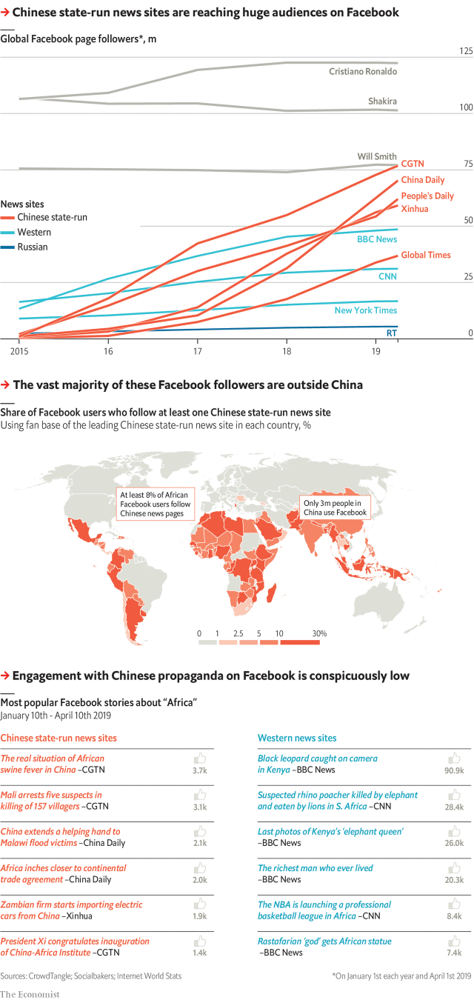

###### Gaining face

# China is using Facebook to build a huge audience around the world 

##### But its methods look fishy 

 

> Apr 20th 2019 

THE CHINESE COMMUNIST PARTY’s approach to Facebook is, ahem, two-faced. At home, to stop citizens sharing messages it cannot read, it blocks the site. Clever users can defy the ban, but only 3m do. It is easier to use WeChat or Weibo, local rivals that the state watches closely. 

Abroad, by contrast, China uses Facebook to dish up propaganda. Squillions of foreigners see its posts. The English-language page of CGTN, a state mouthpiece, has 77m fans—the most of any news site. China now runs five of the six media outlets with the biggest Facebook followings. None had more than 3m fans in 2014. If their current growth rates continue, by 2022 China Daily and CGTN will overtake the page of Cristiano Ronaldo, a footballer, who is Facebook’s most followed celebrity. 

This has given China a loud bullhorn. In 2018 its news pages yielded 370m likes, shares and comments. Russian trolls produced a mere 40m annual Facebook engagements when targeting American elections, according to the Oxford Internet Institute. Among the Chinese pages’ most popular posts are Orwellian titles such as “China human rights report notes violations in US” and “Why is Tibet a target for Western countries to pick on China?” 

How has such dross gained so many fans? Perhaps because China has opened news bureaus in many poor countries, where most of them live. Yet the outlets’ rapid growth looks improbable when compared with the sluggish rates of other Facebook news pages. Many young users have switched to Instagram and Snapchat. 

Moreover, Facebook pages usually gain followers when people share posts with their friends. Chinese outlets receive far fewer shares than Western ones do, which implies that they use some other tactic to amass fans. Facebook has already accused Chinese actors of skulduggery. In March it sued four Chinese firms, which it said had sold “fake accounts, likes and followers”. 

Creating eager, bogus followers—who can fool algorithms into showing posts to more real people—is harder on Facebook than on Twitter. From January to September 2018 the company deleted 2.1bn bots. In response to our findings, Facebook said it would investigate these pages’ growth. 

It would take a vast effort to hoodwink Facebook to this degree. But China spends $10bn a year on soft power. If anyone could do so, it would be the Communist Party. 

Editor’s note (April 17th 2019): After this article was published, Facebook said it had found only a tiny number of fake fans of the Chinese news pages in question, and that these represented less than 0.001% of the total followers of these pages. One explanation for the apparent growth in their popularity might be that sponsors are spending heavily on Facebook ads designed to acquire followers. 

