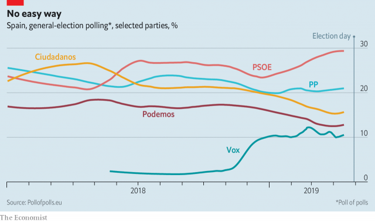

###### Heading nowhere?

# More political paralysis will not serve Spain well 

##### Voters should give the Socialists a governing majority—but almost certainly will not 

 

> Apr 17th 2019 

WHEN HE FAILED in February to get his budget passed, Spain’s Socialist prime minister, Pedro Sánchez, had little choice but to call a snap election. His government, just eight months old, had surprised many by lasting as long as it did. With only 24% of the seats in parliament, but without coalition allies, its every move had been a tricky negotiation. As the country heads to the polls on April 28th, the signs are that the political paralysis which now grips Spain may only worsen. The Socialists look set to win the most seats, but the new parliament will contain five big parties, thanks to the arrival of the ultra-nationalist Vox (see article). None will have anything like a majority, so the options will be another short-lived minority government, an argumentative coalition or, most likely, fresh elections—the fourth in as many years. 

The pattern is becoming familiar in Europe, where fed-up voters have abandoned the traditional parties of right and left (ask France’s Republicans, or Italy’s Democrats) and opted for a plethora of new groups, some on either extreme of the spectrum, others harder to pin down. Political fragmentation has caused protracted delays to the formation of governments in Germany, Italy, Sweden and Estonia in the past year or so. Finland this week looked likely to go the same way after its own inconclusive election. And when governments are eventually formed they tend to be weak, lowest-common-denominator affairs, further enhancing the popular distrust of established politicians; or else chaotic unions like the mixture in Italy of nationalist right and maverick left. France has been an exception, but even President Emmanuel Macron’s ratings have fallen sharply. 

It might be tempting to say that political paralysis is not a death knell. Mariano Rajoy, who lost a confidence vote at the hands of Mr Sánchez last June, managed his own minority government pretty well after losing his majority at the end of 2015. Although growth has now slowed to an expected 2.1% this year, it was above 3% in 2015, 2016 and 2017 as Spain smartly recovered from the disruption of the euro-zone crisis, trimming both its budget deficit and its high unemployment rate at the same time. 

But that recovery was part cyclical and part the delayed result of painful reforms that Mr Rajoy enacted before his People’s Party (PP) lost its majority. Spain faces a number of knotty problems that a weak government will not be able to solve. To sustain growth, it needs plenty more reform: to its schools system, its pensions, its complicated political structure and the labour market, building on Mr Rajoy’s useful work. One danger is that a new Socialist-led government may opt to rely on the left-wing Podemos party, which would frustrate some of this agenda and risk blowing up the budget again. 

The next government must also deal with the crisis in Catalonia, whose regional government declared independence after an unconstitutional referendum in 2017. Mr Rajoy, backed by Mr Sánchez, responded with direct rule. The Catalan government has now been restored, but nine of its former leaders are in jail and being tried on charges likely to result in long sentences. That will shatter an uneasy calm. Catalonia also bedevils the formation of any new government. The Socialists favour dialogue, but their other potential partner, Ciudadanos, is intractably against it—sadly, since in other ways it would act as a useful pro-market influence on Mr Sánchez. 

The alternative, a right-of-centre coalition between the PP and Ciudadanos, is a worrying prospect of a different kind. It would offer the Catalan separatists only further confrontation, and would almost certainly need to bring Vox into government in order to create a majority. For a country that has struggled so hard against the ghosts of Franco’s nationalism, that would be a step in the wrong direction. Ideally, Spaniards would vote on April 28th for Mr Sánchez’s party in large enough numbers for it not to need allies. But that looks highly unlikely. 

