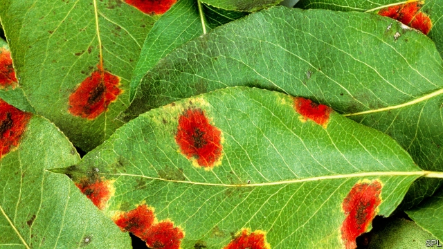

###### Sow early

# Warmer temperatures could play havoc with crops 

##### Even in temperate regions crops need future proofing 

 

> Apr 17th 2019 

RISING CARBON-DIOXIDE levels and the climate change associated with them portend many problems, but one group of people might be expected to give them a cautious welcome: farmers in Earth’s temperate zones. More CO2 typically results in more photosynthesis and therefore higher yields, and milder weather means longer growing seasons. Balanced against these potential benefits, however, is the potential for blight. It is hard to predict how changes in the climate and the atmosphere’s chemistry will affect the prevalence and virulence of agricultural diseases (see article). But there is a risk that such changes will make some plant infections more common in all climatic zones, perhaps catastrophically so. To fend off this danger, seed companies and botanists need to band together to stockpile a genetic arsenal before it is too late. 

Part of the problem is that centuries of selective breeding have refined the genomes of most high-value crops. They are spectacular at growing in today’s conditions but genetic variations that are not immediately useful to them have been bred out. This is good for yields but bad for coping with change. A minor disease or even an unknown one could suddenly rampage through a genetically honed crop. Indeed, this is already happening in America, where a mysterious pathogen is killing apple trees, and India, where warmer-than-usual winters have spread wheat-blast disease, ravaging the country’s second-largest crop. 

New diseases are unlikely to make the West starve. It will always be able to buy its way out of a shortage by importing calories from elsewhere. But soaring world food prices would cause widespread malnutrition and suffering. What is more, the threat of new diseases is a problem with a ready solution. 

All crops have wild relatives that are ill-suited to agriculture but which have vastly more genetic diversity than their cultivated cousins. Within the DNA of these wildlings are genes with the potential to grant resistance to future pathogens. As an insurance policy, those genes need to be collected, studied and stored, usually in the form of seeds, until a time comes when a threat arises that requires them to be inserted into the genome of a specific crop. This is being done, but too slowly. Gene-banks contain too few specimens of two-thirds of the pertinent wild relatives of crops. The rest are not included at all. 

You might think that the giant commercial agribusinesses would help. Ploughing more resources into gene-banks and understanding wild varieties would strengthen food security and, in the long run, would boost the firms’ bottom lines. However, in spite of the threat, firms like Bayer and Syngenta still see future-proofing crops against disease as a responsibility for governments to take on. 

Perhaps that is because the gargantuan task of preparing for all the possible pathogens for all the main crops is too uncertain to be commercially attractive. Wheat alone needs to be tested against hundreds of potential diseases at a range of projected temperature, humidity and CO2 levels in order to identify the biggest future threats. That done, genes collected from wild species can be inserted into the domestic versions and the experiments run again, to see what works. 

Academic botanists can indeed help, as the agrifirms say. However, the work is monotonous and receives little reward or recognition. Whereas curing an epidemic builds careers, ensuring that a would-be plague never surfaces is a route to obscurity. 

If they are to act, plant scientists will need incentives including money for salaries and for the research itself. Large grant-providing agencies, including America’s Department of Agriculture, will have to shift cash towards preparations for future threats. 

One barrier to funding and recognition is official dogma. America’s National Science Foundation rejects grant requests that include the words “climate change”, applicants say, because the administration and its allies have decided it does not exist. Europe is in need of a scolding, too, for its reactionary attitude to genetic engineering. Although the genes of wild-crop relatives can be woven into commercial crops through plant breeding, even modern versions of this technique will be slower than editing a plant’s DNA directly. Gene editing will be essential, even if it makes European consumers, and therefore policymakers, queasy. The sooner they accept it, the better. 

