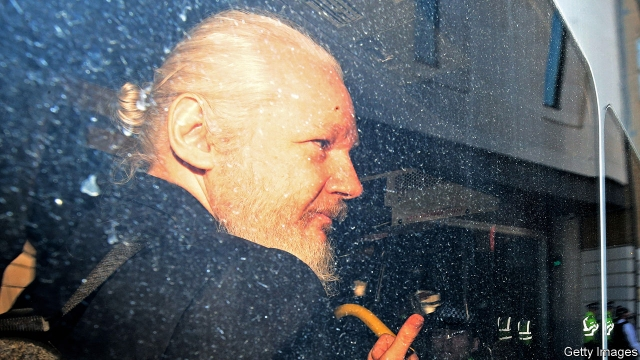

###### Hacking and the law

# Why Julian Assange should be extradited 

##### The WikiLeaks co-founder is accused of hacking, not leaking, and that is a serious crime 

 

> Apr 17th 2019 

WHEN JULIAN ASSANGE was dragged out of Ecuador’s embassy and into a London courtroom on April 11th, you could be forgiven for thinking that it was his life’s work, moral character and personal hygiene in the dock. Mr Assange was “no hero”, said Jeremy Hunt, Britain’s foreign secretary. Nonsense, retorted Jeremy Corbyn, leader of the opposition Labour Party, he “told us the truth about what was actually happening in Afghanistan and in Iraq”. Ecuador’s president complained that Mr Assange had repaid his country’s hospitality by smearing faeces on the embassy wall. These soundbites miss the point. America accuses Mr Assange of hacking Pentagon computers. Does that charge justify his extradition? 

To be sure, Mr Assange’s legacy deserves scrutiny. WikiLeaks did some good in its early years, exposing political corruption, financial malfeasance and military wrongdoing. But the decision to publish over 250,000 diplomatic cables in 2010 was malicious. The vast majority of messages revealed no illegality or misdeeds. Mr Assange’s reckless publication of the unredacted versions of those cables the following year harmed America’s interests by putting its diplomatic sources at risk of reprisals, persecution or worse. 

In 2016 Mr Assange’s organisation showed even poorer judgment in engaging with Guccifer 2.0, an online persona widely assumed—and later proven—to be a front for Russia’s GRU spy agency. As America’s presidential election approached, WikiLeaks disseminated lurid conspiracy theories around the Democratic Party and Hillary Clinton, and asked the Russians for stolen emails relating to Mrs Clinton. 

When Mr Assange said in 2010 that “I enjoy helping people who are vulnerable,” his fans cannot have thought he meant President Vladimir Putin. The contrast between WikiLeaks’s attacks on American spy agencies and its collaboration with their autocratic rivals speaks volumes about Mr Assange’s real motives. 

Yet neither Mr Assange’s journalistic malpractice, nor his hostility to the West and narcissism, however contemptible, are the subject of criminal prosecution. Instead, an American courtroom will focus on his hacking (see article). Mr Assange is accused of helping Chelsea Manning, who stole the war logs and diplomatic cables in 2010, try to crack the password to a classified military network. Though Mr Assange was probably unsuccessful, the alleged act made him a “co-conspirator” in the effort by Ms Manning. 

America’s indictment has some troubling elements. It sets out how Mr Assange helped Ms Manning conceal her communications and exhorted her to provide more information. Both are acts within the legitimate bounds of a relationship between publisher and source, rather than signs of nefarious intent. 

Yet the central charge—computer hacking—is an indefensible violation of the law. Neither journalists nor activists, like Mr Assange, have carte blanche to break the law in exercising their First Amendment rights. They are entitled to publish freely; not to break and enter, physically or digitally, to do so. 

Some critics gripe that going after Mr Assange for hacking is like going after Al Capone for tax evasion—that it was the only charge prosecutors think they can make stick, and that the real reason they want to lock him up is because he threatens national security. But there is nothing wrong with prosecutors acting pragmatically, and they were right not to file bigger charges, such as espionage, that might threaten press freedom if they were successfully used to convict the WikiLeaks founder. Mr Corbyn is therefore misguided when he suggests that Mr Assange is being targeted for extradition “for exposing evidence of atrocities in Iraq and Afghanistan”. If that were really how the system worked, hundreds of American journalists would be in jail. 

In fact, he is being pursued for the alleged law-breaking that sets him apart from real journalists. So if British courts judge that America’s request is lawful, Sajid Javid, Britain’s home secretary, should let it proceed. New charges may yet be issued—particularly if the publication of the Mueller report on April 18th reveals new details of WikiLeaks’s dealings with Russia. But America cannot add these once Britain has agreed to dispatch Mr Assange, without a further request. 

If Sweden reopens its rape case against Mr Assange, which was closed in 2017 because he could not be arrested, Mr Javid might have to judge the precedence of the two claims. That would be hard: is trying to hack military secrets with intent to publish them, risking lives and national security, more or less serious than rape? Both charges carry similar sentences. And although America’s request has come first, Sweden issued its original warrant in 2010. The best option would be for Britain to extradite him to Sweden, if Sweden requests it, and when justice has been done there, for Sweden to extradite him to America. 

