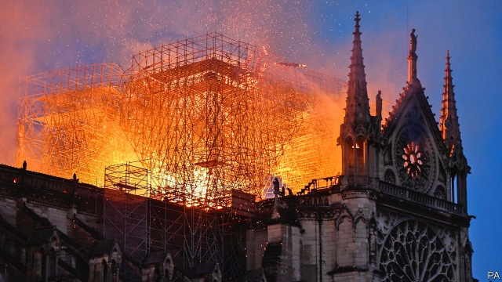

###### The human spark

# Why people care about ancient buildings 

##### The world’s reaction to the flames licking around Notre Dame is profoundly human 

 

> Apr 17th 2019 

“WHAT IS CIVILISATION?” asked Kenneth Clark 50 years ago in the seminal BBC series on the subject. “I don’t know, and I can’t define it in abstract terms, yet. But I think I can recognise it when I see it, and I’m looking at it now.” And he turned to gesture behind him, at the soaring Gothic towers and flying buttresses of Notre Dame. 

It seems inhuman to care more about a building than about people. That the sight of Notre Dame going up in flames (see article) has attracted so much more attention than floods in southern Africa which killed over 1,000 arouses understandable feelings of guilt. Yet the widespread, intense grief at the sight of the cathedral’s collapsing steeple is in fact profoundly human—and in a particularly 21st-century way. 

It is not just the economy that is global today, it is culture too. People wander the world in search not just of jobs and security but also of beauty and history. Familiarity breeds affection. A building on whose sunny steps you have rested, in front of which you have taken a selfie with your loved one, becomes a warm part of your memories and thus of yourself. That helps explain why China is in mourning—WeChat, young China’s principal means of talking to itself, has been throbbing with the story, and Xi Jinping, the country’s president, sent a message of condolence to Emmanuel Macron, his French counterpart—while India was largely indifferent. Tourism from India to the West is a trickle compared with the flood from China. 

This visual age has endowed beauty with new power, and social media have turned great works of art into superstars. Only a few, though, have achieved this status. Just as there is only ever a handful of world-famous actors, so the pantheon of globally recognisable cultural symbols is tiny: the Mona Lisa (see article), Michelangelo’s David, the Taj Mahal, the Great Pyramid—and Notre Dame. Disaster, too, is visual. In the 24 hours after the fire started videos on social media of the burning cathedral were viewed nearly a quarter of a billion times. 

Yet the emotions the sight aroused were less about the building itself than about what losing it might mean. Notre Dame is an expression of humanity at its collective best. Nobody could look up into that vaulted ceiling without wondering at the cumulative genius of the thousands of anonymous craftsmen who, over a century and a half, realised a vision so grand in its structural ambition and so delicate in its hand-chiselled detail. Its survival through 850 years of political turbulence—through war, revolution and Nazi occupation—binds the present to the past. 

The fire also binds people to each other. The outpouring of emotion it has brought forth is proof that, despite the dark forces of division now abroad, we are all in it together. When nationalism is a rising threat, shared sadness makes borders suddenly irrelevant. When politics is polarised, a love of culture has the power to unite. When extremism divides Muslim from Christian and religious people from atheists, those of all faiths and none are mourning together. An edifice built for the glory of God also represents the unity of the human spirit. 

And it will be rebuilt. The morning after the fire, the many Parisians who went to the cathedral to mourn its destruction found comfort instead. Although the spire is gone, the towers are still standing and it seems likely that the whole building can be revived. The effort to rebuild it, like the fire, will bring people together. Within 24 hours, €600m ($677m) had been raised from businesses and rich people, and a rash of crowdfunding campaigns started. A high-resolution laser scan of the building, carried out recently, should help. 

It will never be the same, but that is as it should be. As Victor Hugo wrote in “The Hunchback of Notre Dame”, a three-volume love-letter to the cathedral: “Great edifices, like great mountains, are the work of centuries. Art is often transformed as it is being made...Time is the architect, the nation is the builder.” 

