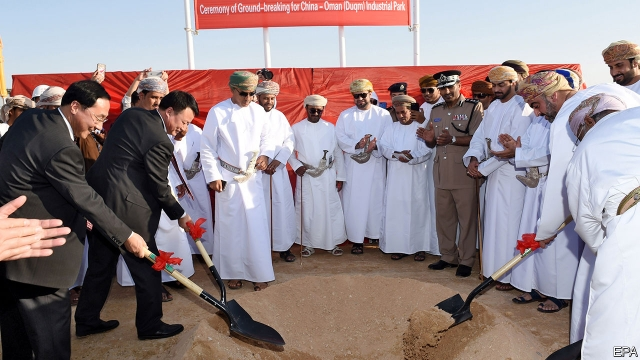
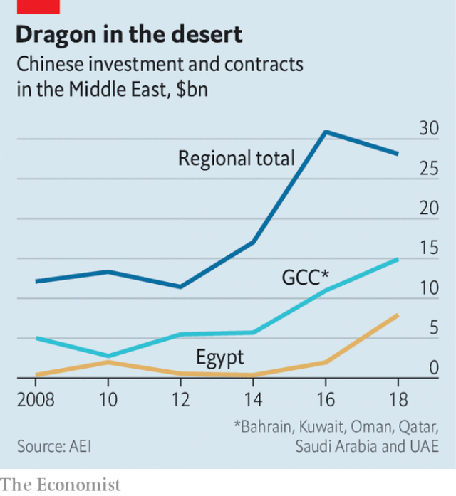

###### No questions asked

# Chinese money is behind some of the Arab world’s biggest projects 

##### The region’s autocrats appreciate Beijing’s no-strings approach 

 

> Apr 20th 2019 

THERE IS NOT much to see for the first 500km south of Oman’s capital, Muscat, as the highway slices through the Hajar mountains and down a barren coast. Then it hits Duqm, a sleepy fishing village that is being transformed into a mega-port. The government’s hope is to capture a share of the shipping trade between Asia, Africa and Europe. And there, in the middle of nowhere, a consortium of Chinese firms wants to invest $10bn to build a 1,000-hectare industrial zone. “Petrochemicals, glass, solar panels, car batteries—they want to attack all these markets,” says Reggy Vermeulen, the port’s CEO. 

For decades the Middle Kingdom saw the Middle East as a petrol station. About half of China’s oil came from Arab states and Iran. Little went in the other direction. In 2008 the region got less than 1% of China’s net outbound foreign direct investment (FDI). Skip ahead a decade and Chinese money is everywhere: ports in Oman, factories in Algeria, skyscrapers in Egypt’s new capital. Last year it pledged $23bn in loans and aid to Arab states and signed another $28bn in investment and construction deals (see chart). 

 

The Arab world is hungry for such investment. Annual FDI inflows have fallen by two-thirds since 2008 and lag far behind other emerging markets. Take Egypt, which is famous for its cotton. Its state-run textile firms are a mess, with machinery that has not been updated in decades. Enter China: in January it promised 2.1bn Egyptian pounds ($121m) to build modern textile factories outside of Cairo. Officials hope the project will create more than 100,000 jobs. 

Such job creation is not common, though. Since 2005 China has signed $148bn worth of construction deals with Arab states, estimates the American Enterprise Institute, a think-tank. More than one-third of that sum went to energy projects which, while necessary, will not employ many locals. Even the construction itself does not create many local jobs. The China State Construction Engineering Corporation has built both a five-star Sheraton resort in Algiers and a less luxurious prison south-east of Algeria’s capital. On these projects, and dozens of others in Algeria worth a combined $16bn, some 40,000 Chinese labourers did most of the work. 

Trade between China and the Arab world is lopsided. In 2017 Tunisia imported $1.9bn worth of goods from China, 9% of its total imports. It exported just $30m to China. “Twenty-five percent of our trade deficit comes from China alone,” says Lotfi Bensassi, an adviser to the prime minister. The trinkets hawked to tourists in souqs are usually made in Chinese factories, not Arab workshops. In the occupied West Bank even the makers of keffiyehs, a symbol of Palestinian identity, cannot keep up with their Chinese competitors. A few Arab states hope that China’s growing taste for olive oil will lower their trade deficits a bit. But China will not put millions of unemployed Arabs to work. 

Instead it is following the model that has burdened some Asian and African states with crippling debt. Arab governments have been more cautious. There are no local equivalents of Sri Lanka’s “ghost airport”, built with Chinese capital and devoid of flights. Algeria, struggling with low oil prices and a high budget deficit, stopped signing big deals with Chinese firms two years ago. Infrastructure loans from China to the Middle East grew almost tenfold from 2015 to 2016, to $3.5bn. But more than half went to the United Arab Emirates (UAE) to finance projects like the expansion of Dubai’s airports, the world’s busiest. Wealthy Gulf states like the UAE have no trouble repaying big loans. 

Although the UAE is keen to attract China’s cash, it is also nervous about its ambitions. Officials at DP World, a port operator mostly owned by Dubai, say its network of ports and railway hubs will complement the Belt and Road Initiative (BRI), a programme of global infrastructure projects by China. Maybe so, but the BRI is also a threat. Almost two-thirds of Chinese exports to Europe, the Middle East and Africa move through Emirati ports. If the Chinese-funded port at Gwadar, in Pakistan, becomes a trans-shipment hub, it could take business from Dubai’s flagship Jebel Ali port. Duqm poses a similar threat. 

Other countries that are active in the region worry about security. A Chinese firm won the tender to operate a new port in Haifa, Israel’s third-biggest city, where American warships often call. America wants Israel to reverse the decision. Oman got a similar warning over Duqm. “They can have a piece of the industrial zone, but we’re keen to keep them out of the military side,” says an American diplomat in Muscat. In recent months Oman has signed deals that allow the American and British navies to operate in Duqm. China received no such privileges. 

Part of what makes China an attractive partner is that its money comes with few strings attached. Its policy of political “non-interference” lets it build ties with mortal enemies—Saudi Arabia and Iran, Israel and Syria—and makes it a useful hedge against America, which Arab autocrats fear will abandon them. But the lack of strategic engagement has a downside. Without ships in the Mediterranean, China needed Greece’s help to extract its citizens from war-torn Libya. The opening of China’s first overseas military base, in Djibouti, in 2017 may be a sign of broader ambitions. 

Arab officials who once ignored China talk of it as a rising regional power—a softer sort than America or Russia. An influx of Chinese tourists has led to hotels in Cairo teaching staff to speak Mandarin and cook Chinese dishes. Diplomats from Beijing often have a command of Arabic that puts their Western counterparts to shame. When Lebanon’s prime minister formed a government in February, after nine months of deadlock, his first visit came from the Chinese ambassador. But China seems to have little interest in sorting out the civil war just over the border in Syria. Mercantilism is its priority, not fixing the region’s many problems. 

