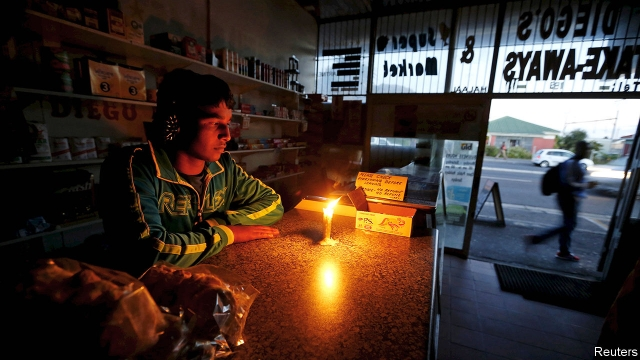
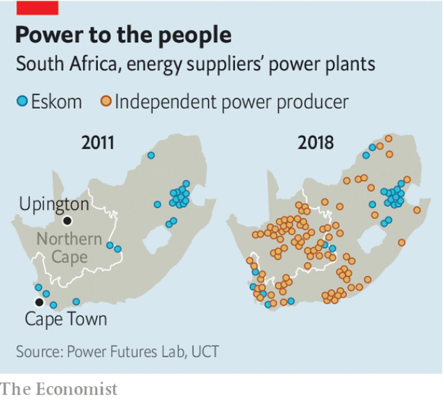

###### A glimmer of light

# How to solve South Africa’s energy crisis 

##### President Cyril Ramaphosa must face down unions to embrace clean power 

 

> Apr 17th 2019 

IN THE CONTROL room of Scatec Solar in Cape Town Johan Badenhorst gazes at the six monitors on the wall. The screens display the status of the firm’s 16 plants in 11 countries. The three in South Africa are doing nicely, producing enough energy to power 93,000 homes. Problems are rare, says Mr Badenhorst, Scatec’s senior control officer, before correcting himself: once a bird dropped a tortoise on a solar panel, smashing the glass. 

Such issues, while upsetting for tortoises, are minor compared with those faced by Eskom, the state-owned utility that supplies 95% of South Africa’s electricity. At least one-third of its power stations are broken or shut for maintenance. Over recent months the talk of the country has been of “load-shedding”: a euphemism for blackouts because Eskom cannot meet demand. March was the worst-ever month for load-shedding, when Eskom regularly took 4,000-megawatts (MW) off the grid, about one-eleventh of its total capacity (45,561MW), or enough to power 3m homes. 

Further failures could have severe consequences. “Eskom is the greatest systemic risk to the South African economy,” says Colin Coleman, the boss for sub-Saharan Africa of Goldman Sachs, a bank. Goldman reckons power cuts could reduce GDP growth by 0.9 percentage points, about half the rate of official growth forecasts. 

Eskom also threatens South Africa’s public finances. Since 2007 Eskom’s debt has risen from 40bn to 420bn rand ($30bn). It is effectively insolvent, borrowing to pay interest on its debts. In February the Treasury announced a 69bn rand bail-out. It will not be the last. “There is a real risk of financial meltdown,” says Anton Eberhard, who advises President Cyril Ramaphosa on energy. The president, who took over from Jacob Zuma last year, is standing in elections on May 8th. People may not take kindly to voting in darkness. 

Eskom’s predicament has deep roots. Between the 1960s and 1990s the apartheid government built big and dirty power stations hoping cheap electricity would spark industrialisation. After white rule ended in 1994 the African National Congress (ANC) had Eskom provide power to the more than two-thirds of black households that lacked electricity, one of the fastest electrification projects in history. 

In the past two decades Eskom has symbolised South Africa’s failings, rather than its successes. In the 2000s the government of Thabo Mbeki delayed building new plants, mostly because of overcapacity. By 2008, when this capacity was used up, Eskom started load-shedding. Two huge coal-fired power stations were meant to fill the gap, adding 4,800MW of power to the grid. But construction is running years late and about three times over budget, says Chris Yelland, an independent analyst. 

One reason is that some of Eskom’s bosses have spent more time stealing than managing. Cronies of Mr Zuma and his patrons, the Gupta brothers, are alleged to have siphoned off tens of billions of rand in inflated or irregular contracts. The utility sells less electricity than it did in 2007 but spends three times as much on employees and five times as much on coal (though inflation accounts for some of this). 

Eskom’s structure makes matters worse. The utility is “vertically integrated”, meaning that it has a critical role in the three parts of electricity supply: generation (power plants), transmission (the national grid) and distribution (the final power lines). Most rich countries have ditched this monolithic model, with good reason. It blocks competition, reduces transparency and deflects accountability. 

On February 7th Mr Ramaphosa said that Eskom would be broken up. It was the seventh time that a president has used his State of the Nation Address to make such a pledge. But this time may be different because there is a clear alternative to the coal-dominated monolith—a market-based model that is open to renewable energy. 

 

It is a model with which the country has begun to experiment (see map). In 2011 South Africa launched a renewable power programme that was widely acclaimed for using auctions to drive down the cost of power. It was set up at the urging of the Treasury, an island of competence in a swamp of corruption. These auctions led to $14bn in private capital investment and about 5,000MW of extra capacity. 

But in 2015 Eskom refused to sign agreements with independent power projects that had won the auctions. This was because Mr Zuma’s allies were trying to force through a ruinous deal he had struck with Vladimir Putin for Russian nuclear power stations. (Fortunately this venture was unsuccessful.) It was only last year that the stalled projects could go ahead. As part of this revival Scatec Solar is building three plants in Upington in the Northern Cape. 

More renewable energy will help the environment. Just three countries in the world get a higher share of their electricity from coal. Yet there is also a financial case for them. Wind and solar stations can go up quickly without straining Eskom’s balance-sheet. They also generate power more cheaply than that humming down the line from Eskom’s coal-fired power stations. Recent international auctions have priced renewable power at about 30 South African cents per kWh, versus more than 50 cents for Eskom’s existing coal plants. “South Africa should never build another coal station ever again, purely on the basis of economics,” argues Tobias Bischof-Niemz, a former Eskom engineer who is now a director at ENERTRAG SA, a renewables firm. 

Whether it will depends on the government’s long-delayed Integrated Resources Plan, due to be published after the election. It ought to lay out how South Africa will make two transitions: from coal to renewables; and from a monopoly to a market-based system. Vested interests in Eskom and mining unions will resist both. Assuming Mr Ramaphosa wins on May 8th, he will have to face them down. If he fails, the future will be dark, for him and for South Africa. 

