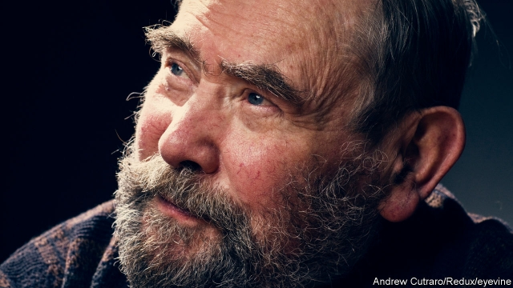

###### Irrepressible

# Obituary: Sydney Brenner died on April 5th 

##### The molecular biologist who shared Francis Crick’s office for 20 years was 92 

 

> Apr 17th 2019 

IT WAS A book, rather than the natural world itself, that made Sydney Brenner want to be a scientist. He was so captivated by “The Science of Life”, by H.G. Wells, Julian Huxley and G.P. Wells, that rather than return it to the public library in Germiston, his South African birthplace, he paid a daunting two-shilling fine for losing it. Purloined in the 1930s, it was still with him in the 1990s. 

A precocious boy—a student at the University of the Witwatersrand by the time he was 15—and bullied for it, reading was his connection to the wider world. Courses, he said, never taught him anything. The way to learn was to get a book that told you how to do things, and then to start doing them, whether it was making dyes or, later in life, programming computers. If he thought more deeply than the other great biologists of his age, which he did, it was surely because he read further, too. 

Unsurprising, then, that he saw the life he studied as a thing that could be read—and that could read itself. In 1960, during a long conversation with two of the other giants of molecular biology, Francis Crick and François Jacob, he was the first person in the world—by about a second—to understand how cells read genes to make proteins. In the 1970s he suggested a way of turning all the genes needed to make up a human into a “Book of Man”—a precursor to the Human Genome Project that he would go on to champion. The most sustained project of his life was an attempt to learn how a tiny worm read itself into existence from nothing but an egg and a genome. 

Which is not to say that he was locked in silent study. Anything but. He was voluble, and mischievous. He joked, and harangued, and seemed rarely to let a thought go unexpressed. The years in which he shared an office with Crick in Cambridge were times of endless talk, of sense and nonsense; nothing, he would say, was too stupid to say. It was not a dictum to which he was true. He made plenty of people think that what they had said was indeed stupid. He mocked people; he wrote them off, too. But he believed it was true of himself, and of those he chose to respect. 

He met Crick in 1953, when on a cold April day he and other young researchers from Oxford drove to Cambridge to see the model of the DNA double-helix structure that Crick and James Watson had assembled at the Cavendish Laboratory. It was, he said, the watershed moment of his life. After spells in America and back in South Africa, he and Crick became room mates, friends and collaborators. They shared their fathers’ trade—both men had been shoemakers, though Harry Crick’s Northamptonshire version of the business had been more comfortable than that of Morris Brenner, an illiterate Lithuanian immigrant. They shared impressive eyebrows, too. Recalling a conversation with Brenner at the high table of Kings College, the historian Horace Freeland Judson noted that some of the hairs in them were a full three inches long. 

More to the point, Brenner and Crick developed a shared way of looking at the problem they faced: how DNA told cells to make proteins. Brenner had read papers by the mathematician John von Neumann from which he had taken the lesson that what was necessary for reproduction was a structure that contained within itself an account of how it could be made—the account, the finished structure and the means of its making being logically distinct. Though he did not articulate the ideas straight away, they were to inform both men’s thinking about the genetic code that is written in DNA and how it is read first by being transcribed into “messenger RNA” and then translated through “adaptors” into protein. 

By the early 1960s they were looking for new fields. Brenner chose to apply the idea that a life form was a computer reading a program that told it how to make itself at the level of a whole organism, rather than a cell or virus. To do this, he needed an organism to study. Naturally, he looked for it in books. On a day when he was ill his wife May collected one from Heffers, a Cambridge bookshop, that introduced him to a tiny nematode worm called Caenorhabditis elegans. It turned out to be perfect; transparent, and thus easily looked into; easily frozen, too, for later use. Normally hermaphroditic, which meant it could be copied; but capable of sex, so mutants could be crossbred when necessary. Simple—just a few thousand cells in all, and with a nervous system (Brenner’s particular interest) of just 300. Quickly bred—a generation every three days. And its development was as deterministic as a programmer could wish; every adult with the same number of cells arranged the same way, every connection between nerves constant and mappable. 

Brenner and his colleagues spent decades anatomising the worm’s development, its genome and the fate of all its cells. Increasingly, labs elsewhere followed suit; by one estimate the worm and its workings are now studied by 1,500 research groups around the world. Brenner, his Cambridge colleague John Sulston and Robert Horvitz of MIT were awarded the Nobel prize for medicine in 2002 in recognition of their work on its developmental pathways and the ways that some cells were programmed to die in order for the desired final anatomy to take shape. 

He was, for the most part, a starter, not a finisher, much better at opening institutions than running them. In his early years, he delighted in remembering later on, he was described as an “enfant terrible” of his field; at an age when others would retire (he never did) he re-styled himself as wily old Uncle Syd, dispensing sharp questions and half-formed provocations, surprising young researchers with an ability to know what organism they were working on by reading just a snatch of DNA or protein sequence over their shoulder. 

“Inside every animal there is an internal description of that animal,” Brenner told Judson at high table as Judson fixated on his eyebrows. Inside him sat both the reasons for the flamboyant development of those hairs and the reason such internal descriptions so fascinated him. It was a life that read itself. 

