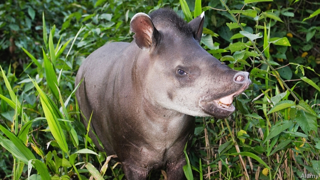

###### Ecology

# Do tapirs defecate in the woods? 

##### They prefer burnt-out scrub. And that may help to regenerate forests 

 

> Apr 17th 2019 

AN OBVIOUS RESPONSE to deforestation is to plant more trees. But this is no easy task. Sowing the right mix of seeds and ensuring that saplings survive long enough to establish themselves is complicated, time-consuming and expensive. Things can, however, be simplified to some extent by recruiting the local wildlife. And in a South American context, according to a study published in Biotropica by Lucas Paolucci of the Amazon Institute of Environmental Research, in Brazil, that means looking after the local tapirs. 

The role of bats and birds in reseeding damaged areas is well known. These flying animals often defecate pips and stones from fruit they have eaten in places distant from where the food were consumed. Much research has therefore been devoted to luring them into damaged areas—sometimes with success. There is a limit, however, to the size of seed that a bat or a bird can carry, and that constrains which plants can be regenerated in this manner. 

Lowland tapirs suffer no such constraint. They are the region’s biggest herbivores and swallow lots of large seeds. Dr Paolucci thus wondered to what extent tapirs were transporting seeds from pristine to damaged areas. To try to find out he and a team of colleagues set up a study of tapirs’ defecatory habits. 

The researchers used a mixture of field observations and camera traps to monitor tapirs in three adjacent plots that are part of a larger project to study the effect of fire on Amazonian rainforest. These plots were confirmed at the beginning of the study to be similar in such matters as plant-species richness, the relative abundance of the commonest species, the density and composition of woody stems in the area, and the moisture content of the leaf litter. Each had an area of half a square kilometre, and each was bounded on one side by healthy rainforest and on the other by a soyabean plantation. One plot was then burned every year from 2004 to 2010. A second was burned every three years (2004, 2007 and 2010). The third was left pristine. 

Dr Paolucci and his colleagues carried out their study in 2016. In January, April, June and September of that year they searched the plots for tapir dung piles. They collected, cleaned and identified the seeds in these piles, and examined them for damage that might stop germination. 

Altogether, they found 163 dung piles. Of these 43 were in the pristine plot, 48 in the triennially burned plot and a surprising 72 in the plot that had endured annual fires. The piles contained, they found, a grand total of 129,204 seeds from 24 species of plant. Fewer than 1% of those seeds were so badly damaged as to suggest that they would not germinate. On the basis of these results Dr Paolucci calculated that tapirs pass an average of 9,822 seeds per hectare per year in degraded rainforest, compared with 2,950 in pristine forest. 

The camera-trap data suggested that this might be because the animals preferred to spend time in the burned areas, rather than because they actually preferred to defecate there. The traps observed 306 independent visits by tapirs. (Photos taken within 30 minutes of one another were counted as part of the same visit.) Sixty-one of these sightings were in the pristine plot. A hundred and twenty five were in the triennially burned plot. And 120 were recorded in the annually burned plot. 

Why tapirs would gravitate towards disturbed zones is a mystery. But it does suggest the animals play an important, if accidental, role in forest regeneration—and that, if the causes of their preference were better understood, they might be manipulated into sowing yet more seeds in places that need them. 

