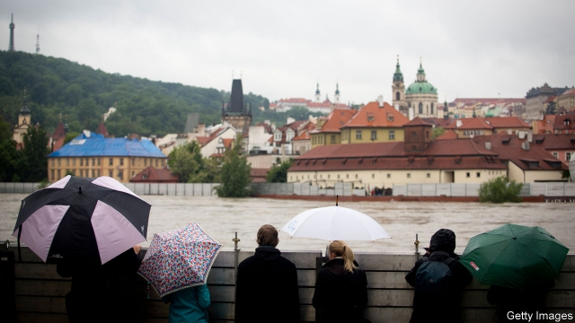

###### Public policy

# Memories of disaster fade fast 

##### When will they ever learn? 

 

> Apr 17th 2019 

AFTER HURRICANE BETSY pummelled New Orleans in 1965, causing damage so severe that “Betsy” was retired from the rotating list of names given to Atlantic hurricanes, the Governor of Louisiana, John McKeithen, pledged that nothing like it would happen in his state again. Exactly 40 years later Hurricane Katrina brought even greater destruction to the city, and hazard planners were deemed to have ignored the lessons of the past. New research suggests that far from being an exception, Louisiana’s forgetfulness is the rule. 

Collective memory for past calamities is of more than just academic interest, precisely because resilience to future calamities is thought to depend on it. Most research on the subject has been conducted by social scientists who have tracked the durability of memories over years—at most a decade—usually by means of questionnaires. Researchers at the Czech University of Life Sciences, in Prague, led by environmental historian Václav Fanta, have approached the problem differently, investigating how memories of disasters shaped decisions over several generations. 

In a paper published recently in Nature Communications, they analysed data on almost 1,300 towns and villages in the Vltava river basin in central Europe—drawing both on historical records and on archaeological methods such as carbon dating—and compared them with the timings of floods in that basin over the course of nearly 900 years. 

The floods studied were defined as extreme, meaning that the river’s run-off was in excess of 4,000 cubic metres per second, or almost 30 times its normal rate. Such mega-floods occur, on average, less than once a century, and the researchers recorded seven of them, the first in 1118 and the last in 1845. In each case, new settlements appeared a significantly higher vertical distance above the river’s normal level than settlements built in the same area before the flood, and continued to do so for 25 years (about a generation) after the deluge. By the subsequent generation, however—the grandchildren of the flood’s survivors—they started creeping downhill again, closer to the river, and encroaching on the zone of flood risk. 

Sites close to watercourses have always been prized, and in calculating where to build their homes, people have necessarily weighed the risks of flood damage against the advantages of being close to a river. That memories of disaster weigh more heavily in this calculation immediately after the flood is not surprising, says Dr Fanta. But that the memory is so short-lived is. He had expected people to heed history’s warning for a century at least. 

This collective forgetfulness is even more puzzling in light of a central preoccupation of ancient chroniclers, the communication of risk. Writing to preserve their eras for posterity, they recounted harrowing tales of extreme climatic events, fires, famines and plagues. Likewise, there is no shortage of written accounts of Hurricane Betsy or of historical floods in Prague—the maximum heights of many of which are marked along the Vltava’s banks. 

Such distant secondhand accounts are not enough, Dr Fanta concludes. To be deterred from placing themselves back in danger, people have to hear disaster tales from eye witnesses who can convey the visceral emotion of having lived through them. The group’s findings thus suggest that one way of teaching history more effectively might be to bring eye witnesses into the classroom. That approach will not work for ever, of course. Over time, witnesses’ own memories fade, and then the witnesses themselves expire. 

The forgetting that Dr Fanta sees with respect to historical floods might also explain the recent rise of vaccine hesitancy and right-wing extremism, he suggests, as the survivors of now-preventable infectious diseases and Hitler, respectively, die of old age. Having not experienced those realities, or heard about them first-hand, many people alive today have quite simply forgotten the horror. 

