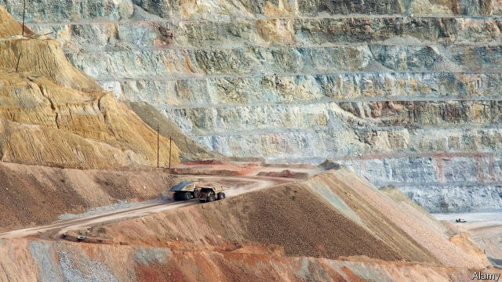

###### Prospecting for minerals

# Ore bodies, it has been discovered, are not randomly distributed 

##### They are concentrated near the edges of structures called cratons 

 

> Apr 17th 2019 

AS TREASURE MAPS go, it will be hard to beat. Geologists from Harvard University, Geoscience Australia and the Australian National University are drawing up a map to show where mining companies should focus their search for the ores of metals such as lead, nickel, copper and zinc. The billions of dollars they spend exploring for these minerals ($8.4bn in 2017) should, the researchers behind the project say, be aimed at the edges of old, thick portions of the continents called cratons. 

The map itself will be published soon in a peer-reviewed journal. But the theory behind it was outlined on April 9th by Fred Richards, of Harvard, at a meeting in Vienna of the European Geosciences Union. The project started with an attempt to make a detailed map of the thickness of Earth’s lithosphere (its crust and upper mantle). The researchers thought this might have something to do with the distribution of sediment-hosted deposits, a particular type of ore body. Such deposits are created by water percolating up through consecutive layers of rock that have different chemical properties. 

If this water is of the right temperature and passes through layers of rock that contain plenty of oxygen, metals will dissolve easily in it. Then, when the metal-laden water reaches strata where oxygen is scarce, its dissolved contents will precipitate and accumulate. But the temperature range required for this to work is narrow: between 50°C and 200°C. Where the lithosphere is thick, the researchers’ thinking was, the temperature difference between the planet’s depths and its surface is stretched out, so any percolating water will spend more time at the right temperatures to collect, and then later to deposit, metals. 

Once the map was created, however, Karol Czarnota, an Australian member of the team, noticed that this hypothesis was wrong. Almost all the large sediment-hosted deposits in that mineral-blessed country are located not in areas of thick lithosphere but, rather, near the junctions between thick and thin areas. Such junctions often mark the edges of cratons. These are islands of old, thick lithosphere, unaffected by mountain-building, earthquakes and so on, that form the cores of continents. 

Prompted by Dr Czarnota’s observation, the team looked at the rest of the world. They saw the same pattern. Not all ores are sediment-hosted. Many are created by water scooping up metals in volcanic processes, resulting in a different pattern of distribution. But sediment-hosted deposits, the team found, did indeed tend to be near craton boundaries. Around 85% of those known to science are within 200km of a boundary—far more than chance alone would predict. According to Dr Richards, that shrinks the space worth searching for sediment-hosted deposits by two-thirds. 

This may encourage mining firms to try their luck in places that are, at the moment, not much explored, such as central Asia and west Africa. Miners might further narrow their search, Dr Richards says, by looking for faults that enable water to penetrate the rock layers. The need for faults, which tend to occur outside cratons, in addition to thick lithosphere, found in cratons, might explain the pattern they found. 

Success in these endeavours would confirm the idea of there being a relationship between cratons and metal deposits. And given that connection, each deposit found would then also add to what is known about cratons. Already, Dr Richards says, the hypothesis that these structures are long-lived, having survived multiple cycles of continent formation and break-up, gets additional confirmation by the great age—up to 2bn years—of a number of the metal deposits nearby. 

