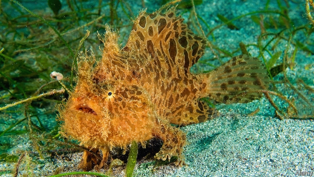

###### Marine biology

# The joys of muck diving 

##### The latest diving craze eschews the gaudy for the cryptic 

 

> Apr 17th 2019 

MUCK DIVING sounds the very antithesis of coral-reef diving. Reef divers swim through a world of colourful coral heads populated by strikingly patterned fish, scuttling arthropods and awesome molluscs. Muck divers explore apparently unpromising sand flats and muddy silts devoid of visible inhabitants. Muck divers, though, see reef divers as the lightweights of the scuba world—people in search of the obvious. Muck diving is about searching for the unusual, the cryptic and the rare. 

Though enthusiasts discovered muck’s attractions less than ten years ago, and the species that live in it were similarly ignored by science, muck diving is now big business. Tallies are not kept, but research conducted in 2014 by Maarten De Brauwer, a marine biologist at Leeds University, in Britain, who is an expert on muck diving, suggests that 100,000 tourists visited the Philippines and Indonesia that year specifically to dive on the muck. This brought $150m into the region. In the Philippines the fishing villages of Anilao in Luzon, and Dauin in Negros Oriental, have been particular beneficiaries of the growth of this sort of tourism. 

Dr De Brauwer thinks of divers who explore these sediments as the marine equivalent of bird watchers, ticking off species in a sort of zoological competition. Top of the list is that master of disguise, the mimic octopus, which evades predators by masquerading as other, venomous, animals—lionfish, sea snakes, even jellyfish. This ability may explain why it remained unknown to science until 1998. Other popular stars are the hairy frogfish (pictured) and the wonderfully titled colourfully garbed flamboyant cuttlefish. 

Tourists looking for these beasts bring employment. Spotting the eye of a mimic octopus in the sand, or a frogfish—an ambush hunter so cleverly camouflaged that it blends to invisibility on the substrate it uses as a hunting platform—needs lots of experience. Keen-eyed young Filipinos are therefore finding work in the diving industry as guides, and can earn double a fisherman’s wage selling their sleuthing skills to outsiders. 

As is often the case with ecotourism, though, there is a risk of the tourists killing the thing they love by turning up in numbers so large that they harm the habitat. Dr De Brauwer believes more study should be directed towards understanding the impact both of divers and of nearby fishing activity on the creatures which make the muck their home. The guides agree, voicing concerns that overcrowding on dive sites could drive the most treasured critters away. Some have already seen evidence of this happening. 

Whether the authorities will go so far as to regulate numbers is moot. But at Dauin the proceeds of a fee which divers are charged for each excursion do at least pay for a coastal patrol that watches over marine sanctuaries to prevent illegal fishing. People in the area are certainly aware of the risk of killing the goose that lays the golden eggs. On the other hand, many of them need the gold now. 

