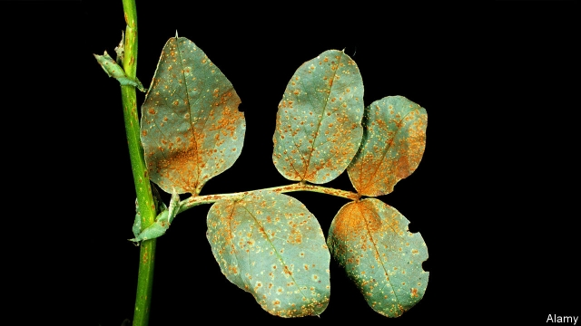

###### Agriculture

# Understanding how crop diseases and climate change interact is vital 

##### But such understanding is poor 

 

> Apr 17th 2019 

IN THE PAST 150 years, the concentration of carbon dioxide in the atmosphere has risen from 280 parts per million (ppm) to 410 ppm. For farmers this is mixed news. Any change in familiar weather patterns caused by the atmospheric warming this rise is bringing is bound to be disruptive. But more carbon dioxide means more fuel for photosynthesis and therefore enhanced growth—sometimes by as much as 40%. And for those in temperate zones, rising temperatures may bring milder weather and a longer growing season. (In the tropics the effects are not so likely to be benign.) What is not clear, though, and not much investigated, is how rising CO2 levels will affect the relation between crops and the diseases that affect them. 

History suggests that is an oversight. Devastating crop diseases do suddenly emerge from obscurity—often becoming epidemic far from their place of origin. In the 1840s, for example, a hitherto obscure fungus from Mexico devastated the Irish potato crop for several years, bringing about a famine that killed a million people. It would not be at all surprising if a changing climate led to conditions that caused similar epidemics. 

Saskia Van Wees, a botanist at Utrecht University, in the Netherlands, is curious about this question and, with the help of a team of colleagues, set up an experiment to take a closer look at how plants respond to changing carbon-dioxide levels. She placed seedlings of Arabidopsis thaliana, a member of the mustard family that serves as a guinea pig of the botanical world, in chambers containing different levels of CO2. Some were at 450 ppm, the level in the laboratory; some well below this (150 ppm); and some well above (800 ppm), a concentration that, if current trends continue, is expected to be reached around 2090. After four weeks, when the plants were established and healthy, Dr Van Wees let loose a mix of common pathogens. These included those of two leaf diseases (Botrytis cinerea, known to laymen as grey mould, and Pseudomonas syringae), and two root diseases (Rhizoctonia solani and Fusarium oxysporum). After a set number of days, appropriate to each disease, she studied the severity of the infections that resulted. 

As she reports in the European Journal of Plant Pathology, high CO2 levels had no impact on the root diseases. The team had expected this because carbon dioxide’s levels in the soil are not much affected by its levels in the air. The leaf diseases were, however, affected quite a lot. Specifically, the severity of B. cinerea infection was substantially weakened by high levels of the gas and that of P. syringae was dramatically strengthened. The reasons for these changes seemed to be shifts in the ways in which the plants defended themselves. 

Plants depend heavily on two substances, salicylic acid and jasmonic acid, to drive away agents of disease. In general, plants increase production of salicylic acid when faced with pathogens that feed on living tissue and do likewise with jasmonic acid when fending off agents that kill the tissue first, before feeding on it. Since B. cinerea consumes dead tissue and P. syringae living tissue, Dr Van Wees speculated that high CO2 levels were driving the plants to produce jasmonic acid more readily, to keep B. cinerea at bay, and to tone down salicylic-acid production, allowing P. syringae to flourish. Chemical analysis of the plants proved this theory correct. 

Dr Van Wees’s experiments are the latest of dozens of trials which make it clear that plant biology is altered substantially by a range of environmental factors. This makes it difficult to predict what effect a changing climate will have on particular bits of agriculture. Carbon dioxide is a case in point. It enhances growth of many plants but, as Dr Van Wees shows, it also shifts the defences to favour some types of disease over others. 

To make matters even more complicated, evidence is mounting that changes in temperature and water availability also shift plant immune responses. André Velásquez and Sheng Yang He, at Michigan State University, wrote an extensive review on the warfare between plants and diseases in Current Biology last year. They noted that though some valuable crops, such as potatoes and rice, experience less disease as moisture levels increase, this is not the case for most plants. High humidity, in general, favours the spread of botanical diseases. The same can be said for temperature—with some diseases, like papaya ringspot virus, thriving in rising temperatures while others, for example potato cyst, are weakened. 

There is also the difficulty of changing insect behaviour. Many disease-causing viruses, bacteria and fungi travel from one plant to another by hitching lifts on insects. Few researchers doubt that a lot of insect species’ behaviour will change as the climate does, but precisely what will happen is an open question. 

The problems are daunting, then, but there is a way to try to solve them. First, all important crops need to have their responses to various diseases studied under a range of expected climate conditions. Second, genes which grant resistance to diseases that might become severe in the future need to be tracked down. Modern crops have been streamlined by artificial selection to be excellent at growing today. This means that they have the genes they need to flourish when faced with the challenges expected from current conditions, but nothing more. Such crops are thus vulnerable to changes in their environment. 

One way to find genes that may alter this state of affairs is to look to crops’ wild relatives. Uncossetted by farmers, these plants must survive disease by themselves—and have been fitted out by evolution with genes to do so. Borrowing their DNA makes sense. But that means collecting and cataloguing them. This is being done, but not fast enough. The International Centre for Tropical Agriculture, a charity which works in the area, reckons that about 30% of the wild relatives of modern crops are unrepresented in gene banks, and almost all of the rest are underrepresented. 

Plant collecting is not, perhaps, the most fashionable of sciences. The very word “botany” is redolent of vascula-carrying Victorian parsons on bracing country walks. More plant collectors (with salaried academic positions for them to occupy) would certainly help. But there is a second issue, redolent of a second sort of Victorian plant collector—the pith-helmeted explorer searching foreign lands for interesting specimens—to address. 

These days, attitudes to this sort of collecting have changed. Most countries are, rightly, protective of their genetic patrimony. If money is to be made by incorporating genes from their plants into crops, they want to have a share of it. It is therefore incumbent on rich countries to abide by rules that enable poor ones to participate in seed collecting without losing out financially. Poor, plant-rich countries are in any case those whose farmers are most likely to be hurt by global warming. It would be ironic if that were made worse because genes from those countries’ plants were unavailable to future-proof the world’s crops. 

