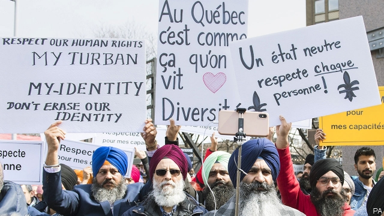

###### Liberté against laïcité

# Quebec wants to ban public servants from wearing religious clothing 

##### Critics say the measure would discriminate against Muslims 

 

> Apr 17th 2019 

A LARGE CRUCIFIX has long hung above the speaker’s chair in Quebec’s legislature. The first one was installed in 1936 to acknowledge the bond between the Catholic church and the government of Canada’s French-speaking province. It survived the “quiet revolution” of the 1960s against the church’s grip on public and private life. The church ceased to run the province’s schools, hospitals and social programmes. But politicians of all parties were loth to take down the crucifix, which was replaced with another in 1982. One premier reportedly said that he was no Joseph of Arimathea, the man who buried Jesus. 

It may now finally come down. Last month the national assembly, as Quebec’s legislature is called, voted unanimously to move the mahogany, bronze and steel object to a less prominent place in the building. But that will happen only if another measure passes which is more contentious. The right-leaning provincial government of François Legault wants to ban newly hired public servants, including teachers, police officers, lawyers and judges, from wearing religious symbols at work. This would make Quebec the first jurisdiction in North America to impose such a ban. 

Mr Legault claims to be enshrining in law the concept of laïcité, an uncompromising version of secularism with roots in the French revolution. This seeks to prevent the state from interfering in citizens’ religious lives, and to free the state itself from religious influence. It obliges citizens to put their faith to one side in their dealings with it. Mr Legault’s critics accuse him of using secularism to hide a nastier agenda of putting religious minorities, especially Muslims, in their place. The relocation of the crucifix is just a decoy, they say. 

The proposal, called Bill 21, pits Montreal, Quebec’s biggest and most diverse city, against the rest of the province. Thousands of people have protested against it. The bill also sharpens differences between Quebec and the rest of Canada. The mayor of Calgary, Naheed Nenshi, who is Muslim, called the religious-attire ban “idiocy”. Justin Trudeau, Canada’s prime minister, said it would legitimise religious discrimination. But Mr Legault’s party, Coalition Avenir Québec, has the votes to pass it. 

Quebec’s worries about both religion in public life and about cultural diversity have deep roots. The quiet revolution was an expression of mounting anti-clericalism. Francophones surrounded by English-speakers, Quebeckers have had to struggle to preserve their language and culture. English-speaking Canada celebrates “multiculturalism”, encouraging minority groups to maintain their distinctive identities. Quebeckers prefer “interculturalism”, which puts more emphasis on appreciation of the host culture. 

Quebec separatism faded as a political force in the 2000s at the same time that immigration from non-European countries increased. In 2011 Muslims were 3% of Quebec’s 7.7m people, double the share of ten years before. Such changes have brought about a “major shift”, says Daniel Béland, director of the McGill Institute for the Study of Canada in Montreal. Legislators “stopped focusing on sovereignty and started focusing instead on issues of religious accommodation and immigration”. 

In 2006 a YMCA frosted a window to please synagogue-goers who did not want to see people working out in tight clothing. This and similar controversies prompted Jean Charest, the province’s Liberal premier, to ask two scholars to study how Quebec could achieve a “reasonable accommodation of minorities”. They said that worry about the erosion of Quebec’s cultural identity was unfounded. But they nonetheless suggested that state employees who “exercise a power of coercion”, such as police, be barred from wearing religious symbols. They also called for the removal of the crucifix from the legislative chamber. 

Governments since 2010 have made three attempts to write laïcité into the law. Two failed because the governments sponsoring them lost elections. In 2017 then-premier Philippe Couillard, also a Liberal, introduced a measure barring people from covering their faces when proffering or receiving public services. It looked like a ban on Muslim face veils. The legislature passed the measure, but judges in Quebec courts suspended it. One said it could cause Muslim women “irreparable harm”. 

Last October Quebeckers who fear their culture is under siege helped elect Coalition Avenir Québec, which was founded in 2011 and had never before exercised power. Mr Legault, a former airline executive, campaigned to curb immigration, even though the province has a labour shortage, and to deny work permits to newcomers who fail tests of “Quebec values” and proficiency in French. The religious-symbols bill would change Quebec’s human-rights charter to acknowledge that the province considers “state laïcité to be of fundamental importance”. Mr Legault initially defended the crucifix as a historical symbol rather than a religious one. Accused of hypocrisy, he changed his mind. 

Like Mr Couillard’s ban, Bill 21 would bar public servants from covering their faces on the job. Current employees will be able to continue wearing religious garb, but only if they stay in the same job. Mr Legault told trainee teachers that those who want to wear religious clothing should choose a different career. 

The government has had a hard time explaining how the ban would work. The public-security minister said police officers could enforce it, then backtracked. Bill 21 applies only to “something that is not naturally on you”, said the immigration minister, Simon Jolin-Barrette. So Rastafarian dreadlocks and tattoos would be permitted. What about discreet items of religious jewellery? There won’t be a “strip search”, Mr Jolin-Barrette promised. 

Ayesha Khan, a Quebec-born high-school science teacher who as an adult decided to wear a hijab, says the bill makes her feel like “a second-class citizen”. The bill probably affects more women than men because they are more likely to wear religious clothing. Some yarmulke-wearing Jews and turbaned Sikhs are also worried. David Ouellette, head of research at the Centre for Israel and Jewish Affairs in Montreal, says the bill restricts religious freedom. “State secularism is an institutional duty, not a personal one,” he says. 

Hate crimes against Muslims in Quebec appear to be increasing. In 2017 the number of incidents reported to police (of everything from incitement of hatred to murder) nearly trebled, to 117. That year a white nationalist killed six worshippers at a mosque in Quebec City, the provincial capital. Charles Taylor, an author of Mr Charest’s report, accused Mr Legault’s government of spreading the idea “that there’s something problematic” about Muslims. 

The premier is braced for a legal challenge. His bill invokes the “notwithstanding clause” of the Canadian constitution, which allows provincial governments to override some constitutional guarantees, including of freedom of religion. 

The government would be “naive” to think that the ban will be easy to enact, says Mr Béland. Lawyers are looking at whether it violates the constitutional right to equal treatment regardless of sex, which is not subject to the notwithstanding clause. 

Such challenges could eventually doom the religious-symbols ban. Then Quebeckers will find out whether the government is serious about secularism. If the crucifix remains in its position above the speaker’s chair, the answer will be “no”. 

