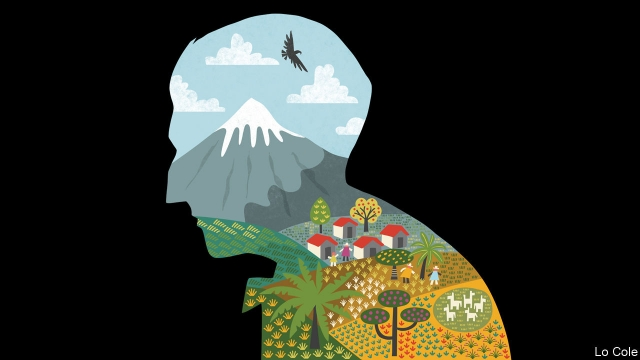

###### Bello

# The wisdom of José Carlos Mariátegui 

##### The Latin American left should rediscover the Peruvian thinker’s pluralism and creativity 

 

> Apr 17th 2019 

HE DIED AGED just 35, disabled for his last six years by the amputation of a leg. But in his short life José Carlos Mariátegui managed to become Latin America’s most influential Marxist thinker, at least until Che Guevara came along. Barely known today outside Peru, he also played a significant role in Latin American culture in the late 1920s, a period when artists and writers were trying to establish national identities based on the recognition of mestizaje (racial mixing) and of workers and peasants. An exhibition, currently at the Reina Sofia museum in Madrid and then bound for Lima, Mexico City and Austin, Texas, introduces Mariátegui to a broader audience while establishing him as a cosmopolitan figure at the hinge of revolutionary politics and artistic vanguards. It offers lessons for the region today. 

The child of a mestiza mother and an absent aristocratic father, Mariátegui was an autodidact who became a journalist and writer. Exiled by Peru’s authoritarian regime, he lived in Europe from 1919 to 1923, mainly in Italy and Berlin. He attended the first congress of the Italian Communist Party and was influenced by its founder, Antonio Gramsci, whose thought was a bridge between liberalism and Marxism and who stressed the importance of culture. Mariátegui was introduced to a profusion of European artistic movements, including Italian futurism, Dada and surrealism. 

He returned to Peru “with the idea of founding a magazine”, he wrote. That idea came to fruition in 1926 with Amauta (“wise one” in Quechua), a political and cultural journal. Mariátegui was never dogmatic or narrow in his interests, and he wanted Amauta to analyse the problems of Peru “in the world panorama”. The first issue contained articles by Sigmund Freud and George Grosz, a German artist, as well as reports on political developments in Spain and Mexico. It included illustrations by Emilio Pettoruti, an Argentine cubist, and José Sabogal, a Peruvian artist who created Amauta’s modernist design. 

In his writings, Mariátegui developed a distinctive revolutionary vision, which he briefly tried to put into practice when he founded the Peruvian Socialist (ie, communist) Party in 1928. Peruvian (and Latin American) socialism should not blindly copy European models, he thought. Rather, it should put the “problem of the Indian”, and thus land reform, at its heart. He believed that the Amerindian peasant communities of the Andes contained the germ of socialism. 

This romantic view set him on a collision course with the apparatchiks from Moscow, who took over Latin American communist parties shortly after his death. But Mariátegui was right in stressing indigenous peoples, popular religiosity and culture in Latin America’s political identity. He was unusual, too, in counting many women among his collaborators. 

The exhibition highlights the loose continental network, with ties to Mexico and Argentina, to which Amauta belonged. It includes art by Diego Rivera and other Mexican muralists. But the visual highlight is the work of Peruvian “indigenist” artists, such as Sabogal and Julia Codesido, who painted portraits of Amerindian elders and scenes of Andean community life. Indigenism was seen as archaic compared with the revolutionary commitment of Rivera. But it endowed its subjects with dignity, and Mariátegui defended it. “The emergence of indigenism represented a radical upheaval that is hard to imagine today,” writes Natalia Majluf, the exhibition’s co-curator and the outgoing director of Lima’s Museum of Art. 

Mariátegui was wrong about big things. It is capitalism, not communism, that has freed billions from poverty. But in the aftermath of the first world war and of the Russian and Mexican revolutions, and having seen the failure of liberalism to prevent Italian fascism, he was not to know that. What he saw was that in Peru a century of political independence and creole capitalism had not freed the Indian from near-serfdom. 

Mariátegui was a committed socialist who also managed to be a free thinker. That makes him valuable today. Much of the Latin American left is blindly obedient to the failed models of Cuba and Venezuela, or still beguiled by populist caudillos (for whom Mariátegui had no time). It desperately needs some of the original thinking of the 1920s. For the right, “Gramscian cultural Marxism” is a new bugbear. They should recognise that Latin America suffers unacceptable inequalities based on sex and race, and needs more tolerance. 

